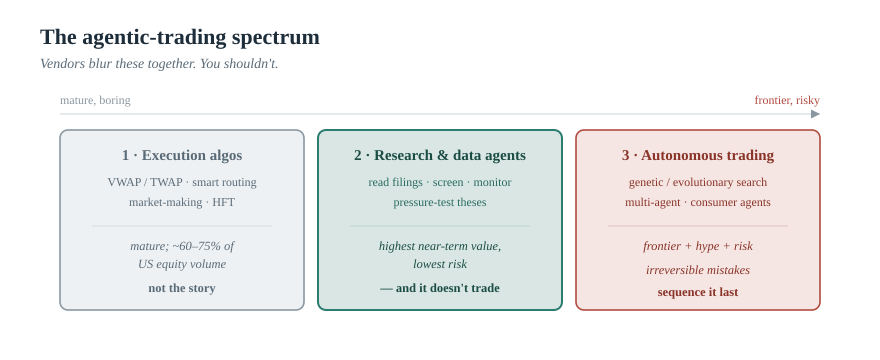
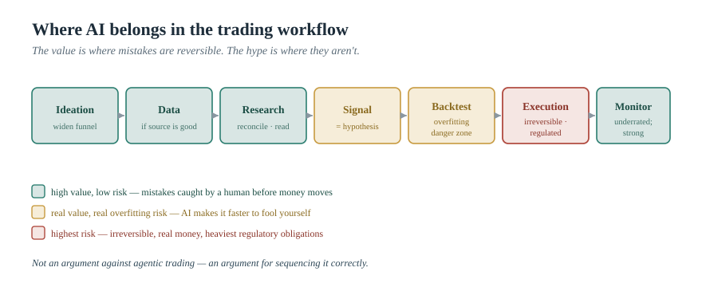
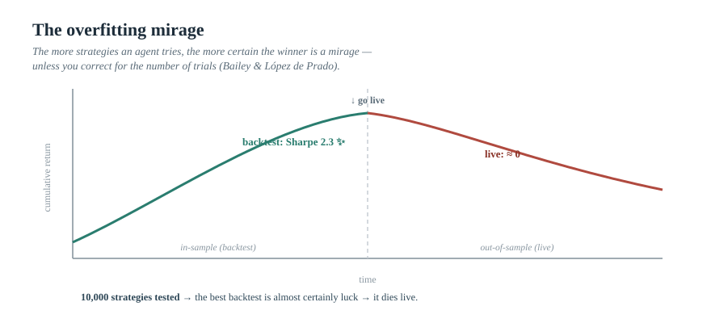

> *The AI Operating Manual for Investment Firms* — Essay 03

# Agentic Trading, Honestly: Where AI Actually Belongs in the Investment Workflow

### "AI that trades" is suddenly everywhere — from Robinhood handing agents the keys to a brokerage account, to quant shops evolving strategies with genetic algorithms, to multi-agent systems that mimic a whole trading floor. This is a practitioner's map: what the platforms actually do beneath the marketing, where the real value sits, the trap almost nobody is pricing in, and how a fund or RIA should actually proceed.

*By [YOUR NAME] · [DATE] · ~18 min read · Nothing here is investment advice.*

---

On May 27, 2026, Robinhood did something that would have sounded like science fiction at the start of the decade: it let customers point an AI agent at a brokerage account and tell it to trade.[^rh] You fund a separate, isolated account; you connect an agent through Robinhood's Model Context Protocol service; and the agent can build a portfolio, adjust concentrations, or read analyst notes and act — in beta, equities only, with options, crypto, and futures on the roadmap.[^rh2]

Read past the headline, though, and the interesting part is the fine print. Robinhood walled the agent off in its own account so it can only touch money you deposit there. It gave you a one-tap kill switch, spending caps, push notifications, and a trade-preview option. And in its own materials it warned that agents can behave unexpectedly and that the customer remains responsible for what the agent does.[^rh][^rh3]

That is the whole essay in miniature. The most aggressive consumer rollout of "AI that trades" did not hand over the keys and walk away. It wrapped the agent in isolation, limits, an off-switch, and a disclaimer. When the company most incentivized to make this look effortless is this careful, you should take the signal seriously: **the hard part of agentic trading was never getting the agent to place an order. It is deciding when to trust it, proving why, and containing it when it is wrong.**

There are two lazy reactions to this moment, and both are wrong. One is to hand over the keys — to assume that because an agent *can* trade, it *should*. The other is to dismiss the whole thing as hype. The useful posture is neither. It is to ask a workflow-specific question: *which part of the trading process does an agent actually improve, and at what risk?*

---

## First, Stop Comparing Three Different Things

Most of the confusion in this space comes from collapsing three distinct things into one word — "agentic trading." They sit on a spectrum from boring-and-mature to frontier-and-dangerous, and a fund or RIA needs to know which one a vendor is selling.

**Algorithmic execution.** This is old news, and it is enormous. By most estimates, somewhere around 60–75% of US equity trading volume is already algorithmic, with high-frequency trading a large subset — though the exact figure depends heavily on how you define "algorithmic," and the dollar-size estimates for the "market" vary so wildly between research shops that I won't cite one.[^algo] VWAP and TWAP order-slicing, smart order routing, market-making — none of this is new, none of it is what the AI hype is about, and your execution desk or broker has done it for years. Set it aside.

**Research, idea, and data agents.** This is where the genuine near-term value lives for almost everyone reading this. Tools that read filings and transcripts, screen companies, assemble research, monitor positions, and pressure-test theses — LinqAlpha, Claude for Financial Services, Perplexity Finance, the AI layers inside Bloomberg and FactSet, banks' internal platforms like Citi's. These do not trade. They compress the path *to* a decision.

**Autonomous strategy discovery and trading.** This is the frontier — and the hype, and the risk. Genetic and evolutionary systems that search for trading strategies on their own; multi-agent "trading firm" architectures; the Robinhood-style consumer agents that act on a real account. The capability is real and improving fast. So is the failure mode, which I will spend a section on, because it is the thing nobody puts on the slide.

*"Vendors blur these together. You shouldn't."*

---

---

## The Workflow, Decomposed

To reason about where an agent helps, decompose the investment process into stages — because "AI for trading" is meaningless until you say *which stage*. Usefully, the academic frontier already organizes itself this way. The widely cited **TradingAgents** framework from UCLA and MIT researchers builds a multi-agent system that mirrors a real trading firm: separate analyst agents for fundamentals, sentiment, news, and technicals; bull and bear *researcher* agents that debate; a trader that synthesizes; and — note this — a risk-management team and a fund-manager approval step before anything executes.[^ta] A broader survey of the field reviewed dozens of LLM-trading papers and found the same architectural instinct: decompose, specialize, and govern.[^survey]

Here is the workflow, stage by stage, with where AI genuinely helps and where it breaks:

| Stage | AI value | Key failure mode |
|-------|----------|-----------------|
| **1. Ideation** — screening, surfacing candidates, mapping catalysts | Strong — widens the funnel | Also widens the funnel of *bad* ideas; the screen must feed a human filter, not a position |
| **2. Data acquisition** — filings, transcripts, prices, alt data, news | Strong, *if* it reaches good data | This layer quietly determines everything (more below) |
| **3. Research and analysis** — reconciling numbers, reading management language | Strong — this is the earnings-season workflow from Essay 02 | A confident summary that's subtly wrong |
| **4. Signal / strategy construction** — turning analysis into a rule or factor | AI can propose | A proposed signal is a hypothesis, not an edge |
| **5. Backtesting and validation** | Real value with discipline | AI makes it *faster to overfit* — the opposite of helpful without guardrails |
| **6. Execution** — placing the order | Largely solved, regulated, commoditized | Autonomy here carries irreversible, real-money consequences |
| **7. Monitoring and risk** — watching positions, flagging drift | Strong and underrated — continuous monitoring is one of AI's best uses[^bal] | — |

*"The value is concentrated where mistakes are reversible. The hype is concentrated where they aren't."*

---

The pattern is hard to miss once you draw it. AI's value is concentrated in the stages where a mistake is *reversible* — a bad screen, a flawed draft, a noisy alert, all caught by a human before money moves. The hype is concentrated in the one stage where a mistake is *irreversible*. That is not an argument against agentic trading. It is an argument for sequencing it correctly.

---

## Below the Surface: What the Platforms Actually Do

You asked to go beneath the marketing. Here is the research-agent layer in real detail, because this is where a fund or RIA should look first — and where, notably, even the most advanced players keep AI firmly in the *research* seat, not the trading seat.

### The institutional research agents

**Claude for Financial Services (Anthropic).** Launched July 2025 and expanded since, this is less a chatbot than a kit. The delivery surfaces are Claude Cowork (a knowledge-work agent app), Claude Code, headless Managed Agents, and Microsoft 365 add-ins for Excel, PowerPoint, Word, and Outlook. In May 2026 Anthropic shipped roughly ten ready-to-run finance agent templates for specific jobs — among them an Earnings Reviewer, a Market Researcher, a Model Builder, plus pitchbook creation, KYC screening, and credit-memo drafting.[^anthropic] It connects to financial data through partnerships with Moody's, FactSet, Morningstar, S&P Global, and Daloopa, among others.[^anthropic2] And the part that matters most for this essay: Anthropic's own documentation frames these agents as producing *drafts for qualified human review* — they do not execute transactions.[^anthropic3] Financial institutions reportedly make up a large share of Anthropic's top customers, including names like JPMorgan, Goldman Sachs, Citi, Citadel, and AIG.[^anthropic]

**LinqAlpha.** A Boston-based, multi-agent research platform founded in 2022 by MIT/Harvard PhDs and ex-investment professionals, used by well over a hundred hedge funds and asset managers.[^linq][^linq2] Beneath the surface it runs a pipeline that collects raw financial data (filings, transcripts, premium news, sell-side research, alternative data across 139+ countries and tens of thousands of companies), cleans and structures it, converts it into AI-friendly formats, and continuously re-ranks results — exposed through a search API and a private-data workspace.[^linq3] Its agentic workflows cover company screening, initiation-report generation, and catalyst mapping. Its most instructive feature is a "Devil's Advocate" agent, built on Claude via Amazon Bedrock, that pressure-tests an investment thesis — and links *every counterargument back to its source document*, creating an auditable trail meant to meet institutional governance standards, with the firm's data kept in its own secure environment.[^linq4] That is the evidence-chain discipline from Essay 01, productized and sold to a hundred-plus funds. It is not a coincidence that the serious money is buying *auditability*, not autonomy.

**The data incumbents: Bloomberg and FactSet.** This is the layer you asked about specifically, and it is more interesting than "they added a chatbot." Bloomberg built **BloombergGPT** in 2023, a 50-billion-parameter model trained on a corpus of roughly 363 billion financial tokens.[^bbg] But its real strategy turned out to be data quality plus retrieval, not the standalone model. Its terminal AI earnings summaries were trained with the help of its 400 Bloomberg Intelligence analysts, are grounded by retrieval over hundreds of millions of documents and thousands of daily news stories, and surface *clickable sources* — with the product team explicit that the summaries guide rather than replace the analyst.[^bbg2] It has since added Document Search & Analysis and, cautiously, **ASKB ("Ask Bloomberg")**, a natural-language interface rolled out in early 2026 — and tellingly, it still won't answer questions about your portfolio.[^bbg3] **FactSet** shipped its **Transcript Assistant** in 2024, powered by a GPT-4-class model but restricted to FactSet's own data and not trained on user queries.[^fs] S&P Global and others followed. The common thread across all of them is decisive: their stated goal is to *accelerate research, not to send buy/hold/sell signals.*[^fs] The incumbents' moat is the data and the grounding — which is exactly why the model alone is not the edge.

**Perplexity Finance.** The prosumer tier. A finance vertical that synthesizes real-time quotes, an earnings hub, live transcripts, SEC-filing analysis, heatmaps, and price alerts into plain-English, source-linked answers, pulling from data providers including Morningstar, FactSet, and others — and now able to connect to a real brokerage account.[^pplx][^pplx2] It is mostly free, which matters: retail participation in US equities roughly doubled from about 10% in 2010 to 20–25% by 2025, and tools like this are the research infrastructure behind that shift.[^pplx2] For an RIA, it is a useful lens on what your clients are now doing on their own.

**The big-bank internal build: Citi.** Worth studying as the "build it yourself at scale" case. Citi runs a proprietary stack — Citi Assist (internal knowledge), Citi Stylus (document intelligence), Stylus Workspaces (multi-step workflows), and Citi Squad (coding) — deployed to roughly 150,000+ employees and running on *both* Google's Gemini and Anthropic's Claude, with agentic capabilities added in late 2025.[^citi][^citi2] Two details matter. First, Citi's CTO tracks AI progress with a "capacity" metric: if a human did a task 100 times at cost X and AI does it at cost Y, you can price the gain — which is precisely the "cost per approved output" discipline from Essay 01, practiced by a global bank.[^citi3] Second, even Citi keeps all of this in research, operations, and advisory. Not autonomous trading.

### The strategy-discovery layer

Now the frontier you were most curious about. The dream is seductive: let a system *discover* profitable strategies on its own.

The classic technique is the **genetic algorithm** (and its cousins in evolutionary computation). You encode a strategy's parameters as "genes," generate a population of candidate strategies, score each by a fitness function (often the Sharpe ratio or cumulative return on historical data), then breed the best via crossover and mutation across many generations — survival of the most profitable backtest. The newest wave makes this *agentic*: frameworks like **QuantEvolve** (from Qraft Technologies) combine evolutionary, quality-diversity optimization with hypothesis-driven, multi-agent strategy generation, aiming to explore the strategy space while preserving diversity; related self-improving systems go by names like R&D-Agent-Quant and QuantAgent.[^qe] Open platforms such as QuantConnect's LEAN engine have hosted genetic-strategy experiments for years.

And here is where the honesty has to kick in, because the people doing this carefully will tell you so themselves. A well-known QuantConnect community example evolved a EUR/USD strategy to a striking out-of-sample Sharpe — and the author openly noted the evolved strategy could not even be replicated on the platform and that the framework's value was the *process*, not the result.[^qc] The most prominent crowdsourced quant-strategy community, Quantopian, shut its public platform down years ago.*

> \* *Worth confirming the exact details before you publish — Quantopian wound down its community platform around 2020 — but the broader point stands regardless of the date.*

The frontier is real. It is also littered with strategies that looked brilliant in a backtest and died on contact with live markets.

---

## The Trap Nobody Puts on the Slide: Backtest Overfitting

This is the single most important section in the essay, and it is the one that separates a practitioner from someone reposting "our AI found a strategy with a Sharpe of 2.3."

When you search over many candidate strategies on the same finite history, you are almost guaranteed to find one that looks spectacular — *purely by chance*. This is not a fringe worry; it is settled quantitative finance. Bailey, Borwein, López de Prado, and Zhu laid it out in work with the deliberately blunt title "Pseudo-Mathematics and Financial Charlatanism," showing how backtest overfitting produces strategies that shine in-sample and fail out-of-sample.[^bailey1] In a related paper they showed that selection bias combined with overfitting can systematically mislead investors into funding strategies that go on to *lose money* — and that the usual "past performance is no guarantee" disclaimer is far too lenient, because in these cases poor outcomes are not merely possible but likely.[^bailey2] Their proposed fix, the **Deflated Sharpe Ratio**, explicitly discounts a strategy's apparent performance by the *number of trials* you ran to find it, along with sample length and the non-normality of returns.[^bailey2] A companion framework estimates the outright probability that your chosen backtest "winner" is overfit.[^bailey3]

Now connect that to agentic strategy discovery, and the danger becomes obvious. A genetic algorithm or a tireless agent does not test ten strategies. It tests thousands, or hundreds of thousands, overnight. Every additional trial makes it *more* certain that the best-looking result is a statistical mirage — not less. An AI that can generate and backtest strategies at superhuman speed is, absent discipline, a superhuman overfitting machine. The deflated Sharpe ratio exists precisely because the number of trials is the thing that kills you, and an agent's defining feature is running an astronomical number of trials.

*"The more strategies an agent tries, the more certain the winner is a mirage — unless you correct for the number of trials (Bailey & López de Prado)."*

The lesson is not "don't use AI to generate strategies." It is: treat every auto-discovered strategy as a *hypothesis to be disproved*, demand genuine out-of-sample and forward (paper-traded) validation, insist on an *economic rationale* for why the edge should exist, and correct your performance statistics for the number of things you tried. Anything an agent hands you with a beautiful backtest and no economic story is guilty until proven innocent.

---

## The Other Two Things People Are Missing

Overfitting is the big one, but two more failures separate durable systems from fragile ones — and both are the operating-model thesis of this whole series, applied to trading.

**Evidence and attribution.** Can you explain *why* the agent did what it did? A research agent that links every claim to a source — the way LinqAlpha's Devil's Advocate ties each counterargument to a 10-K, broker note, or transcript — gives you something you can audit, defend, and learn from.[^linq4] An autonomous trader that produces a P&L and a shrug does not. This is not just good practice; it is increasingly a regulatory expectation. The SEC's 2026 examination priorities direct examiners to assess whether firms adequately supervise their AI *and* to review for accuracy the claims firms make about their AI capabilities — policing the gap between what your AI is said to do and what it actually does.[^sec] An opaque strategy you can't explain is an exam finding waiting to happen.

**Risk controls, kill-switches, and the research-versus-execution line.** The distinction between automating *research* and automating *execution* is the whole ballgame. Research automation is reversible and reviewable; a human sees the output before it matters. Execution automation is irreversible, moves real money, and carries the heaviest obligations — broker-dealers providing market access have long been required to maintain pre-trade risk controls, and the entire market-structure rulebook applies the instant an agent can place an order. It is not an accident that Robinhood's retail launch shipped with an isolated account, hard caps, and a one-tap kill switch, or that the academic TradingAgents architecture routes every decision through a risk team and a fund-manager approval gate before execution.[^rh][^ta] On the regulatory backdrop: the SEC's prescriptive "AI rule" (the 2023 predictive-data-analytics proposal) was formally withdrawn in 2025 — but that removed a specific framework, not the underlying fiduciary, recordkeeping, and supervision obligations, which apply to AI exactly as to anything else, and FINRA has been explicit that its rules are technology-neutral and that it is watching the rise of AI agents.[^reg][^finra] The absence of a bespoke rulebook does not lower the bar. It raises the importance of building your own.

---

## The Right Approach: An Operating Model for AI in Trading

So how should a fund or RIA actually proceed? Not by buying the most autonomous thing available. By sequencing.

- **Research-first, always.** Automate ideation, data, research, and monitoring — the reversible, high-value, low-risk stages — and earn the right to touch execution later, if ever. This is the same research-first principle from Essay 01, and it is what every serious player above actually does.
- **Treat auto-discovered strategies as hypotheses, not money printers.** Out-of-sample validation, forward paper-trading, an economic rationale, and performance statistics deflated for the number of trials. No economic story, no allocation.
- **Keep human judgment and hard risk limits as the control point.** Agents propose; humans and risk systems dispose. Build the fund-manager approval gate and the kill switch *in*, the way both Robinhood and the research literature did.
- **Build the evidence and audit layer.** Every signal traceable to its data and logic; every action logged. If you can't explain it, you can't defend it — to a PM, an investor, or an examiner.
- **Match the tool to the stage and to your firm.** A quant shop validating factors needs different things than a discretionary fund doing earnings work, which needs different things than an RIA managing client portfolios.

> **[YOUR SCREENSHOT / DATA — drop in here.]** You mentioned you can supply screenshots and numbers. The strongest place for them is right here: a screenshot of a research-agent output you actually use (sources redacted), or your own figure on time saved / strategies-tested-vs-survived. See my note on screenshot copyright before you publish.

> **🔧 PROOF SLOT — replace before publishing.** *The most credible thing you could add to this entire essay is a real, anonymized story: "we ran an auto-discovered strategy that backtested at a Sharpe above 2 and watched it decay to nothing in three months of paper trading." If you've lived the overfitting lesson, tell it. It will land harder than the López de Prado citation — though keep both.*

---

## If You're an RIA, Read This Part Twice

Most of the agentic-trading noise is not aimed at you, and you should not let it stampede you.

The Robinhood-style "your agent trades for you" feature is a *retail consumer* product. A retail user is allowed to accept that an agent "can behave unexpectedly" and to bear the consequences personally. You are a fiduciary. You cannot pass that sentence on to a client. The bar for handing trading discretion to an autonomous agent, on a client's money, under a duty of care and loyalty, is far higher than for a retail app — and for the vast majority of RIAs, the honest answer today is: don't.

Your edge with AI is not autonomous execution. It is the green part of the workflow map — research, portfolio analysis, monitoring, and the client-facing work covered in the rest of this series. Start with a research or monitoring agent whose outputs are source-linked and human-reviewed. Use a Perplexity-style tool to understand what your clients are now doing themselves. Ignore, for now, anything that asks you to hand a black box discretion over client capital. You will not be behind. You will be exactly where a fiduciary should be.

---

## The Order Is the Commodity; the Judgment Is the Edge

Strip away the spectacle and agentic trading resolves into the same lesson as everything else in this series. The model that can place an order is rapidly becoming a commodity — Robinhood made it model-agnostic, plugging in whatever agent you bring through a standard protocol. What is scarce, and therefore valuable, is the operating model around it: knowing which stage of the workflow to automate, validating ruthlessly against the overfitting that an agent makes *worse*, keeping an evidence trail you can defend, and holding human judgment and hard risk limits at the point of decision.

The firms that win the agentic era will not be the ones who handed over the keys fastest. They will be the ones who knew exactly which keys to hand over, and which to keep. In trading, the order is the commodity. The judgment about whether to trust it is the edge.

And that edge is durable. The agents will get better; this year's frontier framework will be ordinary by next. None of it changes the shape of the answer, because the durable work is not in the agent that trades. It is in the operating model around the agents that research.

---

### Where This Goes Next

This is Essay 03 of *The AI Operating Manual for Investment Firms*. The threads here open onto their own pieces: a deeper technical essay on why retrieval is not evidence (the data-layer point that decides everything); the real cost model for AI in a fund; and a build-vs-buy framework for choosing among the platforms mapped above. The spine, as always, is the operating model — workflow, evidence, controls — not the subscription.

> **Practical next step.** Take the workflow map and mark, honestly, where your firm is using AI today. If every mark is in the "green" research-and-monitoring zone with source-linked outputs and human review, you are doing this right. If you're being sold something in the "red" autonomous-execution zone, ask the vendor three questions: How do you correct for the number of strategies tested? Can you show the evidence behind every decision? Where is the kill switch? The quality of the answers will tell you everything.

> **[SOFT CTA — your words.]** *I help funds and RIAs cut through the agentic-trading noise — mapping where AI belongs in their workflow, validating strategies against overfitting, and building the evidence and risk-control layer before anything touches execution. If you've seen the platforms and don't know where to start, [get in touch / subscribe / download the trading-workflow AI map below].*

> **[LEAD MAGNET — build before launch.]** *Gate something genuinely useful: a one-page "Where AI Belongs in Your Trading Workflow" map (the green/amber/red diagram), or an "Agentic Trading Readiness & Risk-Control Checklist" (overfitting correction, evidence trail, kill switch, fiduciary line). The download starts the conversation.*

---

## Sources

*Verify each against the primary link before publishing. I've deliberately omitted the "algorithmic trading market size" dollar figures because they vary roughly twentyfold across research vendors — citing one would undercut the anti-hype credibility this brand depends on.*

[^rh]: Robinhood launched Agentic Trading and an Agentic Credit Card on May 27, 2026; agents trade equities (beta) via Robinhood's Model Context Protocol service, in an isolated account funded separately, with a one-tap kill switch, spending caps, push notifications, and trade previews; Robinhood notes agents can behave unexpectedly and that users remain responsible. Bloomberg: https://www.bloomberg.com/news/articles/2026-05-27/robinhood-launches-ai-stock-trading-purchases-on-credit-cards ; CNBC: https://www.cnbc.com/2026/05/27/your-ai-agent-can-now-trade-for-you-on-robinhood-and-buy-stuff-with-your-credit-card-too.html

[^rh2]: On the MCP connection and capabilities (analyze concentration risk and sector exposure, execute trades, read analyst notes; equities-only beta with options/crypto/futures/event contracts on the roadmap): TechCrunch, https://techcrunch.com/2026/05/27/robinhood-now-lets-your-ai-agents-trade-stocks/

[^rh3]: On safety controls and user responsibility ("with or without final human confirmation"): American Banker, https://www.americanbanker.com/payments/news/robinhood-launches-agentic-trading-and-an-agentic-credit-card

[^algo]: Estimates of algorithmic trading's share of US equity volume commonly fall around 60–75% (e.g., Select USA / industry compilations), with HFT a large subset (~50%); figures vary by definition and source. See e.g. QuantifiedStrategies summary: https://www.quantifiedstrategies.com/what-percentage-trading-is-algorithmic/ . Treat as directional, not precise.

[^ta]: Yijia Xiao, Edward Sun, Di Luo, Wei Wang, "TradingAgents: Multi-Agents LLM Financial Trading Framework," arXiv:2412.20138 (2024, rev. 2025). Multi-agent architecture mirroring a trading firm — fundamentals/sentiment/news/technical analysts, bull and bear researchers, a trader, a risk-management team, and a fund-manager approval/execution step. Reported backtest improvements in cumulative return, Sharpe, and max drawdown — note these are backtested results and subject to the overfitting caveats in this essay. https://arxiv.org/abs/2412.20138

[^survey]: "Large Language Model Agent in Financial Trading: A Survey," arXiv:2408.06361 — reviews dozens of papers on LLMs/agents for financial trading. https://arxiv.org/pdf/2408.06361

[^bal]: OpenAI, "How Balyasny Asset Management built an AI research engine for investing" (March 6, 2026) — continuous-monitoring agents (deal-probability updates; proactive filing-discrepancy alerts). https://openai.com/index/balyasny-asset-management/

[^anthropic]: Anthropic, Claude for Financial Services (launched July 2025; ~10 finance agent templates announced May 5, 2026, incl. Earnings Reviewer, Market Researcher, Model Builder, pitchbook, KYC, credit-memo), Microsoft 365 add-ins; financial institutions reported as a large share of top customers (Goldman Sachs, JPMorgan, Citi, Citadel, AIG, etc.). Verify product/customer specifics against Anthropic's own announcement. Coverage: https://fortune.com/2026/05/05/anthropic-wall-street-financial-services-agents-jamie-dimon/

[^anthropic2]: Data partnerships (Moody's, FactSet, Morningstar, S&P Global, Daloopa, Dun & Bradstreet) reported in coverage of Anthropic's May 2026 finance announcement; confirm against Anthropic's primary materials.

[^anthropic3]: Anthropic's finance agent materials describe agents as producing drafts for qualified human review rather than executing transactions autonomously. Confirm exact wording against Anthropic's primary documentation/GitHub.

[^linq]: LinqAlpha — Boston-based multi-agent AI research platform for institutional investors; founded 2022 by MIT/Harvard PhDs and ex-investment professionals (incl. ex-Goldman); ~$6.6M seed. Korea Times profile: https://www.koreatimes.co.kr/business/banking-finance/20250312/linqalpha-builds-ai-to-help-hedge-funds-maximize-alpha ; company site: https://linqalpha.com/about-us

[^linq2]: Adoption figures vary by source (170+ hedge funds/asset managers per AWS; "more than 100 hedge funds/asset managers" and "800+ institutional investors" per company blog) — phrase as "well over a hundred" and confirm current numbers. AWS ML Blog: https://aws.amazon.com/blogs/machine-learning/how-linqalpha-assesses-investment-theses-using-devils-advocate-on-amazon-bedrock/

[^linq3]: LinqAlpha's data pipeline (collect → cleanse → AI-friendly formatting → continuous re-ranking), hybrid semantic+keyword search API, and private-data workspace; coverage across 139+ countries and tens of thousands of companies. Company blog: https://www.getlinq.com/Blog/introducing-linqalpha-api-for-hedge-funds-and-asset-managers and https://linqalpha.com/

[^linq4]: LinqAlpha "Devil's Advocate" agent on Amazon Bedrock (Anthropic Claude): pressure-tests theses with every counterargument linked to its source document, creating an auditable trail; client data kept in the firm's secure AWS environment. AWS ML Blog (Feb 2026): https://aws.amazon.com/blogs/machine-learning/how-linqalpha-assesses-investment-theses-using-devils-advocate-on-amazon-bedrock/

[^bbg]: Bloomberg, "Introducing BloombergGPT" (April 2023) — 50-billion-parameter finance LLM trained on a ~363-billion-token financial corpus (augmented to 700B+ with public data). https://www.bloomberg.com/company/press/bloomberggpt-50-billion-parameter-llm-tuned-finance/

[^bbg2]: Bloomberg terminal AI earnings summaries (Jan 2024) — trained with help from ~400 Bloomberg Intelligence analysts; grounded by retrieval over 200M+ documents and thousands of daily news stories; clickable sources; framed as guiding, not replacing, the analyst. Institutional Investor: https://www.institutionalinvestor.com/article/2cqjgsulkx3md4n3ox2ps/portfolio/bloombergs-first-generative-ai-tool-hits-the-terminal

[^bbg3]: Bloomberg Document Search & Analysis (2025) and ASKB / "Ask Bloomberg" (rolled out cautiously in early 2026; still does not answer portfolio questions); terminal used by ~325,000 professionals. A-Team: https://a-teaminsight.com/blog/bloomberg-launches-ai-powered-research-tool-for-terminal-users/

[^fs]: FactSet "Transcript Assistant" (2024) — AI chatbot to search/summarize earnings transcripts, powered by a GPT-4-class model but restricted to FactSet's data and not trained on user queries; 4,000+ users at launch; the stated goal of these tools (Bloomberg/FactSet) is to accelerate research, not to issue buy/hold/sell signals. Institutional Investor: https://www.institutionalinvestor.com/article/2ct67kt9n08c8stnju7eo/corner-office/on-the-heels-of-bloomberg-factset-launches-its-own-ai-earnings-tool

[^pplx]: Perplexity Finance — finance vertical of Perplexity AI; real-time quotes, earnings hub, live transcripts, SEC-filing analysis, heatmaps, price alerts, automated tasks; source-linked answers; brokerage-account connection; data from providers including Morningstar, FactSet, Crunchbase, FMP. Digital.Finance overview: https://digital.finance/blog/perplexity-ai-finance-features-revolutionizing-financial-research-and-insights

[^pplx2]: Retail participation in US equities roughly doubled from ~10% (2010) to 20–25% (2025); Perplexity AI valued ~$20bn (late 2025). SalesSo guide: https://salesso.com/blog/how-to-access-perplexity-finance-final/

[^citi]: Citi internal generative-AI stack — Citi Assist (knowledge), Citi Stylus (document intelligence), Stylus Workspaces (multi-step workflows), Citi Squad (coding; ~220,000 code reviews in Q1 2025). IMD profile: https://www.imd.org/entity-profile/citigroup-ai-maturity-2025/

[^citi2]: Stylus Workspaces (introduced Dec 2024) is proprietary and runs on both Google Gemini and Anthropic Claude; agentic capabilities added Sept 2025; deployed to ~150,000–182,000 employees. CIO Dive / Banking Dive: https://www.bankingdive.com/news/citi-agentic-AI-tools-stylus-workspaces/760868/

[^citi3]: Citi CTO David Griffiths' "capacity" metric (cost to do a task 100x by human vs. AI) as the basis for measuring AI ROI. Coverage: https://const-ins.com/how-citis-cto-is-rolling-out-new-gen-ai-productivity-tools-to-more-employees-across-the-globe/

[^qe]: Junhyeog Yun, Hyoun Jun Lee, Insu Jeon (Qraft Technologies), "QuantEvolve: Automating Quantitative Strategy Discovery through Multi-Agent Evolutionary Framework," arXiv:2510.18569 (2025) — quality-diversity evolutionary optimization + hypothesis-driven multi-agent strategy generation; references related self-improving systems (R&D-Agent-Quant, QuantAgent). https://arxiv.org/abs/2510.18569

[^qc]: QuantConnect community example of genetic-algorithm strategy development (EUR/USD), in which the author notes the evolved strategy could not be replicated on-platform and that the framework's value is the process, not the headline Sharpe. https://www.quantconnect.com/forum/discussion/2396/developing-trading-strategies-with-genetic-algorithms/ (On Quantopian's wind-down circa 2020 — confirm details before citing.)

[^bailey1]: David H. Bailey, Jonathan M. Borwein, Marcos López de Prado, Qiji Jim Zhu, "Pseudo-Mathematics and Financial Charlatanism: The Effects of Backtest Overfitting on Out-of-Sample Performance," *Notices of the American Mathematical Society* 61(5), 2014, pp. 458–471. SSRN: https://ssrn.com/abstract=2308659

[^bailey2]: David H. Bailey & Marcos López de Prado, "The Deflated Sharpe Ratio: Correcting for Selection Bias, Backtest Overfitting and Non-Normality," *Journal of Portfolio Management* 40(5), 2014, pp. 94–107 — discounts apparent performance by the number of trials, sample length, and non-normality; warns that selection bias + overfitting can lead investors to fund strategies likely to lose money. SSRN: https://ssrn.com/abstract=2460551

[^bailey3]: David H. Bailey, Jonathan M. Borwein, Marcos López de Prado, Qiji Jim Zhu, "The Probability of Backtest Overfitting," *Journal of Computational Finance*, 2015 — estimates the probability that a selected backtest "winner" is overfit (PBO / CSCV). SSRN: https://ssrn.com/abstract=2326253

[^sec]: U.S. SEC Division of Examinations, FY2026 Examination Priorities (Nov 17, 2025) — examiners to assess whether firms adequately supervise AI use and to review for accuracy firms' representations about their AI capabilities. Cite the SEC document directly from SEC.gov.

[^reg]: The SEC's 2023 predictive-data-analytics ("AI") proposal was formally withdrawn June 2025; the withdrawal removed the proposed framework but not existing fiduciary, recordkeeping, and supervision obligations, which apply to AI use. SEC notice: https://www.sec.gov/rules-regulations/2025/06/s7-12-23

[^finra]: FINRA, 2026 Annual Regulatory Oversight Report (Dec 9, 2025) — rules are technology-neutral and apply to GenAI; notes the expanding use of AI agents and associated risks (incl. hallucination). https://www.finra.org/media-center/newsreleases/2025/finra-publishes-2026-regulatory-oversight-report-empower-member-firm
