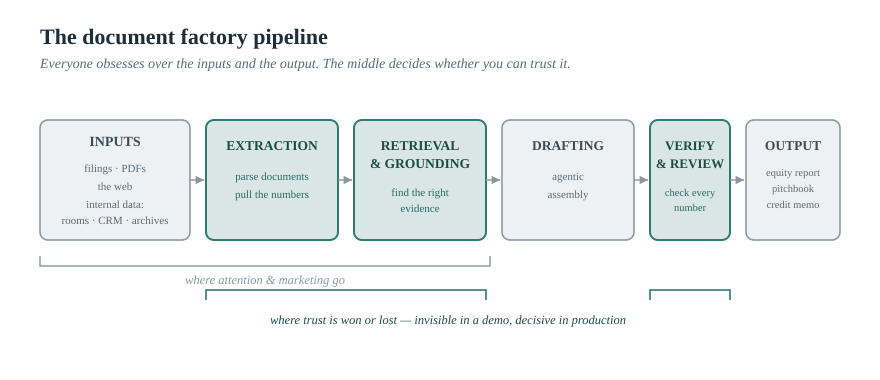
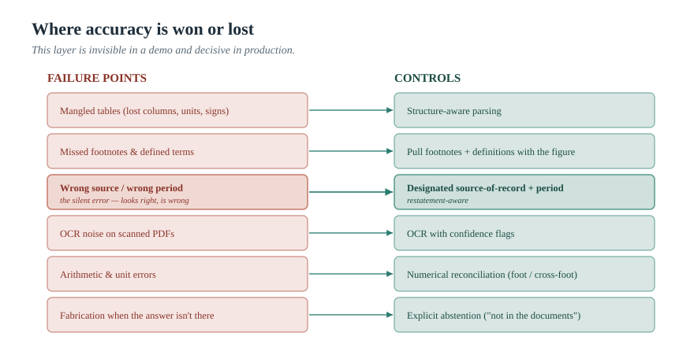
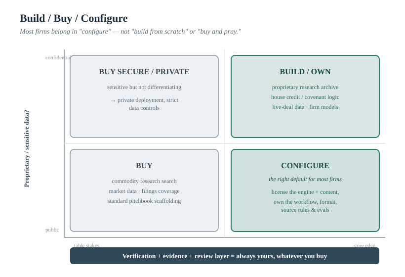

> *The AI Operating Manual for Investment Firms* — Essay 04

# The Document Factory: Why the Hard Part of AI-Generated Reports Isn't the Report

### Pitchbooks, equity research, credit memos, diligence reports — a dozen platforms now generate them from your filings, the web, your data rooms, and your internal systems, in minutes instead of days. The polished deck is the easy 80%. The number on slide 14 — pulled from the right source, the right period, the right line, and actually correct — is the hard 20%. And it is the entire point. A field guide to the players, the technical crux, what the whole category underinvests in, and how to choose.

*By [YOUR NAME] · [DATE] · ~20 min read · Nothing here is investment advice.*

---

In this industry, the document *is* the product. A banker's week is pitchbooks and profiles and models. An equity analyst's output is the note. A credit team's deliverable is the memo and the investment-committee pack. A diligence process is, in the end, a pile of documents that someone has to produce, check, and stand behind. So when a wave of AI platforms arrives promising to generate all of it — from your filings, your data rooms, the open web, and your internal systems, in minutes rather than days — it lands on the single most time-consuming part of the job. The demos are genuinely impressive.

They are also where the trouble starts, because the demo shows you the easy part.

Here is the uncomfortable truth that separates a system you can actually use from one that quietly becomes a liability. Generating a fluent, well-formatted, on-brand report is the easy 80% — modern models do it beautifully. **The hard 20% is the number on slide 14:** was it pulled from the right document, the right period, the right line of the right table; was it reconciled; is it *correct*? In document generation for investment firms, accuracy of extraction from the right source is not a feature you evaluate alongside others. It is the whole game. A pitchbook with one wrong revenue figure is worse than no pitchbook, because it carries your firm's name and a false confidence.

This essay is about that hard 20% — the players racing to solve it, the technical reasons it is genuinely difficult, the part of the problem the entire category underinvests in, and how a confused bank, fund, or advisory firm should actually choose what to buy and what to build.

---

## The Architecture Everyone Is Building

Strip the logos off and almost every one of these platforms is the same pipeline. Here it is formally:

**Inputs** — regulatory filings and PDFs, the open web, and internal sources (data rooms, SharePoint, CRM, research archives, models) — flow into **ingestion and extraction** (parsing documents, pulling out the numbers and facts), then **retrieval and grounding** (finding the right evidence for a given question), then an **agentic drafting** step (assembling the deliverable), then — if the firm is serious — a **verification and review** gate, producing the **output**: an equity report, a pitchbook, a credit memo, a diligence report, a tax document.

*"Everyone obsesses over the inputs and the output. The middle decides whether you can trust it."*

---

The deception is structural. The inputs are obvious and the output is what everyone sees, so that is where attention and marketing concentrate. But the trustworthiness of the whole thing is decided in the two stages in the middle — extraction and verification — which are invisible in a demo and unglamorous to build. Hold that thought; it is the spine of everything below.

---

## The Landscape, Mapped (Not Ranked)

There are now a lot of players, and they blur together in pitches. The useful way to see them is along two axes: **horizontal vs. vertical** (general productivity vs. purpose-built for finance), and **bring-your-own-data vs. bring-the-data** (works over your documents vs. ships with a content library).

### The horizontal productivity layer

**Microsoft 365 Copilot** sits inside Word, Excel, PowerPoint, Outlook, and Teams, reads your organization's data through Microsoft Graph, and drafts documents, decks, and emails from it; Copilot Studio lets firms build custom agents, and a Researcher agent handles multi-step research.[^copilot] It is general-purpose and meets people in the tools they already use. Two caveats worth internalizing: it is only as good as what is in your Graph and how it is governed (governance is the firm's job, not automatic), and adoption is not automatic — by one widely cited estimate roughly a third of enterprise AI seats sit idle, even as deployments like Lloyds Banking Group report meaningful daily time savings.[^copilot2] Copilot drafts from your documents; it is not purpose-built to parse a 10-K's tables or guarantee the number came from the right filing. That gap is what the vertical players sell against.

### The vertical finance platforms

These are built for the document factory specifically:

| Platform | Key differentiator |
|----------|-------------------|
| **Rogo** | "AI OS for investment banking"; used by 35,000+ professionals at 250+ institutions; multi-model architecture; integrations spanning deal data, filings, market databases, CRM, SharePoint; emphasizes *auditable sourcing* and cross-document inconsistency flagging.[^rogo][^rogo2] |
| **Model ML** | AI workflow builder generating client-ready Word, PowerPoint, and Excel in a firm's *exact prior formats*; agents interpret data schemas, reason across sources, write code to extract and transform data, with explicit verification steps.[^modelml][^modelml2] |
| **Hebbia** | Matrix product aggregates any document type into citation-linked, spreadsheet-like grids; retrieval approach ("Iterative Source Decomposition") preserves structure and formatting across documents rather than shredding into naive chunks.[^hebbia][^hebbia2] |
| **AlphaSense** | 500M+ premium documents (filings, transcripts, broker research, expert calls, news); Generative Search, Generative Grid, Deep Research, and Financial Data layer; multi-agent retrieve-analyze-synthesize architecture; generates reports and pitchbook slides on firm templates.[^alpha][^alpha2] |
| **LinqAlpha** | Multi-agent research platform used by well over a hundred funds; "Devil's Advocate" agent links every claim back to its source document to create an auditable trail.[^linq] |

### The data incumbents, now with AI

Bloomberg built a finance-specific model (BloombergGPT) and has layered AI earnings summaries, document search, and a natural-language assistant onto the terminal, grounded in its data with clickable sources; FactSet, S&P Global, and Morningstar have shipped comparable assistants over their own content.[^incumbents] Their stated goal is consistent and telling: accelerate research, not issue buy/sell calls — and their moat is the data and the grounding.[^incumbents2]

### The extraction backbone

Beneath all of this sits a less visible but decisive layer: providers that turn messy filings into clean, structured, normalized financial data (Daloopa is one example), because — as the technical section will show — a structured data source beats free-text retrieval by a wide margin.[^daloopa]

### The big-firm internal builds and model-lab suites

Large institutions increasingly build their own (Citi's internal Stylus platform, running on multiple frontier models, is a good public example), and the model labs now ship finance-specific agent kits — Anthropic's Claude for Financial Services includes ready-made templates for pitchbook creation, credit-memo drafting, and model building, among others, framed as producing drafts for human review.[^builds][^builds2]

### The prosumer tier

Perplexity Finance brings source-linked, real-time research to individuals and small teams for free — useful mainly as a window into what your clients are now doing themselves.[^pplx]

> **[Optional landscape map]** A 2×2: x-axis "Horizontal ↔ Vertical (finance-specific)," y-axis "Bring-your-own-data ↔ Ships-with-content-library." Place the categories (not a ranking) in the quadrants. A natural spot for an annotated screenshot of a tool you actually use, with sensitive data redacted.

Notice what nearly all of them now advertise: citations, "grounded" answers, auditable sourcing. That convergence is the tell. The whole category has realized that for this use case, *trust* is the product — which makes the question not "who generates the nicest deck" but "whose numbers are actually right, and can you prove it." That question has an empirical answer, and it is sobering.

---

## The Technical Crux: Extraction and the "Right Source" Problem

You said it plainly, and you are correct: getting the numbers extracted from the right place is the key. Here is why that is genuinely hard, with the evidence.

### The numbers are not as good as the demos suggest

Start with the most important benchmark in this space. Researchers at Stanford and Patronus AI built **FinanceBench**, a test of thousands of *deliberately clear-cut* questions about public companies, paired with the source filings — a minimum competence bar, not a hard exam. The headline result, in 2023: a leading model used with a retrieval system answered incorrectly or refused on **81% of questions**, even with the right documents available; across realistic configurations, performance landed around 47% correct, 26% outright wrong, and 27% non-answers.[^fb] Those were 2023-era models, and frontier models have improved meaningfully since. But the *structural* lesson has not changed, and a 2026 financial-retrieval benchmark proves it: the same class of model scored about **90.8% accuracy when it could query a structured financial database, versus 19.8% on open web search** — a 71-percentage-point swing driven not by the model's intelligence but by what it was allowed to retrieve from.[^finr]

> Read those two findings together and the conclusion is unavoidable: **the system around the model — extraction, retrieval, and the source it draws on — dominates the outcome far more than the model does.** The model is not the bottleneck. The plumbing is.

### Where accuracy is actually lost

| Failure point | What goes wrong |
|---------------|----------------|
| **Tables** | Naive PDF-to-text conversion mangles tables — merging cells, losing column alignment, dropping multi-level headers, missing "in thousands" stated once at the top, misreading parentheses as negatives |
| **Footnotes and defined terms** | "Adjusted EBITDA" defined by add-backs in a footnote; segment number depends on a reclassification in fine print; covenant ratio computed "as defined in the Credit Agreement" fifty pages away — retrieval that grabs the table but not the footnote produces a precise, sourced, wrong answer |
| **The right-source problem** | The same revenue figure may appear in a press release, an investor deck, the 10-Q, the 10-K, and a stale web copy — in slightly different forms, for slightly different periods, before and after a restatement. Pulling from the wrong source or wrong vintage is a *silent* error |
| **Scanned and image PDFs** | Credit agreements, older filings, and tax documents are frequently scanned images; OCR introduces digit-level noise; a single transposed figure is a material error in a credit memo |
| **Numerical reasoning** | Even with perfect inputs, models make arithmetic and unit mistakes — totals that don't foot, margin computed off the wrong base, currency not converted |
| **Fabrication on absence** | When the answer isn't in the provided documents, the dangerous default is to invent a plausible one rather than say "not found" |

*"This layer is invisible in a demo and decisive in production."*

---

### What "good" looks like

The architecture that actually wins is the set of controls opposite those failures — and you can see the serious players reaching for pieces of it:

1. **Structure-aware parsing**, not naive text-chunking — preserving tables, headers, and units.
2. **A structured-data backbone where possible** — querying normalized financials rather than re-reading prose every time (the 90.8%-vs-19.8% gap is the whole argument for this).
3. **A designated source of record and period**, with provenance tracked and restatements handled — so the number comes from the filing you chose, not whatever the index surfaced.
4. **Grounding to the exact location** — page, table, cell, footnote — so every figure is a link, not an assertion.
5. **A numerical verification layer** — recompute, foot and cross-foot, reconcile across documents — instead of trusting the model's arithmetic.
6. **Explicit abstention** — the system says "this figure is not in the provided documents" rather than inventing one.
7. **Evals on your own documents** — a labeled regression set (FinanceBench-style) that measures extraction accuracy, citation validity, and numerical correctness, so you are buying on measured performance over *your* filings, not on a demo.

*"Every number on the slide should be a link you can click and a calculation you can check."*

---

---

## What the Whole Category Underinvests In

Step back from any individual vendor — this is a gap in the *category*, not a knock on any one product. Across the board, the same things get shortchanged:

| Gap | The problem |
|-----|-------------|
| **Generation gets the budget; extraction gets the leftovers** | Fluent output is the easy, demoable 80%; the trustworthy number is the hard, invisible 20% — and the incentives push toward the demo |
| **Retrieval treated as evidence** | A citation that points at a document is not proof the number is right, complete, or from the right period. "It cited something" has become the industry's substitute for "it's correct." |
| **Nobody makes you measure** | Buyers are dazzled by a live demo on a familiar company and almost never run a regression test on a representative sample of their *own* filings |
| **Source-of-record hand-waved** | Most systems answer from the index, not from a designated authoritative source and period — precisely how silent, look-right errors enter a deck |
| **No real numerical-verification layer** | Confident fabrication reads better in a demo than an honest "not found" |
| **The "looks finished" trap** | A polished, branded, on-format deliverable *signals* done, so human review gets compressed or skipped — at exactly the moment numbers are most likely to be wrong and most likely to leave the building with your name on them |

This last point is not a hypothetical risk in a regulated industry: the SEC's 2026 examination priorities have examiners reviewing the accuracy of firms' representations about their AI, and FINRA has flagged hallucination as a core risk of the summarization-and-extraction use case that is precisely this one.[^reg]

> **🔧 PERSONAL EXPERIENCE SLOT — replace before publishing.** *This is the single most valuable thing you can add to this essay. Tell the real story: the time an AI-generated report pulled a number from the wrong source or the wrong period, what it would have cost if it had gone out, and how you caught it. Or: "we ran an auto-generated pitchbook against the source filings and found N extraction errors in M pages." A specific, lived war story about a wrong number will persuade a skeptical MD or CCO more than every benchmark above — and it positions you as someone who has actually done this, not just read about it. Redact anything confidential.*

---

## Build vs. Buy: A Framework, Not a Recommendation

The question every confused firm asks is "what should we buy?" The honest answer for most is: stop framing it as buy-versus-build, and reframe it as **configure**.

| Approach | What it covers | Why |
|----------|---------------|-----|
| **Buy** | Commoditized, broadly applicable capabilities where a vendor has a data or integration moat you cannot realistically replicate — research search, market intelligence, standard pitchbook scaffolding, filing and transcript coverage | You are not going to out-build a 500-million-document research library or a terminal's market data |
| **Build or own** | Your actual edge or actual risk: internal research archive, house credit-memo and covenant logic, firm-specific models and templates, anything touching confidential live-deal data — and **the verification, evidence, and review layer, regardless of whose engine you buy** | The operating-model layer does not come in the box |
| **Configure** | The synthesis and right default for most firms: license the engine and content, own the workflow, house format, source-of-record rules, numerical checks, controls, and evals | Most firms belong here |

The decision reduces to four questions:
1. Is this capability a source of competitive edge or is it table stakes?
2. How proprietary or sensitive is the data it touches?
3. How firm-specific is the workflow?
4. Can you maintain what you build?

Underneath all four sits the only metric that ultimately matters — not "what does the tool cost" but **what does it cost to produce one *approved*, defensible output**: the cost-per-approved-output measure from Essay 01.[^builds]

*"Most firms belong in 'configure,' not 'build from scratch' or 'buy and pray.'"*

---

## What Different Organizations Should Actually Do Next

| Firm type | Recommended next step |
|-----------|----------------------|
| **Large banks / bulge bracket** | You are already building internally and partnering with labs. Govern AI at the enterprise level, measure capacity, and make the numerical-verification layer non-negotiable before any AI-produced figure reaches a client deliverable |
| **Boutique investment banks / M&A advisory** | Buy a deliverable engine that produces pitchbooks and profiles in your formats, then configure your house style, source-of-record rules, and a verification pass. Do not try to build the model; do own the checking |
| **Hedge funds (fundamental)** | Adopt research and extraction agents with auditable, source-linked outputs, build the proprietary research-archive layer that is your edge, and run evals on your own coverage names |
| **Private credit** | Covenant extraction and the credit memo are the sharpest, highest-stakes case for this technology — long agreements, defined terms that reference other defined terms, numbers whose meaning lives in footnotes. Invest here in structure-aware extraction, footnote-and-definition handling, numerical verification, and an investment-committee evidence pack |
| **RIAs / wealth managers** | Your documents are portfolio commentary, client reporting, and planning materials. The extraction-accuracy stakes are lower than IB or credit, but source-linking and compliance review still matter — buy, configure to your compliance rules, and keep a human reviewer |

> **🔧 PERSONAL EXPERIENCE SLOT — replace before publishing.** *A second strong place for your own story: a build-vs-buy decision you actually made (or watched a firm make) — what they bought, what they kept in-house, and what they got wrong the first time. Concrete beats abstract.*

---

## How to Produce One Equity Report You Can Defend

You asked how a firm should actually prepare an equity report with these tools. Do not start by automating the whole thing. Produce *one*, the disciplined way, and measure it:

1. **Fix the output structure first.** Designate the authoritative sources and the exact periods up front — the filing of record, not whatever the web surfaces.
2. **Extract** with structure-aware parsing, pulling each figure together with its footnote and definition.
3. **Ground** every number to its source cell or page.
4. **Reconcile** the math — foot the totals, check the margins, confirm the units.
5. **Red-team and abstention pass** — is anything in here fabricated, from the wrong period, or from a non-authoritative source?
6. **Human sign-off**, and **log** the whole chain.
7. Run this exact process on five equity reports you have already produced by hand, and compare — on accuracy first, time second.

> Five known cases will tell you more than any vendor demo, because you already know which numbers are right.

That is the difference between a report that compresses your week and a report that ends it.

---

## The Prose Is the Commodity; the Number Is the Product

Strip away the platform names and the demos, and the document factory resolves into the same lesson as the rest of this series. Generating a fluent, on-brand report is rapidly becoming a commodity — every serious tool can do it, and next year's will do it better. What is scarce, and therefore valuable, is everything the demo skips: extracting the right number from the right source, grounding it so it can be checked, verifying the arithmetic, and putting a human accountable at the end.

The firms that win this will not be the ones who generated the prettiest pitchbook fastest. They will be the ones whose every figure is correct, sourced to the document of record, and defensible to a client, a committee, or an examiner — because they invested in the unglamorous extraction-and-verification layer that the rest of the category treats as an afterthought.

In document generation, the prose is the commodity. The number — pulled from the right source, verified, and traceable — is the product. Build for the number.

---

### Where This Goes Next

This is Essay 04 of *The AI Operating Manual for Investment Firms*. The technical thread here — why retrieval is not evidence — deserves and will get its own deeper piece, as will a full treatment of covenant extraction for private credit (the highest-stakes version of this problem) and a build-vs-buy decision framework expanded into a working scorecard. The spine, as always: the advantage is in the workflow, the evidence, and the controls — not the subscription.

> **Practical next step.** Take the last AI-generated deliverable your firm produced and audit ten numbers in it against the source filings — the right filings, the right periods. Count how many are correct, correctly sourced, and from the authoritative version. That number, not the demo, is your real starting point.

> **[SOFT CTA — your words.]** *I help banks, funds, and advisory firms turn AI document generation from an impressive demo into a defensible production process — source-of-record discipline, structure-aware extraction, numerical verification, and an evidence trail every figure can survive. If you've seen the platforms and don't know how to choose or how to make them safe, [get in touch / subscribe / download the extraction-accuracy checklist below].*

> **[LEAD MAGNET — build before launch.]** *Gate something genuinely useful: a "Financial Extraction Accuracy Checklist" (the failure-points-vs-controls list), an "AI Document Tool: Build / Buy / Configure Scorecard," or an "Equity-Report Source-of-Record & Verification Template." The download starts the conversation.*

---

## Sources

*Verify each against the primary link before publishing. I've described vendors factually and grouped them by function rather than ranking them; treat any vendor performance or "no hallucination" claim as a marketing claim to test on your own documents, not as established fact.*

[^copilot]: Microsoft 365 Copilot is embedded across Word, Excel, PowerPoint, Outlook, and Teams, reads organizational data via Microsoft Graph, and supports custom agents via Copilot Studio plus a Researcher agent; Copilot for Finance connects Office to ERP systems (e.g., Dynamics 365) for reconciliation and analysis. Microsoft Cloud Blog: https://www.microsoft.com/en-us/microsoft-cloud/blog/financial-services/2025/06/16/4-ways-microsoft-copilot-empowers-financial-services-employees/ ; Microsoft Learn (Copilot for Finance): https://learn.microsoft.com/en-us/copilot/release-plan/2025wave1/copilot-finance/

[^copilot2]: On idle enterprise AI seats (~35%) and adoption metrics (e.g., Lloyds Banking Group reporting ~46 minutes/day saved), and that governance is the institution's responsibility: deployment guidance such as https://www.myabt.com/blog/copilot-quick-wins-financial-institutions . Treat third-party figures as directional and confirm.

[^rogo]: Rogo — "AI platform purpose-built for finance"; $160M Series D (April 2026, led by Kleiner Perkins); 35,000+ professionals at 250+ institutions (e.g., Lazard, Moelis, Jefferies, Rothschild, Nomura); founded 2022 by ex-J.P. Morgan/Lazard. PRNewswire: https://www.prnewswire.com/news-releases/rogo-raises-160m-series-d-to-scale-the-agentic-platform-for-finance-302756546.html

[^rogo2]: Rogo's multi-model (OpenAI) architecture, integrations (deal data, filings, market databases, CRM, SharePoint; S&P Global, Crunchbase, FactSet; ~50M financial documents), outputs in PowerPoint/Excel/Word (comps, profiles, models), and emphasis on auditable, cited, traceable sourcing and cross-document inconsistency flagging. OpenAI case study: https://openai.com/index/rogo/ ; company site: https://rogo.ai/

[^modelml]: Model ML — AI workflow automation for financial services; ~$87M raised (incl. $75M Series A led by FT Partners, Nov 2025); founded by Chaz & Arnie Englander; clients include large banks, asset managers, and two of the Big Four. PRNewswire: https://www.prnewswire.com/news-releases/model-ml-raises-75m-in-one-of-the-largest-fintech-series-a-rounds-in-history-to-transform-financial-services-with-ai-workflow-automation-302624414.html

[^modelml2]: Model ML generates client-ready Word/PowerPoint/Excel (pitchbooks, diligence reports, investment memos) in exact prior formats; technically its agents interpret schemas, reason across sources, and write code to extract and transform data, with embedded verification steps. (Head-to-head speed/accuracy claims vs. consulting firms are company claims — verify.) fintech.global: https://fintech.global/2025/11/24/model-ml-secures-75m-to-expand-ai-workflow-product/

[^hebbia]: Hebbia — founded 2020 (George Sivulka); flagship product Matrix; reported use by ~30% of the top 50 asset managers by AUM; processes PDFs, presentations, emails, images into citation-linked, spreadsheet-like outputs. TechTimes: https://www.techtimes.com/articles/311222/20250707/hebbia-matrix-transforms-knowledge-work-how-financial-giants-process-millions-documents-minutes.htm

[^hebbia2]: Hebbia's retrieval approach ("Iterative Source Decomposition") is described as preserving context, structure, and formatting across documents; Hebbia also identifies fragmented data architectures (information siloed across systems and formats) as the most common reason AI implementations fail. Company blog: https://www.hebbia.com/blog/how-hedge-funds-use-hebbia ; https://www.hebbia.com/resources/generative-ai-for-finance

[^alpha]: AlphaSense — founded 2011; market-intelligence platform with 500M+ premium documents (filings, transcripts, broker research, expert calls, news) plus users' internal content. Company: https://www.alpha-sense.com/

[^alpha2]: AlphaSense generative tools — Generative Search, Generative Grid (tabular, template-driven, citation-linked), Deep Research, and Financial Data (Oct 2025; blends structured financials with qualitative content); multi-agent retrieve-analyze-synthesize architecture; generates reports and pitchbook slides on firm templates. PRNewswire: https://www.prnewswire.com/news-releases/alphasense-innovations-in-end-to-end-ai-workflows-for-structured-financial-data-expert-content-and-enterprise-intelligence-fuel-rapid-growth-302577532.html ; help docs: https://help.alpha-sense.com/hc/en-us/articles/41666587181203-Interacting-with-Generative-Search

[^linq]: LinqAlpha — multi-agent institutional research platform used by well over a hundred funds; its "Devil's Advocate" agent (built on Claude via Amazon Bedrock) links every counterargument to its source document to create an auditable trail. AWS ML Blog: https://aws.amazon.com/blogs/machine-learning/how-linqalpha-assesses-investment-theses-using-devils-advocate-on-amazon-bedrock/

[^incumbents]: Bloomberg — BloombergGPT (50B-parameter finance LLM, 2023), terminal AI earnings summaries grounded in retrieval with clickable sources, Document Search & Analysis, and the ASKB assistant (rolled out cautiously in 2026; still does not answer portfolio questions). FactSet's Transcript Assistant and S&P Global's Document Intelligence/ChatIQ are comparable assistants over their own content. Bloomberg: https://www.bloomberg.com/company/press/bloomberggpt-50-billion-parameter-llm-tuned-finance/ ; Institutional Investor (FactSet): https://www.institutionalinvestor.com/article/2ct67kt9n08c8stnju7eo/corner-office/on-the-heels-of-bloomberg-factset-launches-its-own-ai-earnings-tool

[^incumbents2]: Bloomberg and FactSet have framed their AI tools as accelerating research rather than issuing buy/hold/sell signals, with answers grounded in proprietary data and clickable sources. See Institutional Investor coverage above.

[^daloopa]: Daloopa — provider of structured/normalized financial data extracted from filings; also the source of the FinRetrieval benchmark cited below. See FinRetrieval (note [^finr]).

[^builds]: Citi's internal AI platform (Citi Stylus / Stylus Workspaces) runs on multiple frontier models (Google Gemini and Anthropic Claude) and is deployed to ~150,000+ employees; Citi's technology leadership measures AI value via a "capacity" metric (cost to perform a task by human vs. AI) — i.e., cost per approved output. Banking Dive: https://www.bankingdive.com/news/citi-agentic-AI-tools-stylus-workspaces/760868/ ; rollout/metric: https://const-ins.com/how-citis-cto-is-rolling-out-new-gen-ai-productivity-tools-to-more-employees-across-the-globe/

[^builds2]: Anthropic's Claude for Financial Services includes ready-made finance agent templates (pitchbook creation, credit-memo drafting, model building, earnings review, KYC, etc.), framed as producing drafts for qualified human review. Confirm specifics against Anthropic's own announcement. Coverage: https://fortune.com/2026/05/05/anthropic-wall-street-financial-services-agents-jamie-dimon/

[^pplx]: Perplexity Finance — source-linked, real-time financial research (quotes, earnings hub, transcripts, filing analysis) drawing on data providers including Morningstar and FactSet; brokerage-account connection; largely free. Overview: https://digital.finance/blog/perplexity-ai-finance-features-revolutionizing-financial-research-and-insights

[^fb]: Pranab Islam et al. (Stanford / Patronus AI), "FinanceBench: A New Benchmark for Financial Question Answering," arXiv:2311.11944 (2023). 10,231 questions about public companies with answers and evidence strings; on a 150-case sample across 16 model configurations, a leading model with a retrieval system incorrectly answered or refused ~81% of questions; realistic configurations averaged roughly 47% correct / 26% incorrect / 27% non-answers; primary failure modes were hallucination and high refusal rates. (Models were 2023-era; the structural lesson is confirmed by later work — see [^finr].) https://arxiv.org/abs/2311.11944 ; data: https://github.com/patronus-ai/financebench

[^finr]: E. Kim & J. Huang (Daloopa), "FinRetrieval: A Benchmark for Financial Data Retrieval by AI Agents" (Jan 2026). A leading model reached ~90.8% accuracy with structured-data APIs vs. ~19.8% with web search alone — a ~71-point gap; "tool availability dominates performance." This is the empirical case that the retrieval/data layer, not the model, drives accuracy. arXiv: https://arxiv.org/abs/2603.04403

[^reg]: SEC Division of Examinations FY2026 priorities direct examiners to review the accuracy of firms' representations about their AI capabilities (and to assess AI supervision); FINRA's 2026 Annual Regulatory Oversight Report identifies summarization and information extraction as the top GenAI use case and flags hallucination as a core risk. SEC: cite the Division of Examinations priorities from SEC.gov. FINRA: https://www.finra.org/media-center/newsreleases/2025/finra-publishes-2026-regulatory-oversight-report-empower-member-firm
