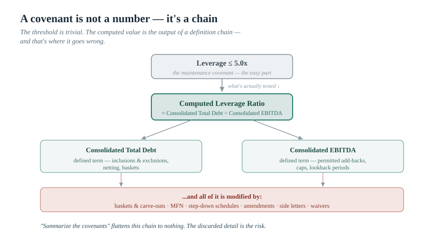
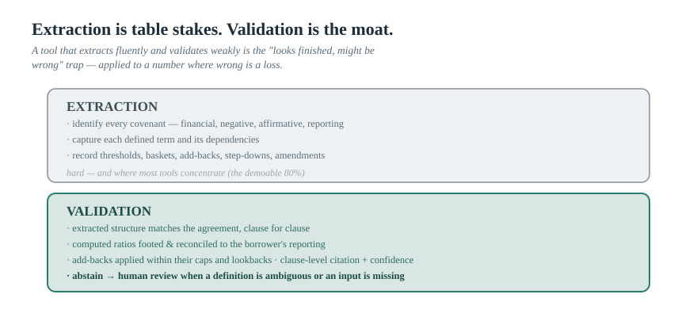
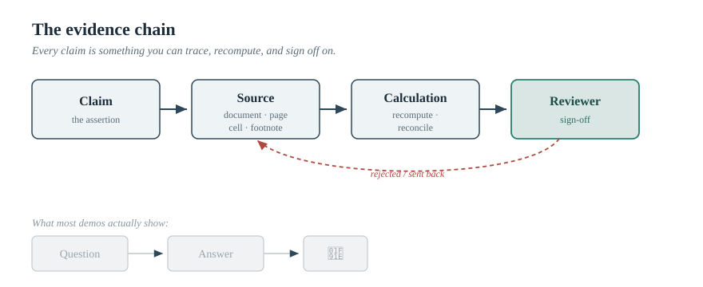

> *The AI Operating Manual for Investment Firms* — Essay 06

# Covenant Extraction Is Not PDF Summarization

### Of every job in finance you could point an AI at, private-credit covenant work is the one where the technology matters most and the demos lie hardest. A credit agreement is a hundred-plus pages of defined terms that reference other defined terms, and "summarize the covenants" is precisely the wrong instruction. Here is what the work actually demands — and why a wrong number here is a loss, not a typo.

*By [YOUR NAME] · [DATE] · ~17 min read · Nothing here is investment advice or legal advice.*

---

Private credit has spent the last decade moving from the edge of the financial system to its center. Global assets under management now sit in the low trillions — estimates cluster around $2 trillion and run higher depending on what you count — with credible forecasts pointing toward $3–4 trillion by the end of the decade, and direct lending now rivaling the broadly syndicated loan market in size.[^market] But the more interesting development for anyone building or buying AI is the second-order one: as the asset class has scaled, investors and regulators have started applying tighter scrutiny to underwriting, reporting quality, and risk management.[^scrutiny] The market is, as one outlook put it, becoming less forgiving.

That combination — enormous document volume, real money at stake, and rising demand for defensible process — is why covenant work is the single best argument for the deterministic-extraction thesis I laid out in the last essay. It is also why it is the workflow where a polished AI demo will most reliably mislead you. Because the thing that breaks here is not summarization. It is *meaning*.

This essay is about the hardest version of the document problem in all of finance, and what it actually takes to do it in a way you could defend to an investment committee, an LP, or an examiner.

---

## Why a credit agreement is not a document — it's a system of definitions

Hand a frontier model a credit agreement and ask it to "summarize the covenants," and it will give you a fluent, confident, plausible answer. It will also, with disturbing regularity, be wrong in ways you cannot see — and the reason is structural, not a matter of model quality.

A credit agreement is not prose with some numbers in it. It is a closed system of **defined terms that reference other defined terms.** The maintenance covenant says leverage shall not exceed 5.0x. Simple — until you realize that "Leverage Ratio" is a defined term, which depends on "Consolidated Total Debt" (another defined term, with its own inclusions and exclusions) over "Consolidated EBITDA" (a defined term that may run three pages and incorporate a dozen permitted **add-backs** — cost savings, synergies, run-rate adjustments, often subject to caps and lookback periods). The "5.0x" is the easy part. The number that actually matters — the *computed* leverage ratio you compare against it — is the output of a chain of definitions that a naive read flattens into nothing.

And it gets harder, because the agreement is built to have exceptions:

- **Baskets and carve-outs.** The negative covenants prohibit incurring debt, making restricted payments, granting liens — *except* through a thicket of permitted baskets, some fixed-dollar, some "grower" baskets that scale with EBITDA, some that build and get used over time. Knowing the covenant without knowing the baskets is knowing nothing. In private credit specifically, these carve-outs have grown more elaborate, not less.
- **EBITDA add-backs.** The single most litigated, most negotiated, most easily-misread feature of modern credit. What counts as "Consolidated EBITDA" determines every ratio in the document. An add-back read wrong — included when capped, uncapped when limited, applied outside its lookback window — silently corrupts the leverage and coverage calculations downstream.
- **MFN, thresholds, and step-downs.** Most-favored-nation provisions on pricing; covenant levels that step down over the life of the loan; thresholds that trigger different obligations. A covenant level is not a constant — it's often a schedule.
- **Amendments, side letters, and waivers.** The agreement you were handed may have been amended three times. The operative covenant lives in the fourth amendment, the relevant add-back was expanded in a side letter, and a prior breach was waived in a letter that isn't in the main file. Read only the original and you are confidently analyzing a document that no longer governs.

This is why "summarize the covenants" is the wrong instruction. Summarization compresses and discards; covenant work requires the opposite — preserving an exact, interconnected structure where the discarded detail *is* the risk. The task is not to read the document. It is to *reconstruct the system the document encodes.*

> *Figure 1 — A covenant is not a number — it's a chain. The maintenance covenant ("Leverage ≤ 5.0x") is the easy part. What actually gets tested is the output of a definition chain: Leverage Ratio → Consolidated Total Debt ÷ Consolidated EBITDA → permitted add-backs (capped · lookback-limited) + baskets/carve-outs + amendments/side letters. The threshold is trivial. The computed value is where it goes wrong.*

---

## Extraction vs. validation: the two jobs people merge into one

Here is the distinction that separates a useful covenant system from a dangerous one — and it maps directly onto the deterministic-extraction argument. There are two different jobs, and most tooling, and most pitches, blur them together.

**Extraction** is pulling the structure out of the agreement: identifying every financial, negative, affirmative, and reporting covenant; capturing each defined term and its dependencies; recording thresholds, baskets, add-backs, step-down schedules, and the amendments that modify them. This is hard, and it is where the current crop of tools concentrates — and where ParseBench's finding bites, since a credit agreement is exactly the kind of dense, table-and-clause-heavy document where parsers diverge.[^parsebench]

**Validation** is the harder, less glamorous, more valuable job: confirming the extracted structure is *correct*, and then confirming the *computed values* derived from it are correct. Does the extracted leverage definition actually match the agreement, clause for clause? When you compute the leverage ratio from the borrower's reporting, does the math foot, are the add-backs applied within their caps and lookbacks, is the result reconciled against what the borrower itself reported? And — the deterministic-layer hallmark from the last essay — does the system *abstain* when a definition is ambiguous or a required input is missing, routing it to a human rather than inventing a clean answer?

The reason this matters is the reason the whole series matters: a covenant tool that *extracts* fluently and *validates* weakly is precisely the "looks finished, might be wrong" trap, applied to a number where being wrong is a realized loss. An IC memo that states a leverage covenant of 5.0x with 0.4x of headroom, built on an add-back the model misread, is not a harmless hallucination. It is a credit decision made on a false premise.

The strongest tools — and the strongest internal builds — treat extraction as table stakes and compete on validation: clause-level citation to the exact page and section, confidence scores, reconciliation of computed ratios, and an explicit "ambiguous / conflicting / not found → human review" path. That is the deterministic extraction-and-validation layer from Essay 05, pointed at the hardest documents in finance.

> *Figure 2 — Extraction is table stakes. Validation is the moat. Top band (neutral): identify covenants · capture defined terms & dependencies · record thresholds, baskets, add-backs, step-downs, amendments — hard, and where most tools concentrate. Bottom band (accent): structure matches the agreement clause-for-clause · computed ratios footed & reconciled · add-backs within caps/lookbacks · clause-level citation + confidence · abstain → human review for ambiguity — harder, less glamorous, and where defensibility lives. "A tool that extracts fluently and validates weakly is the 'looks finished, might be wrong' trap — applied to a number where wrong is a loss."*

---

## The recurring job: borrower monitoring and covenant headroom

One-time extraction at underwriting is valuable, but the place covenant AI earns its keep over and over is **ongoing monitoring** — and it's where the manual status quo is most obviously broken.

Building a full covenant model for a single agreement takes a junior analyst a day or two. For a hundred-borrower book, that work is never truly finished, so teams build careful models for their most important positions and track the rest more loosely — and the loosely-tracked positions are not necessarily the lower-risk ones.[^monitoring] That gap is the opportunity. A monitoring workflow that ingests each borrower's monthly or quarterly reporting, recomputes covenant headroom automatically, and surfaces trajectory — flagging when a borrower's leverage is *trending toward* a maintenance threshold well before it breaches, rather than after — turns a pile of static agreements into a live early-warning system.[^monitoring]

The design rules are the ones that run through everything in this series, and they are non-negotiable here because the stakes are:

- **Recompute, don't restate.** Headroom is a calculation, and the calculation must be re-run against the actual reporting and the validated definition — not lifted from a prior memo or the borrower's own compliance certificate without a check. (The borrower's certificate is itself a claim to be verified, not a source of truth.)
- **Trajectory, not just status.** "In compliance" is a snapshot. "Leverage has moved from 4.1x to 4.6x over two quarters against a 5.0x covenant stepping down to 4.75x next quarter" is a decision-relevant signal. The value is in the trend and the forward step-down, surfaced early.
- **Source-of-record discipline.** Which reporting package is authoritative, for which period? This is the wrong-source/wrong-period problem from the last essay, and it is acute in monitoring, where stale or superseded financials circulate.
- **Monitored is not covered.** An alert opens a piece of work for a credit professional. It does not change a risk rating or a reserve on its own. The model widens the perimeter of what you watch; it does not shrink the perimeter of what a person decides.

> **🔧 PERSONAL EXPERIENCE SLOT — replace before publishing.** *The most credible thing you could add here: a real, anonymized instance where covenant headroom was mis-stated — an add-back applied wrong, a step-down missed, a waiver that lived in a side letter no one had modeled — and what it meant (or nearly meant) for the position. Or a concrete monitoring win: "the trajectory flag caught a borrower drifting toward its leverage covenant a quarter before the compliance certificate would have." A lived story from inside a credit process will land harder than any feature list. Redact anything confidential, and mind MNPI.*

---

## The IC evidence pack: the actual product

If there is a single deliverable that captures what good covenant AI should produce, it is not a summary and not a dashboard. It is an **investment-committee evidence pack** — and reframing the output this way is the whole pitch.

A credit committee does not need the AI's opinion on whether to lend. It needs to see the evidence behind a recommendation, organized so that judgment can be applied to it: here is each covenant and its level; here is the defined term it depends on, quoted from the agreement with a clause-level citation; here is the computed ratio and the arithmetic behind it; here are the add-backs applied and the caps they respect; here are the baskets and their current usage; here is the amendment history that modified any of it; and — explicitly — here is what the model extracted versus what a credit professional has reviewed and approved.

That last line is the product. The entire value of bringing AI to this workflow is not speed; it is producing work whose evidence chain is *inspectable* — where every number traces to a clause, every computation can be checked, and the boundary between machine extraction and human judgment is drawn on the page. A credit memo that asserts numbers is a liability. A credit memo where every number is a link to its source clause and a visible calculation is an asset — defensible to the IC today, and to an LP or examiner later.

> *Figure 3 — The Evidence Chain, labelled for credit. Claim (covenant level / computed ratio) → Source (agreement § · page · defined term · amendment) → Calculation (recompute ratio · apply add-backs within caps · reconcile to reporting) → Reviewer (credit professional sign-off), with the "ambiguous / conflicting → human review" loop. This is the IC evidence pack.*

---

## What the whole category is still getting wrong

Here is the honest state of the market, and it is not "nobody does this." Covenant extraction is now a contested space — contract-analysis platforms, generative legal-AI tools, credit-document-intelligence providers, and a wave of private-credit-specific agents are all here, several advertising very high extraction accuracy and source-linked clauses.[^landscape] Pretending the field is empty would be the kind of claim this brand doesn't make. The gap is more specific, and more useful to name — and I'll keep it at the category level rather than singling anyone out, because it's a pattern, not a vendor flaw:

**Extraction is marketed; validation is assumed.** The demos show clauses identified and covenants pulled into a table. They rarely show the computed leverage ratio reconciled against the borrower's reporting, the add-backs checked against their caps, or the abstention behavior when a definition is ambiguous. Extraction is the demoable 80%; validation of the *computed value* is the hard, invisible 20% that decides whether the number is right.

**"99% accuracy" is a claim about the wrong thing — and untested on your book.** Accuracy on *what*, measured *how*, on *whose* documents? Identifying that a leverage covenant exists is not the same as correctly computing the leverage ratio under that covenant's specific definition, with that borrower's specific add-backs. A headline accuracy figure with no stated methodology, on a vendor's chosen documents, tells you very little about performance on your messiest amended-and-restated agreement. In a space this crowded, an accuracy number you can't interrogate is marketing, not evidence.

**Defined-term reasoning is the real test, and the hardest to verify.** The thing that actually distinguishes a credit-grade system from a clever document chatbot is whether it follows the definition chain correctly — resolving "Consolidated EBITDA" through its add-backs and caps, not just locating the phrase. This is precisely what's hardest to assess from a demo and most consequential in production.

**The wrong-source/wrong-period problem is acute and under-addressed.** With amendments, side letters, restatements, and multiple reporting packages in circulation, "which document governs, for which period" is a first-order question — and, as OfficeQA Pro demonstrated on a different corpus, agents tend to stop at the first plausible answer rather than the authoritative one.[^officeqa]

**The human line is often blurred.** This is MNPI-adjacent, fiduciary, high-stakes work. A system that doesn't clearly separate what it extracted from what a person approved — and doesn't fail safely to human review on ambiguity — is producing exactly the false confidence that gets a firm in trouble.

The point of naming these is not to disparage the tools. It is that a buyer cannot tell, from a demo, which of them actually do the hard part. The only way to know is to measure on your own agreements.

---

## How to actually deploy this

The right approach is the one this whole series argues for: narrow, measured, and validated against work you already trust. A sane sequence:

Start with **extraction on the existing book**, because it produces immediate, measurable value — a complete covenant model where, for a meaningful share of borrowers, one may not fully exist today.[^monitoring] Set up the **security and data architecture in parallel and first** — data classification, vendor assessment, private/no-train deployment — because this is MNPI-adjacent and that is not optional. Then **validate against history**: run the system on agreements your team has already modeled by hand, ingest several recent quarters of borrower reporting, and confirm the system's covenant calculations match your team's historical work — noting both where it errs and where it catches something the team missed. Only once the parallel run earns the team's trust do you make it the **primary monitoring tool with human oversight**, where analysts review AI outputs rather than building from scratch, and the system improves as edge cases are incorporated.[^buildguide]

Two non-negotiables throughout: **measure accuracy on your own agreements** — build a covenant-extraction eval from your actual credit agreements and lead your tooling decision with the number, not the demo; and **keep the human as the control point**, with abstention-to-review wired in, because the cost of a silent error here is a credit loss.

> **🔧 PERSONAL EXPERIENCE SLOT — replace before publishing.** *A second strong spot: a real deployment or evaluation you ran — what the parallel run revealed, where the tool matched the team and where it diverged, what an honest accuracy number looked like on genuinely hard agreements. Concrete and slightly unflattering is more credible than triumphant.*

---

## Why this is the best GenAI use case in finance — and the most unforgiving

Put it together and covenant work sits at a rare intersection. The documents are long, dense, repetitive, and high-stakes — exactly where automation should pay off most. The core questions are deterministic — a leverage ratio under a defined term either computes to 4.6x or it doesn't — exactly where the extraction-and-validation tier belongs. And the output, done right, is an evidence pack that makes a credit decision more defensible, not less — exactly what a scrutinized, scaling asset class needs.

But it is unforgiving in equal measure, and that is the point. A wrong number in a market research deck is an embarrassment. A wrong covenant calculation in an IC memo is a mispriced risk, a missed early warning, or a breach you didn't see coming. The asymmetry is the whole reason this is a deterministic-extraction problem and not a summarization one: the cost of "looks right, is wrong" is not reputational here. It is financial.

So the firms that win covenant AI will not be the ones with the slickest extraction demo or the highest unqualified accuracy claim. They will be the ones who treated extraction as the easy part, built or bought genuine validation — clause-level citation, recomputed and reconciled ratios, defined-term reasoning, source-of-record discipline, and honest abstention — and measured it on their own agreements before trusting it. They will produce covenant work where every number traces to a clause and a calculation, and where the line between machine and judgment is drawn on the page.

**A credit agreement is a system of definitions. Reading it is not the job. Reconstructing the system, validating the numbers it produces, and being able to prove both — that is the job. Summarization was never going to get you there.**

---

### Where this goes next

This is Essay 06 of *The AI Operating Manual for Investment Firms*, and the most demanding application of the deterministic-extraction thesis from Essay 05. From here the series turns to the buyer who has been watching all of this from the compliance seat: the next essays take up RIA AI governance — what a chief compliance officer should actually ask before allowing these tools — and the real cost model behind build-versus-buy. The spine holds: the advantage is in the workflow, the evidence, and the controls — not the subscription, not the citation, and not the demo.

> **Practical next step.** Take one credit agreement your team has already modeled by hand — ideally an amended-and-restated one with real add-backs and a step-down. Run whatever AI tool you're considering against it, and check three things: did it follow the *defined-term chain* to the right computed ratio, did it pick up the *amendments and side letters*, and does every extracted covenant carry a *clause-level citation* you can click? Then ask the vendor how it *validates* the computed value and what it does when a definition is *ambiguous*. The answers separate a credit-grade system from a document chatbot.

> **[SOFT CTA — your words.]** *I help private-credit teams turn covenant work from manual spreadsheets and fluent-but-unverified AI into a validated, defensible process — extraction, defined-term reasoning, recomputed headroom, IC evidence packs, and an accuracy benchmark on your own agreements. If you're evaluating covenant tools and can't tell who actually does the hard part, [get in touch / subscribe / download the covenant-extraction evaluation checklist below].*

> **[LEAD MAGNET — build before launch.]** *Gate a "Covenant Extraction & Validation Checklist": defined-term chain (leverage / coverage / EBITDA add-backs and caps), baskets & carve-outs, MFN and step-down schedules, amendment/side-letter capture, source-of-record rules, clause-level citation, computed-ratio reconciliation, and the abstention-to-review test — plus a template for benchmarking a tool on your own agreements. This is the highest-ticket lead magnet in the series; it speaks directly to a credit PM, CIO, or COO.*

---

## Sources

*Verify each against the primary link before publishing. Market-size figures vary by source and definition; I've given a range rather than a single number on purpose. The competitive landscape is described at the category level rather than ranking vendors.*

[^market]: Global private-credit AUM estimates cluster in the low trillions and vary by definition. Examples: AIMA/ACC, "Financing the Economy 2025," puts the global market at ~US$3.5 trillion AUM (https://www.aima.org/article/press-release-strong-growth-sees-private-credit-market-reach-us-3-5-trillion.html); Moody's projects AUM exceeding $2 trillion in 2026 and approaching $4 trillion by 2030 (https://www.moodys.com/web/en/us/insights/credit-risk/outlooks/private-credit-2026.html); Cleary Gottlieb notes direct lending at $1.5–2 trillion, matching the broadly syndicated loan market, forecast toward $3 trillion by 2028 (https://www.clearygottlieb.com/news-and-insights/publication-listing/outlook-for-private-credit-in-2026). State the range, not a single figure.

[^scrutiny]: On rising scrutiny of underwriting, reporting quality, and risk management as the market scales, see e.g. Percent's 2026 Private Credit Outlook ("the market is becoming less forgiving"): https://www.prnewswire.com/news-releases/percent-releases-2026-private-credit-outlook-growth-continues-as-scrutiny-intensifies-302662163.html ; and With Intelligence, "Private Credit Outlook 2026": https://www.withintelligence.com/insights/private-credit-outlook-2026/

[^parsebench]: LlamaIndex, "ParseBench: A Document Parsing Benchmark for AI Agents," arXiv:2604.08538 (April 2026). ~2,000 human-verified enterprise pages (finance/insurance/government), 169K+ test rules across five dimensions (tables, charts, content faithfulness, semantic formatting, visual grounding); across 14 methods, no method was consistently strong across all five — a "fragmented capability landscape," with visual grounding framed as required for auditability in regulated workflows. https://arxiv.org/abs/2604.08538

[^monitoring]: On the manual status quo and the monitoring/headroom workflow — building a full covenant model per agreement takes a junior analyst 1–2 days, the work is never fully done across a 100+ borrower book, less-carefully-tracked positions are not necessarily lower-risk, and a covenant agent can flag a borrower trending toward a maintenance threshold ~60–90 days before breach — see WorkWise Solutions, "Best AI Agents for Private Credit Firms" (2026): https://workwisesolutions.org/guides/best-ai-agents-private-credit-2026.html (third-party practitioner guide; treat operational specifics as illustrative and confirm against your own process).

[^officeqa]: Databricks AI Research, "OfficeQA Pro: An Enterprise Benchmark for End-to-End Grounded Reasoning," arXiv:2603.08655 (March 2026). On a revised-and-reissued document corpus, agents "stop searching once they find a plausible answer," missing the most authoritative or up-to-date source despite being prompted to find the latest — the wrong-source/wrong-period failure mode. Structured parsing yielded a 16.1% average relative accuracy gain. https://arxiv.org/abs/2603.08655

[^landscape]: The AI covenant-review landscape spans contract-analysis platforms (e.g., Kira, Luminance), generative legal AI (e.g., Harvey, Legora), credit-document intelligence (e.g., Octus / Covenant Review), and private-credit-specific extraction/monitoring tools (e.g., V7 Go, Keye), with several advertising high extraction accuracy and source-linked clauses. See, e.g., WorkWise Solutions buyer's guide, "AI for Credit Agreement and Covenant Review": https://workwisesolutions.org/guides/ai-credit-agreement-covenant-review.html and "AI Tools for Private Credit in 2026": https://privatecreditpulse.substack.com/p/ai-tools-for-private-credit-in-2026 (third-party guides; vendor capability claims are theirs and should be verified directly and benchmarked on your own documents).

[^buildguide]: On the recommended phased deployment (configure to the fund's covenant library, ingest ≥4 quarters of history, validate against the team's historical work in a parallel run, then transition to AI-first monitoring with human oversight), see WorkWise Solutions, "AI for Private Credit & Direct Lending: The Complete Guide (2026)": https://workwisesolutions.org/guides/ai-private-credit-complete-guide.html (third-party practitioner guide; adapt to your own controls).
