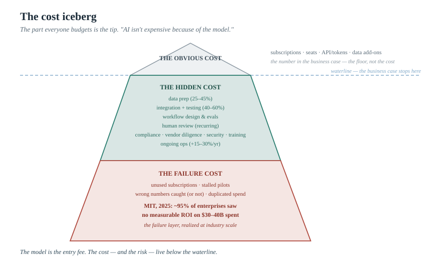
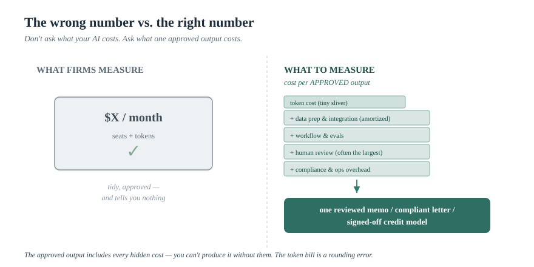

> *The AI Operating Manual for Investment Firms* — Essay 08

# The Real Cost of GenAI in an Investment Firm: Tokens Are the Smallest Part

### When a firm asks "what will AI cost us," it looks at the invoice from OpenAI or Anthropic. That number is real, and it is the least important figure in the entire budget. The cost that decides whether the investment pays off lives in five places the business case almost never includes — and the data on where AI spending actually fails is unambiguous about which ones.

*By [YOUR NAME] · [DATE] · ~15 min read · Nothing here is investment advice.*

---

Ask a fund COO or an RIA principal what their AI costs, and you'll usually get an answer denominated in subscriptions: so many Claude seats, so much API usage, a data add-on or two. It's a clean number, it fits on a line, and the CFO can approve it. It is also, for the purposes of deciding whether AI will actually pay off, close to irrelevant.

Here is the uncomfortable arithmetic the vendors are not incentivized to walk you through: the model is the *entry point*, not the cost. The license fee or token bill is the smallest component of what it takes to get one defensible, AI-assisted output out the door — and the components that dominate the total are precisely the ones missing from the business case that got signed. As one enterprise-AI cost analysis put it bluntly, "AI isn't expensive because of the model."[^cio] The expense lives in everything around it.

This matters for an investment firm more than for most businesses, because the work is high-stakes and regulated — a wrong output isn't a bug, it's a liability, which means the "around-it" costs (verification, review, controls) aren't optional extras. So this essay does something unglamorous and useful: it lays out where the money actually goes, anchors it to the data on where AI spending succeeds and fails, and gives you the one unit of measurement that turns AI from a leap of faith into a managed investment.

---

## The number that should reframe the conversation

Start with the finding that ought to be on the wall of every firm contemplating an AI budget. In July 2025, MIT's Project NANDA published *The GenAI Divide: State of AI in Business 2025* — built on 150 leader interviews, 350 employee surveys, and analysis of 300 public deployments. Its headline: despite an estimated **$30–40 billion** in enterprise generative-AI spending, roughly **95% of organizations were seeing no measurable return** on the P&L. Only about 5% of pilots were extracting real value.[^mit]

Now the part that matters for a cost essay, because it tells you *why* the money evaporated. MIT was explicit that the failure was **not the quality of the AI models.** It was the "learning gap" — flawed integration into actual workflows, and misaligned spending. More than half of GenAI budgets went to sales-and-marketing tools, where the ROI was *lowest*; the real returns sat in less glamorous back-office automation.[^mit] In other words: the firms that lost their money didn't lose it on tokens or on a weak model. They lost it on everything the model doesn't do by itself — and on pointing the spend at the wrong work.

That is the whole thesis of this essay, validated at the scale of tens of billions of dollars: **the cost and the risk of GenAI live outside the model.** If you budget for the subscription and assume the rest is free, you are budgeting like the 95%.

---

## The iceberg: three layers of cost

Think of GenAI cost as an iceberg. The part above the waterline — the part everyone budgets — is the smallest. There are three layers, and they grow as they go down.

**Layer 1 — the obvious cost (above the waterline).** Model subscriptions and seats, API/token usage, data add-ons. This is the number in the business case. It's real, it's plannable, and a structural shift is making it less predictable than it looks: vendors are moving from flat per-seat pricing toward **hybrid consumption models**, because each new model generation — bigger context windows, heavier reasoning — consumes materially more compute, so the bill increasingly scales with use rather than sitting fixed at the seat price you negotiated.[^pricing] Even so, this layer is the *floor*, not the cost.

**Layer 2 — the hidden cost (just below the waterline).** This is where the budget actually goes, and the figures are remarkably consistent across the industry:

- **Data preparation** — getting filings, transcripts, CRM data, research archives, portfolio files into a state an AI can use. Multiple 2026 cost analyses put this at **25–45% of total project cost**, and an even larger share of the *time*; when data is fragmented or locked in separate systems, the work to make it usable can exceed the cost of the model work itself.[^data]
- **Integration** — connecting AI to existing systems (CRM, portfolio, document stores), with authentication, data mapping, and access controls. For enterprise deployments, integration engineering plus quality testing together routinely run **40–60% of total build cost.**[^integration]
- **Workflow design, retrieval tuning, and evals** — the engineering to make the thing reliable on your documents (the deterministic extraction-and-validation work from earlier essays doesn't build itself).
- **The human review layer** — in a regulated firm, every client-facing or numbers-bearing output needs a reviewer. That reviewer's time is a real, recurring cost of producing an *approved* output — and it never goes away.
- **Compliance, vendor diligence, security, and training** — Reg S-P vendor oversight, the AI usage policy and its enforcement, staff who actually know how to use the tools. Deloitte's 2026 enterprise survey named the **skills gap** the single biggest barrier to AI integration.[^integration] Governance and security costs are growing fast as a share of the total.
- **Ongoing operations** — monitoring, retraining, scaling. Frequently underestimated, this typically adds **15–30% of the initial build cost every year**, and tends to surprise teams in months three through six as usage scales.[^ops]

**Layer 3 — the failure cost (deep below the waterline).** The most expensive layer, and the one no one budgets at all: the cost of paying for capability that goes unused or produces unusable work. Unused subscriptions. Pilots that never reach production. Wrong numbers that have to be caught and corrected (or aren't). A wrong figure in a client deliverable or an IC memo — reputational at best, a mispriced risk or a Marketing Rule problem at worst. Duplicated vendor spend across teams that didn't coordinate. The MIT 95% *is* this layer, quantified: tens of billions spent, no return — the failure cost realized at industry scale.[^mit]

> *Figure 1 — The cost iceberg. Above the waterline (small tip): "THE OBVIOUS COST — model subscriptions · seats · API/tokens · data add-ons → the number in the business case." Just below (larger): "THE HIDDEN COST — data prep (25–45%) · integration + testing (40–60%) · workflow & evals · human review · compliance, vendor diligence, security, training · ongoing ops (+15–30%/yr)." Deep below (largest): "THE FAILURE COST — unused subscriptions · stalled pilots · wrong numbers · duplicated spend · the 95% with no measurable ROI." The part everyone budgets is the tip. "AI isn't expensive because of the model."*

---

## Why the model is the cheapest thing you'll buy

It's worth dwelling on the counterintuitive core, because it inverts how most firms reason about this.

The frontier models are, in the scheme of a finance workflow, a near-commodity you rent cheaply. Running a capable model through an API costs pennies per request. The expensive part is everything required to make those pennies produce something a regulated investment firm can actually use and defend: clean data pointed at it, a workflow around it, an evidence layer beneath the numbers, a human accountable at the end, and the compliance scaffolding to survive an exam. The model reads the document in seconds; the cost is in being able to *trust and defend* what it read — which is the entire argument of the document-factory and "retrieval is not evidence" essays, now expressed as a budget.

This also explains the most consistent finding in the failure data, and it bears directly on build-vs-buy. MIT found that purchasing from specialized vendors and partnering succeeded about **67% of the time, while internal builds succeeded roughly one-third as often.**[^mit] Read that through the cost lens: building internally means *you* absorb all of Layer 2 — the data, integration, workflow, eval, and ops costs — and most firms underestimate every one of them. That doesn't mean never build; it means the build decision has to be priced with Layer 2 fully loaded, not as "we'll just stand up a model." The cost-aware version of build-vs-buy-vs-configure (from the document-factory essay) is simply: buy the commoditized layers where a vendor absorbs the hidden costs at scale, build only where the workflow is your genuine edge and you've honestly priced the iceberg, and own the verification-and-review layer regardless because it's a recurring cost no purchase removes.

---

## The one number that changes everything: cost per approved output

If the obvious cost is the wrong number, what's the right one? Stop asking *"what is our AI bill?"* and start asking *"what does it cost us to produce one approved output?"*

That reframing is the single most useful move in this entire essay, and it isn't theoretical — it's how a global bank already runs the math. Citi's technology leadership tracks AI not by spend but by a **"capacity" metric**: if a task done by a human 100 times costs X, and AI does it at cost Y, the firm can price the actual gain.[^citi] That's cost-per-output thinking at institutional scale, and it works because it forces every hidden cost into the denominator. The "one approved output" — one reviewed earnings memo, one compliant client letter, one signed-off credit memo, one verified covenant model — *includes* the data prep, the workflow, the review time, and the compliance overhead, because you can't produce the approved output without them. The token cost is a rounding error inside it.

The unit also exposes the failure layer automatically. If you're measuring cost per approved output and the number is absurd, it's telling you something real: the workflow isn't working, the review burden is too high, the tool is producing too much that gets rejected, or the use case was wrong. A firm tracking only its subscription bill sees a tidy, approved number and learns nothing. A firm tracking cost per approved output sees the truth.

Pick the unit to fit the workflow:

- cost per **reviewed research memo**
- cost per **compliance-reviewed client communication**
- cost per **signed-off credit memo or covenant model**
- cost per **analyst-hour genuinely saved** (net of review time)
- cost per **approved pitchbook or report**

> *Figure 2 — The wrong number vs. the right number. Left, "WHAT FIRMS MEASURE": a clean invoice — "$X / seats + tokens" — tidy, approved, and tells you nothing. Right, "WHAT TO MEASURE": cost per APPROVED output — a stack feeding one box: token cost (tiny sliver) + data prep + workflow + human review + compliance → "one reviewed memo / compliant letter / signed-off credit model." The approved output includes every hidden cost — because you can't produce it without them. The token bill is a rounding error inside it.*

---

## A practical cost framework

To make this usable, here's how to actually build the number for one workflow before scaling it — the same "start narrow, measure, then scale" discipline that runs through this series.

Take one workflow (say, the earnings memo). Estimate the **fully loaded cost per approved output**: the model/token cost (small), plus the amortized data and integration setup, plus the per-output human-review time (often the largest recurring piece in a regulated firm), plus an allocation for compliance, vendor, and ongoing-ops overhead. Then compare it honestly against the **old cost** — what the analyst's time cost to produce the same output the manual way. The gain is the difference, and it's only real if you've counted the review time, not pretended it away.

Two cost traps to name, because they're where firms fool themselves. First, the **review-time trap**: AI that drafts in seconds but requires 40 minutes of senior review hasn't saved what it appears to — and in a regulated firm the review isn't optional, so it belongs in every calculation. Second, the **"small experiment" trap**: as one CIO put it, low-cost experiments quietly evolve into complex, always-on systems that behave like core infrastructure — and get budgeted like an experiment long after they've become infrastructure.[^cio] What starts as a $20-a-seat pilot becomes a production dependency with data, integration, and ops costs nobody re-budgeted.

> **🔧 PERSONAL EXPERIENCE SLOT — replace before publishing.** *The most credible thing you could add: a real cost reckoning you've seen — a firm that budgeted the subscription and got blindsided by the integration or review bill; a pilot that looked cheap until the data-prep cost landed; or a genuine cost-per-approved-output number from a workflow you ran (even a rough one). A lived "here's what it actually cost, versus what we thought" story will land harder than any industry percentage. Redact specifics.*

---

## What this means for the decision

Pull it together and the cost lens clarifies the decisions the rest of this series has been circling.

It tells you **where to point AI**: not at the most visible or exciting use case, but at the repeated, document-heavy, reviewable workflow where the fully-loaded cost per approved output beats the manual cost — which, per MIT, is usually the unglamorous back-office work, not the splashy front-office demo.[^mit] It tells you **build vs. buy**: buy where a vendor absorbs the hidden-cost iceberg at scale; build only where the workflow is your edge *and* you've priced Layer 2 honestly. It tells you **how to measure**: cost per approved output, not subscription spend, because only the former includes the costs that actually determine the return. And it tells you **why most AI spending fails** — not weak models, but unbudgeted integration, unmeasured review burden, and use cases pointed at the wrong work.

The firms that get real value from GenAI won't be the ones that found the cheapest model or the ones that spent the most. They'll be the ones who understood that the model was the entry fee, priced the whole iceberg, pointed the spend at workflows where the approved output genuinely costs less than the manual one, and measured it honestly enough to kill what wasn't working.

**Don't ask what your AI costs. Ask what one approved output costs — and whether that's less than doing it the old way.** That question, answered honestly, is the difference between the 5% and the 95%.

---

### Where this goes next

This is Essay 08 of *The AI Operating Manual for Investment Firms*. The cost lens completes the build-vs-buy argument from the document-factory essay and the governance argument from the RIA essay — what you can afford to build, what you should buy, and what an approved output actually costs. From here the series turns to the investor's side of the table: the AI due-diligence questionnaire that allocators are increasingly putting in front of managers, and what a fund must be ready to answer. The spine holds: the advantage is in the workflow, the evidence, and the controls — not the subscription.

> **Practical next step.** Take one AI workflow your firm runs and try to compute its fully-loaded cost per approved output — token cost, plus a fair share of setup, plus the actual review time, plus compliance overhead. Then compare it to what the manual version costs. If you've never done this math, you don't yet know whether your AI is saving money or quietly costing it. That number is where cost discipline begins.

> **[SOFT CTA — your words.]** *I help investment firms see the real cost of GenAI — the hidden integration, review, and compliance layers the business case omits — and build a cost-per-approved-output model that tells them which workflows actually pay off and which to kill. If your AI budget is a subscription line and nothing more, [get in touch / subscribe / download the cost-per-approved-output worksheet below].*

> **[LEAD MAGNET — build before launch.]** *Gate a "Cost-Per-Approved-Output Worksheet": the cost iceberg checklist (obvious / hidden / failure layers), a per-workflow calculator (token + amortized setup + review time + compliance overhead), the review-time and "small-experiment" traps, and a build-vs-buy cost comparison. This is the natural lead magnet for a CFO/COO buyer and pairs with the build-vs-buy scorecard from the document-factory essay.*

---

## Sources

*Verify each against the primary link before publishing. Cost percentages vary by source and deployment type; I've given ranges rather than single figures on purpose, and a firm's own numbers will differ — these are directional, not benchmarks.*

[^mit]: MIT Project NANDA, "The GenAI Divide: State of AI in Business 2025" (July 2025). Based on ~150 leader interviews, 350 employee surveys, and 300 public AI deployments: despite an estimated $30–40 billion in enterprise GenAI spending, ~95% of organizations saw no measurable P&L return (only ~5% of pilots extracted significant value); the report attributes failure to the "learning gap" / poor workflow integration rather than model quality, notes >50% of budgets went to sales/marketing where ROI was lowest (vs. higher returns in back-office automation), and found buying from specialized vendors + partnering succeeded ~67% of the time vs. internal builds succeeding ~1/3 as often. Coverage: Fortune, https://fortune.com/2025/08/18/mit-report-95-percent-generative-ai-pilots-at-companies-failing-cfo ; report context: https://www.healthcareitnews.com/news/mit-95-enterprise-ai-pilots-fail-deliver-measurable-roi . Confirm specifics against the MIT NANDA report directly.

[^cio]: On "AI isn't expensive because of the model" and the majority of cost coming from data prep, infrastructure, monitoring, retraining, and governance — plus the dynamic of low-cost experiments evolving into always-on infrastructure — see Commvault CIO Ha Hoang, via CIO Inc (April 2026): https://www.cio.inc/hidden-costs-enterprise-ai-most-cios-miss-a-31434

[^pricing]: On the structural shift from flat per-seat pricing toward hybrid seat-plus-consumption models (driven by newer models consuming materially more compute), see "The Hidden Costs of Enterprise AI" (Enterprise AI Procurement, March 2026): https://www.enterpriseaiprocurement.com.au/hidden-costs-enterprise-ai-budget/

[^data]: Data-preparation cost estimates vary by source and deployment: ~25–35% of project budget (CloudZero, with 50–70% of project *time*: https://www.cloudzero.com/blog/how-much-does-ai-cost/); ~15–25% rising to 30–40% in data-intensive deployments (TechAhead: https://www.techaheadcorp.com/blog/enterprise-ai-development-cost/); ~30–50% (Riseup Labs: https://riseuplabs.com/cost-of-implementing-ai-in-business/); up to ~45% of project *effort* (RTS Labs, citing HPC Wire: https://rtslabs.com/ai-development-cost/). Treat as directional ranges, not a single benchmark.

[^integration]: On integration engineering + quality testing accounting for ~40–60% of enterprise build cost, and Deloitte's "State of AI in the Enterprise 2026" (survey of 3,235 senior leaders) identifying the AI skills gap as the single biggest barrier to enterprise AI integration, see CloudZero: https://www.cloudzero.com/blog/how-much-does-ai-cost/

[^ops]: On ongoing operational costs (monitoring, retraining, scaling) typically adding ~15–30% of initial build cost annually and surprising teams in months 3–6 of production, see TechAhead: https://www.techaheadcorp.com/blog/enterprise-ai-development-cost/ and Riseup Labs: https://riseuplabs.com/cost-of-implementing-ai-in-business/

[^citi]: Citi's technology leadership tracks AI value via a "capacity" metric — the cost to perform a task by human (100x) vs. by AI — i.e., cost per output. Coverage: https://const-ins.com/how-citis-cto-is-rolling-out-new-gen-ai-productivity-tools-to-more-employees-across-the-globe/ ; see also Citi Stylus deployment, Banking Dive: https://www.bankingdive.com/news/citi-agentic-AI-tools-stylus-workspaces/760868/
