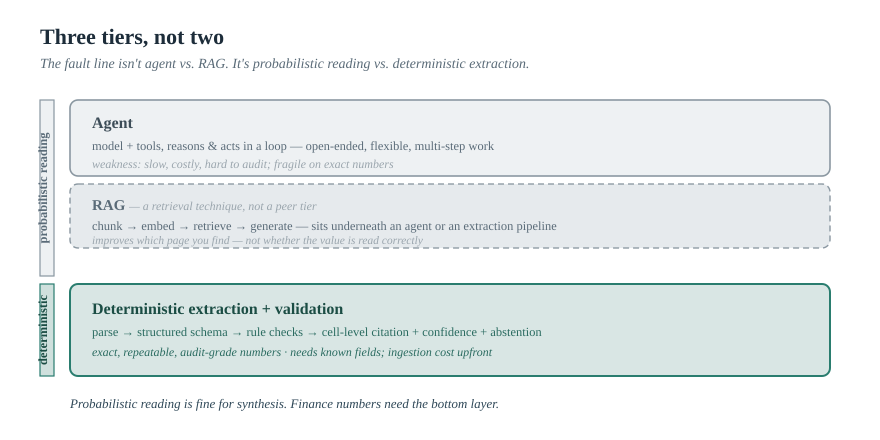
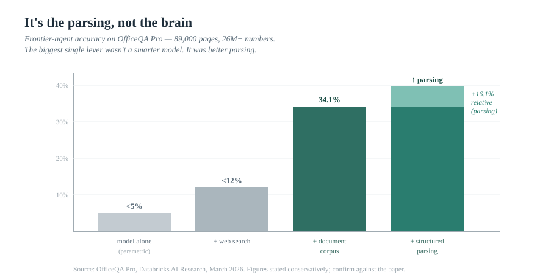

> *The AI Operating Manual for Investment Firms* — Essay 05

# Retrieval Is Not Evidence: Why "It Cited a Source" Still Gets Finance Wrong

### Everyone has converged on the same fix for AI hallucination: ground the model in your documents, show a citation, trust the answer. For synthesis, that works. For the number on slide 14, it quietly doesn't — and the reason exposes the most important architectural decision in financial AI. It isn't "agents vs. RAG." It's *probabilistic reading vs. deterministic extraction.*

*By [YOUR NAME] · [DATE] · ~16 min read · Nothing here is investment advice.*

---

By now the industry has settled on a reassuring story about AI accuracy. Raw language models hallucinate, the story goes, so you ground them: connect the model to your filings, your data room, your research archive; retrieve the relevant passage; show a citation next to the answer. The citation is the proof. Problem solved.

It is a good story, and for a large class of work it is true. For finance, it contains a quiet and expensive error — and naming that error precisely is the most useful thing this essay can do, because it turns out to be the single most important architectural decision a firm makes when it puts AI near its numbers.

Here is the error in one line: **a citation tells you the model found a document. It does not tell you the model read the number correctly.** Those are different claims, and the gap between them is exactly where a wrong figure hides — behind a real, clickable, entirely legitimate footnote.

---

## The reframe: it was never "agents vs. RAG"

Most discussion of this sorts the world into two buckets: agents over here, retrieval-augmented generation (RAG) over there, pick your architecture. That framing will get you picked apart by anyone technical, because it misses the actual fault line.

Agents and RAG are not opposites. They are both *probabilistic reading*. In both, a language model ends up looking at some retrieved text and transcribing what it sees — and in both, it can grab the wrong cell, misread "in thousands" as "in millions," or pull a figure from the wrong period (FY24 instead of Q4, reported instead of adjusted). RAG improves *retrieval* — finding the right page. It does nothing for *extraction correctness* — getting the value off that page exactly right. An agent adds tools and a reasoning loop on top, but the moment it reads a number out of a document, it is doing the same fragile thing.

The real dividing line runs somewhere else entirely — between **probabilistic reading** of any kind and **deterministic extraction with validation**: parse the document into a structured representation, pull values into a defined schema, run rule checks on them, and attach a cell-level citation, a confidence score, and the ability to *abstain* when the evidence is missing or conflicting.

So the picture is three tiers, not two:

| Tier | What it is | Good for | Where it breaks |
|------|------------|----------|-----------------|
| **Agent** | Model + tools, reasons and acts in a loop | Open-ended, multi-step, flexible work | Slow, costly, hard to audit; fragile on exact numbers |
| **RAG** | Chunk → embed → retrieve → generate | Search and synthesis over a large corpus | Retrieves *text*, not *validated values*; same extraction fragility |
| **Deterministic extraction + validation** | Parse → schema → rule checks → cell-level citation + confidence + abstention | Exact, repeatable, audit-grade numbers | Needs known fields/templates; ingestion cost upfront |

And the relationship between them matters: RAG is not a peer of "agent." RAG sits *underneath* an agent or an extraction pipeline as a retrieval technique. Pitch "agents vs. RAG" to a sophisticated buyer and they hear a category error. The line that actually predicts whether you can trust an output is the line between the first two tiers and the third.

> Probabilistic reading is fine for synthesis. Finance numbers need a deterministic extraction-and-validation layer.

> *Figure 1 — Three tiers, not two. The fault line isn't agent vs. RAG — both are probabilistic reading. The dividing line is between probabilistic reading and deterministic extraction with validation. RAG sits underneath both tiers as a shared retrieval substrate, not a peer column.*

---

## The evidence is now overwhelming — and recent

This is not a theoretical worry, and you no longer have to take it on assertion. Two benchmarks published in the last few months make the point with unusual force, and a third and fourth confirm it isn't new.

Start with the most brutal. In March 2026, Databricks released **OfficeQA Pro**, a benchmark built on roughly 89,000 pages of U.S. Treasury Bulletins spanning nearly a century — over 26 million numerical values, the kind of messy, table-heavy, partially-scanned corpus that actually resembles enterprise documents. The questions are designed to require finding the right figure across thousands of pages and then doing precise, "economic-grade" arithmetic on it. The results: frontier models scored **under 5% accuracy** relying on their own knowledge, **under 12%** even with web access, and — given direct access to the document corpus — **34.1% on average**, still failing more than half the questions.[^officeqa]

Then the finding that should reframe how every firm thinks about this. Databricks showed that handing the agents a **structured document representation** — produced by a dedicated parsing step rather than raw PDF — yielded a **16.1% average relative performance gain across models.**[^officeqa] Sit with that. The biggest single lever was not a smarter model. It was *better parsing.* How the AI *sees* the document mattered as much as the reasoning behind its eyes.

The second benchmark explains why parsing is so decisive. In April 2026, LlamaIndex released **ParseBench**, ~2,000 human-verified enterprise pages from finance, insurance, and government, with 169,000+ test rules across five dimensions: tables, charts, content faithfulness, semantic formatting, and **visual grounding** — tracing every extracted element back to its exact spot on the page, which the authors note plainly is "required for auditability in regulated workflows." Across fourteen methods, the headline was a **fragmented capability landscape: no method was consistently strong across all five dimensions.**[^parsebench] Read those five dimensions again — they are precisely the things a financial document demands, and the best tools are each good at some and weak at others.

And lest anyone object that this is a 2026 problem with 2026 models, it isn't new. Back in 2023, the Stanford/Patronus **FinanceBench** showed a leading model with a retrieval system answering incorrectly or refusing on **81%** of deliberately clear-cut questions about public filings — even with the documents in hand.[^financebench] And a 2026 financial-retrieval benchmark, **FinRetrieval**, found the same class of model scoring ~**90.8%** with a structured-data source versus ~**19.8%** on open web — a 71-point swing driven by the data layer, not the model.[^finretrieval] Four benchmarks, two years apart, all pointing the same direction.

The conclusion is no longer arguable: **the system around the model — how the document is parsed, where the number is retrieved from, and whether the value is validated — dominates the outcome far more than which model you use.** The model is not the bottleneck. The plumbing is.

> *Figure 2 — It's the parsing, not the brain. OfficeQA Pro accuracy: ~5% (model alone) → ~12% (+ web) → 34.1% (+ document corpus) → +16.1% relative gain from structured parsing on top. The biggest lever wasn't a smarter model — it was better parsing. Source: OfficeQA Pro, Databricks, March 2026.*

---

## Where retrieval fails on a financial number, specifically

Strip it down to mechanics and the failure points are specific, and obvious to anyone who has actually read a 10-K or a credit agreement:

- **Tables.** Financial statements *are* tables, and converting a PDF table to text is where most accuracy dies — merged cells, lost column alignment, multi-level headers, a "in thousands" stated once at the top and then forgotten, parentheses that mean *negative* read as ordinary digits. OfficeQA Pro's own error analysis named "table topology failures" — shifted rows, mangled structure — as a core failure mode.[^officeqa] A model handed a scrambled table will give you a confident, precise, wrong number.
- **Footnotes and defined terms.** The meaning of a figure often lives somewhere other than the figure. "Adjusted EBITDA" is defined by add-backs in a footnote; a covenant ratio is computed "as defined in the Credit Agreement" fifty pages away; a segment number rests on a reclassification in fine print. Retrieval that grabs the table but not the footnote produces a sourced, precise, wrong answer.
- **The wrong-source / wrong-period problem.** This is the one nobody handles well, and it is the heart of the matter. The same revenue figure appears in a press release, an investor deck, the 10-Q, the 10-K, and a stale third-party copy on the web — in slightly different forms, for slightly different periods, before and after a restatement. Which is authoritative? OfficeQA Pro caught exactly this: the Treasury Bulletins are revised and reissued, multiple legitimate values exist for the same data point, and the agents "stop searching once they find a plausible answer," missing the most authoritative or current one — *despite being told to find the latest.*[^officeqa] That is a silent error. It looks right. It is wrong. And a citation does not save you, because the citation points at a real document — just not the right one.
- **Scanned and image PDFs.** Credit agreements, older filings, and tax documents are frequently scans. OCR introduces digit-level noise, and one transposed figure is a material error in a credit memo. (OfficeQA Pro had to strip the bulletins' existing OCR layer precisely because it was too inaccurate to trust.[^officeqa])
- **Numerical reasoning.** Even with perfect inputs, models make arithmetic and unit errors — totals that don't foot, a margin off the wrong base, a currency not converted.
- **Fabrication on absence.** When the answer simply isn't in the documents, the dangerous default is to invent a plausible one rather than say "not found." FinanceBench captured this exact tension between hallucination and refusal.[^financebench]

Notice the through-line: in almost every case the model is *confident*, the output is *fluent*, and — if there's a RAG layer — there's *a citation attached.* None of that makes the number right. "It cited something" has quietly become the industry's substitute for "it's correct," and they are not the same thing.

---

## What an evidence layer actually is

If retrieval isn't evidence, what is? Evidence is a chain you can inspect, and it is the defining feature of the third tier. For every material claim — especially every number — you should be able to see four things:

1. **The claim** — the figure or assertion itself.
2. **The source** — not "the 10-K," but the exact location: page, table, cell, footnote, *and the designated source-of-record and period*, with restatements handled. The number came from the filing you chose, not whatever the index happened to surface.
3. **The calculation** — any number that was computed, recomputed and reconciled: totals footed and cross-footed, ratios checked, units and currency confirmed.
4. **The reviewer** — a named human who signed off, with the authority to send it back.

This is the evidence chain that runs through this entire series, here pointed at the hardest case — a single financial figure. The difference between this and a RAG citation is the difference between "here is a document that mentions this" and "here is the exact cell this came from, here is the math I redid, here is where it sits versus the other places it appears, and here is who approved it."

> *Figure 3 — The Evidence Chain. Claim → Source (document · page · cell · footnote) → Calculation (recompute · reconcile) → Reviewer (sign-off), with the "rejected / sent back" loop. A RAG citation gives you the first arrow and skips the rest.*

The architecture that delivers this is the set of controls that mirror the failure points above: **structure-aware parsing** instead of naive text-chunking (the OfficeQA lesson); a **structured-data backbone** wherever the fields are known (the FinRetrieval lesson); a **designated source-of-record and period** with provenance tracked; **grounding to the exact cell** so every figure is a link, not an assertion; a **numerical verification layer** that recomputes rather than trusting the model's arithmetic; and **explicit abstention** — the system says "this figure is not in the provided documents" instead of inventing one. And critically, the abstention and review belong to a *deterministic* layer, not to an agent asked to double-check its own work — a probabilistic reader auditing a probabilistic reader inherits the same blind spots.

---

## The honest limits of the third tier

This essay would be hype of a different flavor if it claimed deterministic extraction is free or universal. It isn't, and saying so is part of the point.

Deterministic extraction needs **known fields or templates** — it shines on financial statements, covenant schedules, holdings files, bank statements, structured filings, where you know what you're looking for. It is a poor fit for genuinely open-ended, exploratory work over heterogeneous documents you've never seen. There is real **ingestion cost upfront** — parsing, schema design, validation rules, eval sets — that probabilistic reading skips. And ParseBench is the cold-water reminder that even the parsing layer is *not solved*: no method was strong across all five dimensions, so anyone promising perfect extraction is selling you something.[^parsebench]

So this is not "deterministic good, probabilistic bad." It is **horses for courses**, and knowing which course you're on:

- *Synthesis, search, drafting, exploration* — use agents and RAG freely. A fuzzy answer is fine because a human reviews it and the cost of a small error is low. "Summarize the bear case across these forty documents" is a probabilistic-reading task, and a good one.
- *Exact, repeatable, consequential numbers* — covenant thresholds, spreading, NAV, reconciliation, anything where a wrong value is not a harmless hallucination — demand the deterministic layer. "What is the leverage ratio as defined in this agreement, and is it in breach" is not a synthesis task. It is an extraction-and-validation task wearing a chatbot's clothing.

The failure mode that actually hurts firms is using a probabilistic-reading tool for a deterministic-number job, trusting the citation, and shipping the wrong figure with the firm's name on it.

> *Figure 4 — Match the tier to the job. **Probabilistic reading is fine (agents / RAG):** cross-document research · thesis & sector synthesis · memo & note drafting · CIM summaries · deal-room search · comps screening structure. **Deterministic extraction is mandatory:** financial spreading · covenant thresholds & breach checks · debt schedules · NAV & holdings ingestion · position reconciliation · statement tie-outs · reported-vs-adjusted · chart-value extraction. The mistake that costs you is using the left tool for a right-column job — and trusting the citation.*

---

## Why this is the most important decision you'll make

Pull it together and the practical weight of the reframe becomes clear. When a firm evaluates AI for anything touching its numbers, the first question is usually "which model?" or "does it have citations?" Both are close to the wrong question. The right first question is: **is this a synthesis task or an exact-number task — and if it's an exact-number task, where is the deterministic extraction-and-validation layer?**

A tool that produces fluent answers with citations will pass every demo. It will look finished — and "looks finished" is itself the trap, because a polished, sourced, on-brand output signals *done* at exactly the moment the number is most likely wrong and most likely to leave the building. The only way to know the difference is to stop being dazzled by the citation and ask to see the chain: the cell, the recomputation, the source-of-record rule, the abstention behavior. And the only way to *buy* well is to stop trusting the demo and measure — run the tool on a representative sample of your own documents, with answers you already know, and count how many numbers are correct, correctly sourced, and from the authoritative version. In a space this crowded, a defensible accuracy number on *your* documents is worth more than any architecture diagram.

This is also, quietly, where the regulatory wind is blowing. The SEC's 2026 examination priorities have examiners reviewing the accuracy of firms' representations about their AI, and FINRA has flagged hallucination as a core risk of exactly the summarization-and-extraction use case this essay is about.[^reg] "We use a grounded AI with citations" is not, by itself, a defensible answer to "how do you know the numbers are right." The defensible answer describes the evidence layer.

> **🔧 PERSONAL EXPERIENCE SLOT — replace before publishing.** *The strongest possible addition: a real story where a grounded, cited AI output still produced a wrong number — the right footnote, the wrong period; a clean citation, a scrambled table. What it would have cost downstream, and how the catch happened. A lived "the citation was real and the number was still wrong" anecdote will land harder than all four benchmarks combined, and it positions you as someone who has actually run this in production. Redact anything confidential.*

---

## The number is the product

Strip away the architecture debate and this resolves into the lesson underneath the whole series. Generating a fluent, grounded, cited answer is becoming a commodity — every serious tool does it, and next year's will do it better. What is scarce, and therefore valuable, is everything the citation skips: parsing the document so the value survives, drawing it from the authoritative source and period, recomputing the math, and putting a human accountable at the end.

It was never agents versus RAG. Both are probabilistic reading, and probabilistic reading is wonderful for synthesis and treacherous for exact numbers. The firms that get this right will not be the ones with the most citations. They will be the ones who drew the line in the right place — synthesis on one side, a deterministic extraction-and-validation layer on the other — and who can show, for every number that matters, the cell it came from and the check that confirmed it.

**Retrieval finds text. Evidence proves a number. Build for the difference.**

---

### Where this goes next

This is Essay 05 of *The AI Operating Manual for Investment Firms*. It sets up the most demanding application of everything here — **covenant extraction in private credit**, where the documents are longest, the defined terms reference other defined terms, and a misread threshold is a real loss, not a typo. That's the next essay, and it's the deterministic-extraction thesis at its highest stakes. The spine remains constant: the advantage is in the workflow, the evidence, and the controls — not the subscription, and not the citation.

> **Practical next step.** Take the last AI-generated number your firm relied on — a figure in a memo, a model, a client report — and try to rebuild its evidence chain. Can you point to the exact cell it came from? Was the source the authoritative filing, and the right period? Was the arithmetic re-checked, or trusted? If the chain breaks at any link, you were doing probabilistic reading on a deterministic-number job. That's the gap this essay is about.

> **[SOFT CTA — your words.]** *I help investment firms draw the line correctly — synthesis where probabilistic reading is fine, a deterministic extraction-and-validation layer where the number has to be right — and prove it with an accuracy benchmark on their own documents. If your AI gives confident, cited answers and you're not sure the numbers are right, [get in touch / subscribe / download the extraction-accuracy checklist below].*

> **[LEAD MAGNET — build before launch.]** *Gate the "Financial Extraction Accuracy Checklist": wrong-source / wrong-period risk, table-parsing failures, footnotes & defined terms, confidence scores, source-of-record rules, the abstention test, and a 10-number audit template. This is the single most natural lead magnet in the series — it's the operational form of this whole essay.*

---

## Sources

*Verify each against the primary link before publishing. The four benchmarks below carry the argument; all are citable from arXiv or the issuing company. I've stated each result conservatively — confirm the exact figures against the source, since precision is the entire credibility of this piece.*

[^officeqa]: Databricks AI Research, "OfficeQA Pro: An Enterprise Benchmark for End-to-End Grounded Reasoning," arXiv:2603.08655 (March 2026). Corpus: ~89,000 pages of U.S. Treasury Bulletins spanning ~100 years, 26M+ numerical values. Frontier models (Claude Opus 4.6, GPT-5.4, Gemini 3.1 Pro Preview) scored <5% on parametric knowledge, <12% with web access, and 34.1% on average with direct document-corpus access (still failing >50% of questions). A structured document representation via Databricks' `ai_parse_document` yielded a 16.1% average relative performance gain. Error analysis identified "table topology failures" and the wrong-source/wrong-period problem (bulletins are revised/reissued; agents stop at the first plausible answer despite being told to find the latest). https://arxiv.org/abs/2603.08655 ; blog: https://www.databricks.com/blog/introducing-officeqa-benchmark-end-to-end-grounded-reasoning ; code: https://github.com/databricks/officeqa

[^parsebench]: LlamaIndex, "ParseBench: A Document Parsing Benchmark for AI Agents," arXiv:2604.08538 (April 2026). ~2,000 human-verified enterprise pages (finance, insurance, government) from 1,200+ documents, 169K+ test rules, five capability dimensions: tables, charts, content faithfulness, semantic formatting, and visual grounding (the last explicitly framed as "required for auditability in regulated workflows"). Across 14 methods (VLMs, specialized parsers, LlamaParse), the result was a "fragmented capability landscape": no method consistently strong across all five dimensions (highest overall ~84.9%). https://arxiv.org/abs/2604.08538 ; blog: https://www.llamaindex.ai/blog/parsebench ; data: https://huggingface.co/datasets/llamaindex/ParseBench

[^financebench]: Pranab Islam et al. (Stanford / Patronus AI), "FinanceBench: A New Benchmark for Financial Question Answering," arXiv:2311.11944 (2023). On a 150-case sample, a leading model with a retrieval system incorrectly answered or refused ~81% of deliberately clear-cut questions about public filings, even with the documents available; primary failure modes were hallucination and high refusal. (2023-era models; the structural lesson is confirmed by the 2026 work above.) https://arxiv.org/abs/2311.11944

[^finretrieval]: E. Kim & J. Huang (Daloopa), "FinRetrieval: A Benchmark for Financial Data Retrieval by AI Agents" (January 2026). A leading model reached ~90.8% accuracy with a structured-data source vs. ~19.8% with open web search — a ~71-point gap, demonstrating that the retrieval/data layer dominates accuracy more than the model. https://arxiv.org/abs/2603.04403

[^reg]: SEC Division of Examinations FY2026 priorities direct examiners to review the accuracy of firms' representations about their AI capabilities and to assess AI supervision; FINRA's 2026 Annual Regulatory Oversight Report identifies summarization and information extraction as the top GenAI use case and flags hallucination as a core risk. SEC: cite the Division of Examinations priorities from SEC.gov. FINRA: https://www.finra.org/media-center/newsreleases/2025/finra-publishes-2026-regulatory-oversight-report-empower-member-firm
