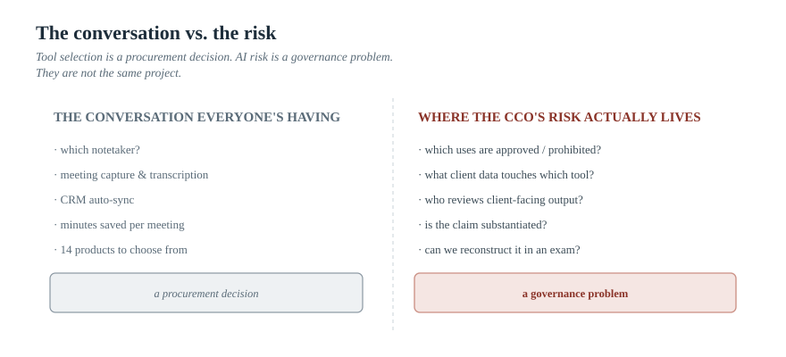
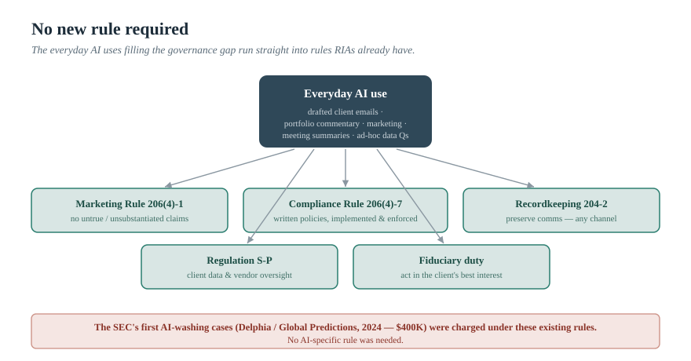
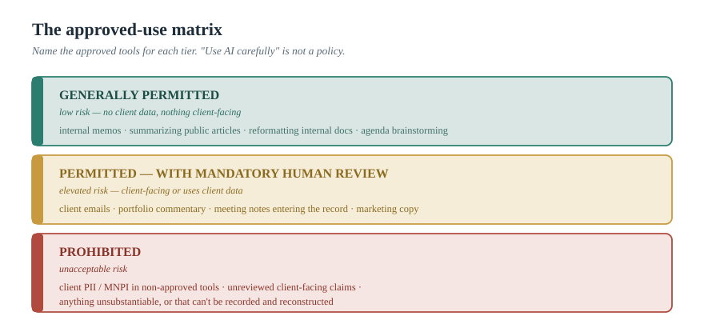

> *The AI Operating Manual for Investment Firms* — Essay 07

# RIAs Don't Need an AI Toy. They Need an AI Usage Policy

### Most of the AI conversation in wealth management is about which notetaker to buy. That's the wrong conversation for the person who actually carries the risk. For a chief compliance officer, the question is not "which tool" — it's "can we describe, supervise, and defend how AI is used across this firm." The SEC has already shown it will charge firms that can't. Here is what governance actually requires.

*By [YOUR NAME] · [DATE] · ~16 min read · Nothing here is legal or compliance advice; consult your own counsel and CCO.*

---

Walk into almost any registered investment adviser today and you will find AI already in use — and you will find that nobody can quite tell you the rules. An advisor is running client meetings through a notetaker. An associate is drafting client emails with a chatbot. Someone in marketing is using AI to polish a quarterly commentary. A junior analyst is pasting portfolio data into a consumer tool to "ask it a quick question." None of this was approved, exactly. None of it was prohibited, exactly. It just… started.

That is the actual state of AI at most RIAs, and it is worth being precise about what it is and isn't. It is real *usage* — by some industry counts, more than half of RIAs now use AI in some form, with meeting documentation alone reaching roughly 70% in one 2026 buyer's guide.[^adoption] What it is *not* is *governance*. And for one specific person in the firm — the chief compliance officer — that gap is not an efficiency story or an innovation story. It is a liability sitting in the open, accruing risk with every unreviewed output.

This essay is written for that person, and for the founder or COO who shares the exposure. The thesis is blunt: an RIA does not need another AI tool. It needs an AI usage policy — and the supervisory process to make the policy real. Because the regulator has already made clear it will hold firms to exactly that, and it didn't wait for an AI-specific rule to do it.

---

## The conversation everyone is having is the wrong one

Open any wealth-management trade publication and the AI story is about tools — specifically, notetakers. It is a genuine gold rush: a year ago the main advisor-software survey tracked a single AI notetaker product; a recent edition tracked fourteen.[^notetakers] Two vendors have raised more than $170 million combined to turn meeting capture into an "advisor operating system," and the category leader claims roughly one in ten U.S. advisors.[^notetakers] One analyst report went so far as to call the notetaker "the new control plane for the entire advisor stack" — and, tellingly, "the most consequential AI purchase an advisory firm will make this year — not trading, not planning, not compliance."[^notetakers]

That last line is exactly backwards for the person reading this. The tools are good, the adoption is real, and choosing among them is a worthwhile procurement decision. But the notetaker is not where an RIA's AI risk lives, and "which tool" is not the question that determines whether the firm survives an exam. The risk lives in what happens to the *output* — where it goes, who reviewed it, whether it made a claim it shouldn't, whether anyone can reconstruct the decision a year later. A firm can buy the best notetaker on the market and still have no idea which uses of AI are permitted, which are forbidden, what client data may touch which tool, or how a client-facing AI output gets reviewed before it leaves the building. That is the gap. And no tool purchase closes it.

> *Figure 1 — The conversation vs. the risk. Left, "The conversation everyone is having": which notetaker · meeting capture · CRM auto-sync · time saved per meeting · 14 products to choose from. Right, "Where the CCO's risk actually lives": which uses are approved/prohibited · what client data touches which tool · who reviews client-facing output · is the claim substantiated · can the firm reconstruct it in an exam · vendor data handling. Tool selection is a procurement decision. AI risk is a governance problem. They are not the same project.*

---

## The regulator already showed its hand — and didn't need a new rule

Here is the fact that should reframe the entire discussion, because it converts an abstract worry into a concrete, citable event.

On March 18, 2024, the SEC announced settled charges against two investment advisers — Delphia and Global Predictions — for making false and misleading statements about their use of AI. Both firms had marketed AI capabilities they did not actually have; one had claimed to be the "first regulated AI financial advisor" and couldn't substantiate it. They paid civil penalties of $225,000 and $175,000 — $400,000 in total — and were censured.[^aiwashing] The SEC's enforcement director put it plainly: if you claim to use AI in your investment processes, your representations had better not be false or misleading.[^aiwashing]

Three things about those cases matter enormously for every RIA, and they are easy to miss if you only read the "AI-washing" headline:

First, the charges weren't only the antifraud provisions. The firms were charged under the **Marketing Rule** (206(4)-1) — for advertisements containing untrue statements — *and* under the **Compliance Rule** (206(4)-7), for failing to implement written policies and procedures reasonably designed to prevent the violations.[^aiwashing] Read that again: part of the violation was *not having the governance.* The absence of a real policy was itself part of the case.

Second — and this is the line every CCO should internalize — the SEC did not need an AI-specific rule to bring these actions. As one analysis put it, the settlements demonstrate the SEC can readily deploy existing federal securities laws to charge AI-related violations.[^aiwashing] This matters because, as I noted in an earlier essay, the SEC's proposed bespoke "AI rule" (the 2023 predictive-data-analytics proposal) was formally withdrawn in 2025. A lot of firms misread that withdrawal as a reprieve. It was nothing of the kind. The prescriptive rule went away; the Marketing Rule, the Compliance Rule, the recordkeeping rule, and the fiduciary duty did not — and they are entirely sufficient to reach AI misconduct, as the enforcement record already proves.

Third, the cases were about a *claim* — but the same machinery reaches the everyday, internal uses that fill the governance gap. A promissory sentence in an AI-drafted client email, an unsubstantiated performance explanation in AI-generated commentary, an AI output that can't be reproduced for an examiner — each runs into the same rules. AI-washing in marketing is just the most visible edge of a much larger surface.

> *Figure 2 — No new rule required. Center: "Everyday AI use at an RIA" (drafted client emails · portfolio commentary · marketing copy · meeting summaries · ad-hoc data questions). Arrows to existing rules that already govern each: Marketing Rule 206(4)-1 · Compliance Rule 206(4)-7 · Recordkeeping Rule 204-2 · Reg S-P · Fiduciary duty. The SEC's first AI-washing cases (Delphia / Global Predictions, 2024, $400K) were charged under existing rules — no AI-specific rule needed.*

---

## What the existing rules actually require of AI use

Translate that framework into the obligations an RIA already carries, now applied to AI. None of these are new; AI just creates new ways to fall short of them.

**Marketing Rule (206(4)-1).** Any advertisement — and the rule's definition is broad — must not contain untrue or unsubstantiated statements. AI-generated marketing copy, performance commentary used promotionally, anything client-facing that makes a claim: all of it must be substantiated and reviewable. The 2026 Marketing Rule FAQs reinforced that this is principles-based, not a checklist, and that flexibility comes only with documentation, disclosure, and durable recordkeeping of content as it was actually used.[^marketing] An AI tool that generates a confident performance claim nobody substantiated is a Marketing Rule problem with a silicon author.

**Compliance Rule (206(4)-7).** The firm must adopt and implement written policies reasonably designed to prevent violations. This is the rule that requires an AI usage policy to *exist* — and the FY2026 examination priorities sharpen the bar further: examiners are focused on whether policies are "implemented and enforced," not merely written.[^priorities] A binder with an unread AI policy in it is not compliance. The policy has to be operating in practice.

**Recordkeeping Rule (204-2).** Business communications must be made and preserved — and, crucially, the rule is *channel-agnostic*. It has never specified email versus text versus anything else; it simply requires preservation regardless of technology. (The billions in off-channel-communications fines between 2022 and 2024 were enforcement of this decades-old rule against new channels, not a new regulation.)[^recordkeeping] The implication for AI is direct: AI-assisted business communications and the records behind them — what was generated, what was reviewed, what was sent — fall within the same preservation obligation. "It was just a chatbot draft" is not an exemption.

**Regulation S-P and vendor oversight.** The amended Reg S-P regime raises the stakes on client data and third-party providers: firms must oversee service providers — explicitly including AI vendors — and ensure breaches involving client data are addressed within tight timelines, and the adviser remains responsible even when notification duties are delegated.[^regsp] An advisor pasting client information into a consumer AI tool with unknown data-handling is a Reg S-P exposure, not a productivity hack. (Compliance dates phase in across 2026 by firm size.)[^regsp]

**Fiduciary duty.** Underneath all of it, the adviser's duty to act in each client's best interest applies to AI-assisted work exactly as to any other. An AI output that drifts toward unsuitable advice, or a recommendation shaped by a tool the advisor doesn't understand, doesn't get a fiduciary pass for being machine-generated.

The throughline is simple and clarifying: **AI doesn't create a new rulebook for RIAs. It creates new, faster, higher-volume ways to violate the rulebook you already have.** Which is precisely why the answer is governance, not a tool.

---

## Why governance — not another tool — is the wedge

It's worth saying directly why the right move for an RIA is to build the usage-and-supervision layer rather than chase the next product, because the market pressure runs the other way.

The notetaker and advisor-workflow space is saturated and exceptionally well-capitalized — fourteen products where there was one, three years of venture money, a clear top two.[^notetakers] To their credit, the serious tools now advertise configurable compliance settings, recordkeeping alignment, access controls, and SOC 2 infrastructure.[^jump] That is genuinely useful. But a tool's *settings* are not a firm's *policy*. The vendor gives you the dials; the firm has to decide where they should be set, which uses are sanctioned, what data is allowed near which system, who reviews what, and how all of it is recorded and supervised — and then has to make that real across every advisor, not just on the demo.

That decision layer is the thing no purchase delivers and the thing the regulator actually examines. It is also, candidly, where the durable value is: tools will keep changing — this year's category leader may not be next year's — but a firm's approved-use matrix, review workflow, recordkeeping discipline, and vendor-oversight process stay relevant no matter which logos sit underneath. This is the operating-model argument from the first essay in this series, in its compliance form: prompts and products are disposable; the governance is durable.

So the rest of this essay is the governance, concretely.

---

## The approved / prohibited matrix

The foundation of an AI usage policy is a clear, written matrix of what's permitted, what's permitted-with-review, and what's prohibited — specific enough that an advisor knows the answer without guessing. Calibrate the categories to risk:

- **Generally permitted (low risk):** internal productivity that touches no client data and produces nothing client-facing — summarizing a public article, drafting an internal memo, reformatting an internal document, brainstorming agenda topics.
- **Permitted with mandatory human review (elevated risk):** anything client-facing or built on client data — client emails, portfolio commentary, meeting summaries that enter the client record, marketing copy. The output is allowed; what's mandatory is the named reviewer and the record of the review *before* it goes out.
- **Prohibited (unacceptable risk):** pasting client PII or MNPI-adjacent information into consumer tools with unknown data handling; any client-facing claim or recommendation released without human review; anything that creates a representation the firm can't substantiate; using AI in a way that can't be recorded or reconstructed.

The matrix has to name the *tools*, too — which approved systems may be used for which category — because "use AI carefully" is not a policy. "You may use [approved tool] for meeting summaries, which route to [reviewer] before entering the CRM; you may not put client data into any non-approved tool" is.

> *Figure 3 — The approved-use matrix. Three tiers: **Green — Generally permitted** (no client data, nothing client-facing: internal memos, public-article summaries, reformatting). **Amber — Permitted with mandatory human review** (client-facing or uses client data: client emails, portfolio commentary, meeting notes to the record, marketing). **Red — Prohibited** (client PII/MNPI in non-approved tools · unreviewed client-facing claims · anything unsubstantiable or unrecordable). Name the approved tools for each tier. "Use AI carefully" is not a policy.*

---

## The workflow that actually matters: client-communication review

If there's one workflow to get right, it's the review of client-facing AI output — because that's where the Marketing Rule, the recordkeeping rule, and fiduciary duty all converge, and where a single bad sentence does real damage.

The design is the evidence-and-control discipline from across this series, applied to a client email or a piece of commentary. Before anything client-facing leaves the firm, it should pass a review that checks for the specific failure modes AI introduces:

- **Promissory or guaranteeing language** — "this will," "you can expect," anything that reads as a promise of performance.
- **Unsubstantiated claims** — a performance explanation or comparison the firm can't back with data it actually holds.
- **Suitability drift** — language that edges toward advice misaligned with the client's documented profile.
- **Unsupported specifics** — numbers, returns, or characterizations the AI produced that nobody verified.

And the review has to be *recorded*: what the AI generated, what the reviewer changed, who approved it, and when — preserved like any other business communication, so the firm can reconstruct the decision for an examiner. That record is not bureaucratic overhead; it is the difference between "we have a defensible process" and "people are experimenting." A client-facing AI output without a reviewer and a record is the RIA version of the unverified number on slide 14.

> **🔧 PERSONAL EXPERIENCE SLOT — replace before publishing.** *The strongest possible addition: a real, anonymized instance where an AI-drafted client communication contained something it shouldn't have — a promissory phrase, an unsupported performance claim — and was caught in review (or the near-miss that prompted the firm to build review in the first place). A lived "here's the sentence that would have been a Marketing Rule problem" story will land harder with a CCO than any rule citation. Redact client details.*

---

## What a CCO should actually ask — before allowing the tools

Pulling it together into the practical checklist a chief compliance officer can use before sanctioning AI use, and when evaluating any vendor:

**On the firm's own use:** Which AI uses are approved, which require review, which are prohibited — and is that written down and specific to named tools? Who reviews client-facing AI output before it goes out, and is that review recorded? Can we reproduce, for an examiner, what AI generated and what a human approved? Have we inventoried where AI is actually being used across the firm — including by advisors informally and by our service providers?[^inventory] Does our policy reflect the FY2026 "implemented and enforced" standard, or is it a binder nobody reads?

**On any AI vendor:** What happens to our data — is it stored, is it used to train external models, where does it live? Can we meet our Reg S-P vendor-oversight and breach-timeline obligations with this provider? What are the tool's recordkeeping and audit capabilities — can it preserve and reproduce what we need? What access controls and permissions does it support? And the one that ties back to the enforcement record: **does anything we say about this tool — to clients, in marketing, in our ADV — match what it actually does?** Because that last question is the one the SEC has already answered with $400,000 in penalties.

> **🔧 PERSONAL EXPERIENCE SLOT — replace before publishing.** *A second strong spot: a real vendor-diligence or policy-build engagement — what surprised you (a tool that trained on inputs, a policy that looked fine on paper but wasn't enforced, an inventory that surfaced shadow AI use nobody had sanctioned). Concrete and specific beats generic checklist advice.*

---

## Defensible beats clever

Strip away the product noise and the RIA's AI situation resolves into the same lesson that runs through everything in this series. The clever part — the tool that drafts the email, captures the meeting, writes the commentary — is becoming a commodity, and choosing among the options is a procurement decision the market will keep making easier. What's scarce, and what actually protects the firm, is the governance: the written, enforced policy; the approved-use matrix; the client-communication review with a record behind it; the vendor oversight; and the ability to describe and defend all of it.

The RIAs that come through the next few years intact will not be the ones that adopted AI fastest or bought the slickest notetaker. They will be the ones whose CCO can answer, without hesitating, how AI is used at the firm, where it's prohibited, who reviews what, and how every client-facing output can be reconstructed — and who built that answer *before* an examiner asked the question. The SEC has already shown, with real penalties under existing rules, that "we were experimenting" is not an answer.

**An RIA doesn't need an AI toy. It needs an AI usage policy that's written, enforced, and defensible. The tool is the easy part. The governance is the product.**

---

### Where this goes next

This is Essay 07 of *The AI Operating Manual for Investment Firms*, and the first written for the compliance seat rather than the investment desk. From here the series takes up the economics directly — the real cost of GenAI in an investment firm, where tokens are the smallest line item — and, for managers facing their investors, what the coming AI due-diligence questionnaire will demand. The spine is unchanged: the advantage is in the workflow, the evidence, and the controls — not the subscription, not the citation, and not the tool.

> **Practical next step.** Ask one question at your firm this week: *if an examiner asked us today how AI is used here, who would answer, and what would they say?* If the answer is "it depends who you ask," you have usage without governance — and that's the gap this essay is about. Start with the inventory: find every place AI is actually being used, including informally and by your vendors. You can't govern what you haven't found.

> **[SOFT CTA — your words.]** *I help RIAs turn scattered, unsanctioned AI use into a defensible program — an enforced usage policy, an approved-use matrix, a recorded client-communication review workflow, and vendor oversight that meets the actual rules. If you're a CCO, COO, or founder who can't yet answer "how is AI used here," [get in touch / subscribe / download the RIA AI Usage Policy template below].*

> **[LEAD MAGNET — build before launch.]** *Gate the "RIA AI Usage Policy Template + CCO Checklist": the approved/prohibited matrix, client-data rules, the mandatory-review trigger and record, recordkeeping alignment (204-2), the vendor due-diligence questions (Reg S-P, training-on-data, audit/reproduction), and the "does our marketing match reality" AI-washing self-check. This is the most natural lead magnet for the compliance buyer in the entire series — and the cleanest distribution path is through outsourced-CCO and RIA compliance consultants, who already hold the trust.*

---

## Sources

*Verify each against the primary link before publishing. The regulatory facts are the credibility of this piece — confirm them against SEC primary sources, and have your own counsel review any policy you build from this. The vendor/landscape material is described at the category level; treat vendor capability claims as their own and verify directly.*

[^adoption]: RIA AI adoption above 50% is reported across multiple 2026 industry sources (e.g., Envestnet's 2026 RIA trends report; Charles Schwab's January 2026 RIA-and-AI study put adoption at 63%). Meeting documentation specifically reached ~70% of RIAs per Ezra Group's 2026 AI Notetakers buyer's guide (see [^notetakers]). Figures vary by survey and definition; cite the specific source you use and confirm.

[^notetakers]: Ezra Group, "AI Notetakers & Agentic OS for Financial Advisors: The 2026 Strategic Buyer's Guide" (May 2026): the advisor-software survey went from tracking one AI notetaker a year earlier to fourteen; Jump and Zocks have raised >$170M combined; the report frames the notetaker as "the new control plane" and "the most consequential AI purchase an advisory firm will make this year — not trading, not planning, not compliance." https://wealthtechtoday.com/2026/05/08/ai-notetakers-financial-advisors-2026/ ; on category leadership (~1 in 10 U.S. advisors / 27,000–31,000+ advisors on Jump) see also https://www.kitces.com/blog/the-latest-in-financial-advisortech-march-2026-altruist-jump-zocks-ria-custodian/

[^aiwashing]: SEC, "SEC Charges Two Investment Advisers with Making False and Misleading Statements About Their Use of Artificial Intelligence," Press Release 2024-36 (March 18, 2024). Delphia (USA) Inc. and Global Predictions Inc. settled for $225,000 and $175,000 respectively ($400,000 total) and were censured; charged under Advisers Act §§206(2) and 206(4), the Marketing Rule (206(4)-1), and the Compliance Rule (206(4)-7). Global Predictions falsely claimed to be the "first regulated AI financial advisor." SEC: https://www.sec.gov/newsroom/press-releases/2024-36 . On the key takeaway that the SEC did not need an AI-specific rule and can deploy existing securities laws, see Debevoise: https://www.debevoise.com/insights/publications/2024/03/ai-enforcement-starts-with-washing-the-sec-charges and Mayer Brown: https://www.mayerbrown.com/en/insights/publications/2024/04/securities-and-exchange-commission-brings-first-enforcement-actions-over-aiwashing

[^marketing]: SEC Division of Investment Management Marketing Rule FAQs (January 2026) reinforce that the Marketing Rule is principles-based, not a checklist, with flexibility contingent on documentation, disclosure, and durable recordkeeping of content as actually used. Summary: https://www.smarsh.com/blog/thought-leadership/sec-marketing-rule-faqs-2026-compliance-guidance/ ; confirm against SEC IM FAQs on SEC.gov.

[^priorities]: SEC Division of Examinations, Fiscal Year 2026 Examination Priorities (released November 17, 2025): increasing attention to AI; emphasis on whether advisers' policies and procedures are "implemented and enforced," not merely written; continued focus on fiduciary standards and compliance-program effectiveness. Analyses: Goodwin, https://www.goodwinlaw.com/en/insights/publications/2025/12/alerts-privateequity-pif-2026-sec-exam-priorities-for-registered-investment-advisers ; Advisor Perspectives, https://www.advisorperspectives.com/articles/2025/12/24/understanding-sec-examination-financial-services-firms . Cite the SEC priorities document directly from SEC.gov.

[^recordkeeping]: Advisers Act Rule 204-2 requires advisers to make and preserve business communications and is channel-agnostic (it does not specify email, text, or platform). The 2022–2024 off-channel-communications enforcement (billions in penalties) enforced this existing rule against new channels rather than imposing a new one. Analysis: https://www.wealthmanagement.com/regulation-compliance/sec-2026-examination-priorities-what-financial-services-firms-need-to-know

[^regsp]: Amendments to Regulation S-P (adopted 2024) heighten obligations on client data and service-provider oversight, including breach-response timelines and explicit oversight of third-party providers (including AI vendors), with the adviser remaining responsible even when notification duties are delegated; compliance dates phase in across 2026 by firm size (larger advisers earlier, smaller advisers later). Summaries: https://www.ncontracts.com/nsight-blog/investment-advisers-artificial-intelligence and https://www.shulmanrogers.com/legal-alert-sec-releases-fy-2026-examinations-priorities-for-rias-and-others/ ; confirm dates and scope against the SEC's Reg S-P adopting release on SEC.gov.

[^jump]: Serious advisor-AI tools now advertise configurable compliance/recordkeeping settings, access controls, and SOC 2 infrastructure (e.g., Jump's product materials). These are vendor capabilities, not a substitute for firm policy; verify directly. https://jump.ai/

[^inventory]: On the expectation that RIAs inventory AI use across the firm — including by affiliates and service providers — and demonstrate that governance is followed, not just written, see ncontracts: https://www.ncontracts.com/nsight-blog/investment-advisers-artificial-intelligence (third-party compliance commentary; corroborate against the SEC FY2026 priorities).
