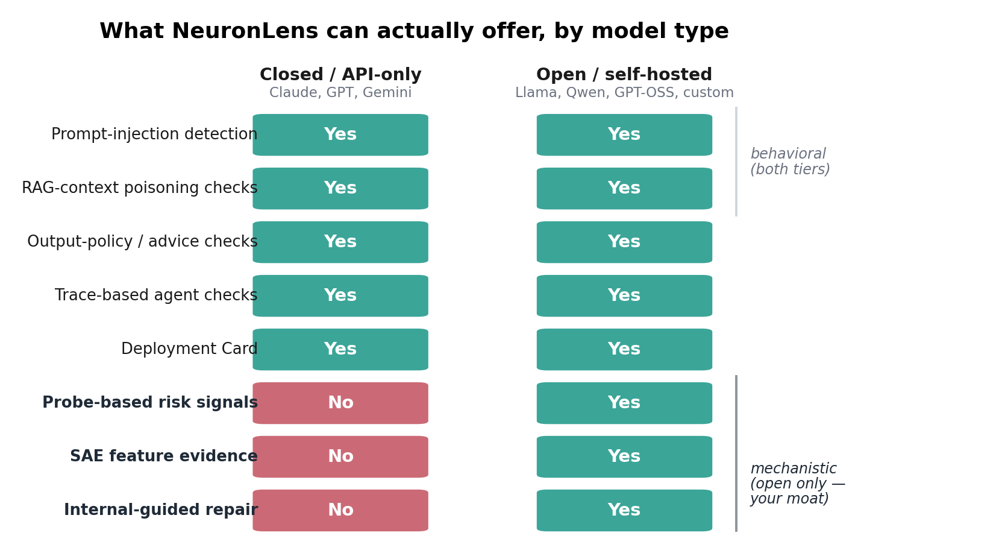
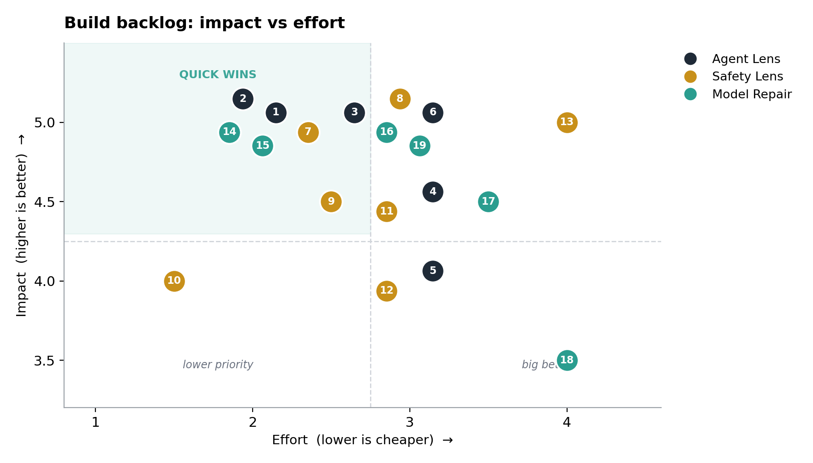
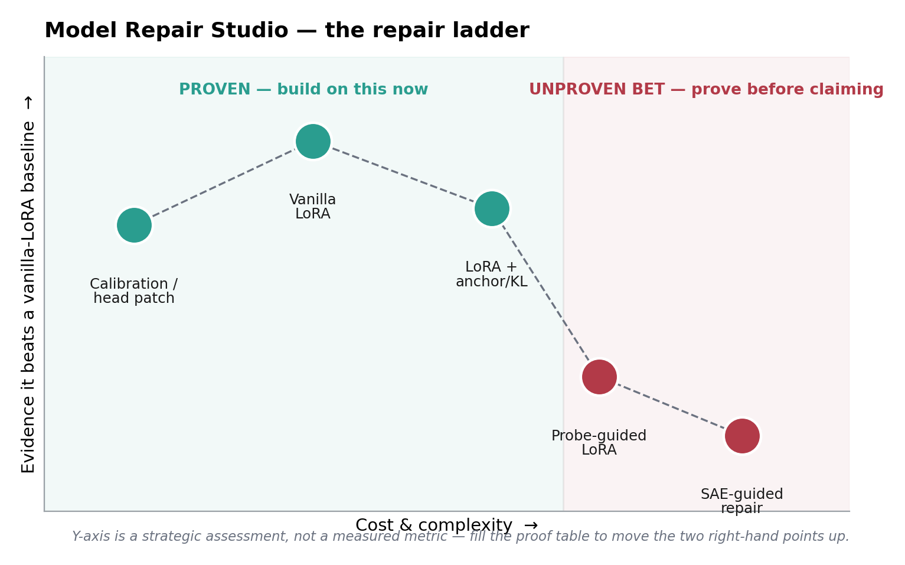
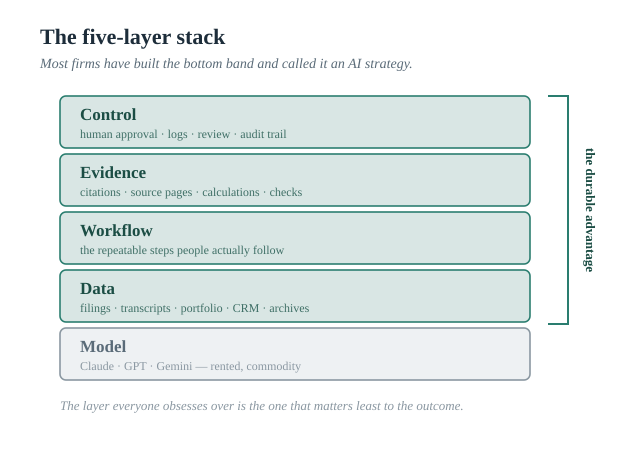
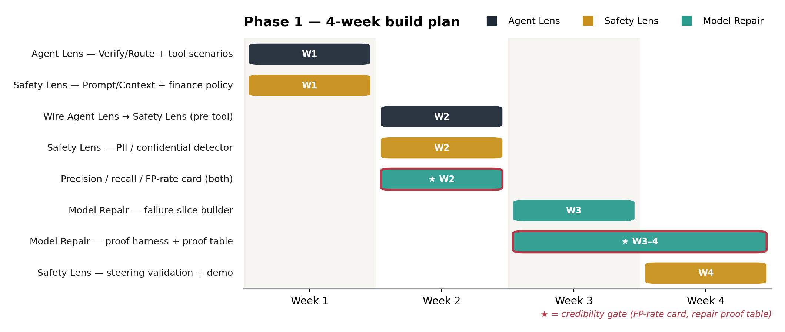
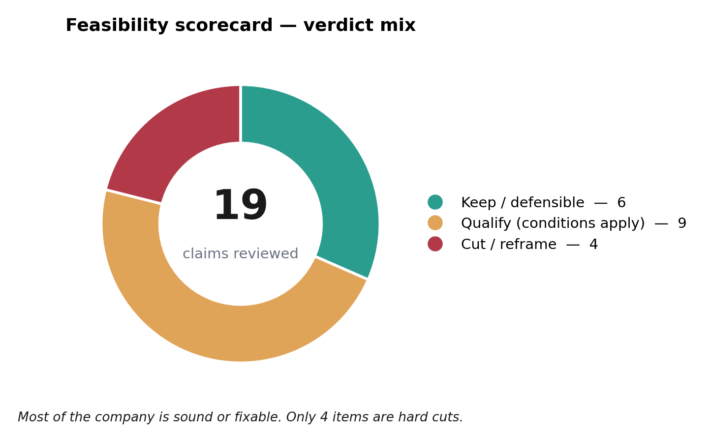

# NeuronLens — Consolidated Strategy, Build Plan & Feasibility Review

*Single source of truth. Merges the two game-plan documents, removes the overlap, keeps every item and every reference, and flags what will not survive enterprise procurement or VC technical diligence.*

---

## Legend

| Symbol | Meaning |
|--------|---------|
| ✅ **KEEP** | Defensible today — build it |
| 🟡 **QUALIFY** | Real, but only under specific conditions; over-claiming here loses deals |
| ⛔ **FLAG** | Not defensible as a production line item an enterprise will purchase, or not survivable in technical diligence, *as currently framed* — fix the framing or cut it |

---

## How to Read This Document

This consolidates two prior documents (the "clean consolidated structure" and the "game plans") into one. Where they agreed, I kept the stronger version. Where they disagreed, I picked the more defensible one and said why.

The VC said "something like this is not practical." Most of that objection is aimed at a small number of specific over-claims, not the whole company. This document separates the two so you can defend the strong parts hard and stop defending the weak parts.

---

## Table of Contents

| # | Section |
|---|---------|
| [Part 0](#part-0--executive-summary) | Executive Summary |
| [Part 1](#part-1--final-product-structure) | Final Product Structure |
| [Part 2](#part-2--the-central-pivot-black-box-vs-white-box) | The Central Pivot: Black-box vs White-box |
| [Part 3](#part-3--agent-lens) | Agent Lens |
| [Part 4](#part-4--safety-lens) | Safety Lens |
| [Part 5](#part-5--model-repair-studio) | Model Repair Studio |
| [Part 6](#part-6--how-the-products-fit-together) | How the Products Fit Together |
| [Part 7](#part-7--the-deployment-card) | The Deployment Card |
| [Part 8](#part-8--steering-a-feature-never-a-product) | Steering: a Feature, Never a Product |
| [Part 9](#part-9--supporting-items) | Supporting Items |
| [Part 10](#part-10--the-claude-opus-48-system-card-narrative) | The Claude Opus 4.8 System-Card Narrative |
| [Part 11](#part-11--build-plan) | Build Plan |
| [Part 12](#part-12--use-cases-by-product) | Use Cases by Product |
| [Part 13](#part-13--go-to-market) | Go-to-Market |
| [Part 14](#part-14--recommended-pilot-offers) | Recommended Pilot Offers |
| [Part 15](#part-15--the-vc-response) | The VC Response |
| [Part 16](#part-16--master-reference-library) | Master Reference Library |
| [Part 17](#part-17--brutal-feasibility-scorecard) | Brutal Feasibility Scorecard |

---

## Part 0 — Executive Summary

### The one-paragraph strategy

> NeuronLens narrows from four "verticals" to **three connected products**: **Safety Lens** (a safety/policy firewall for prompts, RAG context, and outputs), **Agent Lens** (a pre-action evidence-and-decision layer for tool-using agents), and **Model Repair Studio** (a regression-tested repair loop for recurring failures in open/self-hosted models). These are unified by one enterprise deliverable — a **Deployment Card** — and one honest technical boundary: **behavioral (black-box) coverage for closed API models; mechanistic (white-box) coverage only for open/self-hosted models.** The "why now" is that frontier labs (e.g., Anthropic's Claude Opus 4.8 system card) already run this machinery internally before deployment; enterprises running their own agents, RAG systems, and models need a deployment-specific version and have nowhere to buy it.

---

### The brutal read (what to fix before the next VC conversation)

Four things, in priority order. None of them kill the company. All of them, left unfixed, justify the "not practical" verdict.

| # | Signal | Issue | Fix |
|:-:|:------:|-------|-----|
| 1 | ⛔ | **The deck claims things about closed models that are physically impossible.** "Discover model internals" plus an integration list that includes Claude and OpenAI agents implies you read the internals of closed, API-only models. You cannot. The majority of enterprise agents today run on closed APIs. For those, NeuronLens is a *behavioral* product, full stop. The mechanistic story is real, but only for open/self-hosted models. | Adopt the two-tier framing everywhere and rewrite the deck to match it (details in Part 2). This single change is the difference between "interesting but not practical" and "credible." |
| 2 | ⛔ | **"Generate Alpha" is the least defensible claim in the entire pitch.** Headline-sentiment-to-trading-signal is the single most commoditized idea in quantitative finance; "Coverage 1.0%" is a red flag, not a feature; and there is no backtested, cost-adjusted, out-of-sample evidence anywhere. Your own quant credibility works *against* you here, because a sophisticated buyer knows you know better. | Kill the alpha framing entirely. Repackage as a **Finance AI Assurance / Explainability Pack** (Part 9). |
| 3 | 🟡 | **SAE features are not yet a production gating signal.** They are unstable across retrains and model versions, frequently polysemantic, and their labels (e.g., via Neuronpedia) are auto-generated and often wrong or vague. A number like "91% intent signal" means nothing without a false-positive rate on a named benchmark — and in a system that *blocks* actions, false positives are the expensive failure. | Lead with **linear probes** (cheaper, far more stable, ~90–96% accuracy for behaviors like sandbagging detection); treat SAE features as *supporting evidence*, never the sole gate; publish a precision/recall/FP-rate card. |
| 4 | 🟡 | **Don't lead with autonomous blocking.** Inserting a third-party gate into the critical path of agent execution is a slow, high-liability enterprise sell (latency, false blocks, "who owns it when you wrongly block a $10M trade?"). | Enter as **evidence + observability + Review/shadow-mode**; earn Block later, opt-in, per workflow. |

Everything else in the strategy is defensible if you frame it honestly. The rest of this document is how.

---

### What is genuinely strong (defend these without flinching)

| ✅ Item | Why |
|--------|-----|
| **The Deployment Card** | Most defensible, most procurable thing you have. Rides directly on the regulatory wave (EU AI Act, SR 11-7-style model-risk governance) and needs *zero* mechanistic access to deliver value |
| **The two-tier honest positioning** | It is the answer to the "not practical" objection, not a weakness |
| **Safety Lens as a prompt-injection / RAG-poisoning / output-policy firewall** | Crowded market, but a real and growing need; the mechanistic tier is a genuine differentiator *for open models* |
| **The detect → evidence → repair → prove loop** | Selling the *loop* (not a single detector) is what makes this a platform rather than a feature |
| **The finance assurance angle (not alpha)** | Defensible precisely because of the founder |
| **Founder credibility** | Quant + interpretability + enterprise GenAI + an O'Reilly book + a published finance-MI paper is a real, rare combination for this buyer |

---

## Part 1 — Final Product Structure

### The three products

| Product | Core question it answers | Primary buyer | Priority | Keep separate? |
|---------|--------------------------|--------------|:--------:|---------------|
| **Agent Lens** | "Can this agent safely act?" | AI platform teams, agent builders, CISO, model risk | **P0** | **Yes** — agents have plans, tools, actions, omissions, and trace risk that a generic safety layer doesn't model |
| **Safety Lens** | "Is this prompt / context / output safe and compliant?" | AI governance, compliance, security, chatbot/RAG teams | **P0** | **Yes** — useful for chatbots, RAG, copilots *and* agents; sells independently |
| **Model Repair Studio** | "Can we fix repeated failures without breaking the model?" | ML teams, model-risk, open/custom model owners | **P1** | **Yes, second phase** — converts repeated Agent/Safety failures into regression-tested patches |

> **Safety Lens detects safety/policy risk. Agent Lens decides whether an agent can act. Model Repair Studio fixes repeated failures.**



---

### Everything else becomes supporting (or gets cut)

| Old item | New role | Verdict |
|----------|---------|---------|
| **Concept Studio** | Internal feature/probe/SAE investigation workbench | ⛔ **Do not sell as a product.** It is your backend evidence layer, not a budget line item |
| **Domain Lens** | Domain evaluation/assurance packs | 🟡 Keep as *one* pack, not a platform of verticals |
| **Trading Lens** | **Finance AI Assurance Pack, not an alpha product** | ⛔ Kill "alpha." Repackage as assurance/explainability (Part 9) |
| **Runtime Control / Steering** | Optional action layer used *after* a detector fires | 🟡 **Feature, not product.** Never lead with it (Part 8) |

> ⛔ **FLAG on the "four verticals / one engine" narrative.** The deck's "Four product types. One working engine. Built part-time." reads to an investor as *lack of focus*, not breadth. The shared-engine point is good engineering; lead with **two P0 products + one P1**, and mention the shared engine as *why you can ship them*, not as a fourth and fifth thing you also do.

---

## Part 2 — The Central Pivot: Black-box vs White-box

*This resolves the "not practical" objection. Get this framing right and most of the VC's objection evaporates.*

### The hard technical truth

| Model type | Examples | Can you read activations / SAE features? | What NeuronLens can actually offer |
|-----------|----------|:----------------------------------------:|-----------------------------------|
| **Closed, API-only** | Claude, GPT-4/5, Gemini | **No** — there is no activation access | **Behavioral / black-box** detection only: prompt-injection patterns, RAG-context checks, output-policy checks, trace-based agent checks, and the Deployment Card |
| **Open / self-hosted** | GPT-OSS, Llama, Qwen, Gemma, DeepSeek, customer-fine-tuned models | **Yes** | **Mechanistic / white-box**: probe-based risk signals, SAE feature evidence, internal-guided repair |

### Why this matters commercially

The majority of production enterprise agents and copilots today run on **closed** APIs. For that majority, your *mechanistic* moat does not apply — you compete on behavioral detection in a crowded field (Lakera, Protect AI, Robust Intelligence, NeMo Guardrails, GuardrailsAI, and the model vendors' own filters). So:

- **For closed models, your wedge is not "we see inside the model." It is the Deployment Card and the detect→repair→prove loop**, which are governance and workflow products, not interpretability products.
- **The white-box, mechanistic story is your differentiator only for the open/self-hosted segment** — banks running self-hosted FinBERT-style or domain models, regulated on-prem deployments, and AI-native companies building on open weights.

### What to say (and what to never say again)

| ⛔ Never say | ✅ Say instead |
|-------------|--------------|
| "We discover the internals of any model." (deck hero) | "Behavioral safety for closed models; mechanistic safety for open/self-hosted models." |
| "Agent Lens reads model internals for Claude/OpenAI agents." (implied by deck p.6) | "Agent Lens reads internals for open/self-hosted agents; for closed-model agents it uses behavioral and trace signals." |
| "Agent Lens fully understands model intent." | "Agent Lens exposes useful internal decision *signals* (evidence, not causal proof) before an action fires." |

> **Action:** Rewrite deck pages 1 (hero), 5 (Runtime Lens), and 6 (Agent Lens "model internals — why blocked" panel) so the mechanistic claims are scoped to open/self-hosted models. The Agent Lens demo (a finance agent on an open model, e.g. GPT-OSS-20B) is fine *as an open-model demo*; it is misleading if presented as how Claude/OpenAI agents are inspected.

---

## Part 3 — Agent Lens

### Positioning

> **Agent Lens monitors AI agents before they use tools or take actions. It detects skipped verification, risky tool calls, prompt injection (via Safety Lens), false completion, and action risk, then routes the agent to allow, verify, review, block, or route — with internal decision signals as evidence for open/self-hosted models and behavioral/trace signals for closed-model agents.**

### What you already have (don't rebrand — sharpen)

The current Agent Lens already hooks into agent stacks, detects tool-use intent from internal signals, scores action risk, routes to allow/review/block with mechanistic evidence, and integrates with HTTP, LangChain, CrewAI, and LlamaIndex. It uses GPT-OSS-20B SAE features with a `tool_needed_probe` and a `tool_risk_category_probe`. That is a real foundation. Keep the name. Upgrade the parts below.

| Existing item | Keep? | Upgrade |
|--------------|:-----:|---------|
| Tool-needed probe | ✅ Yes | Add an omission/failure taxonomy: "tool needed but skipped" |
| Tool-risk probe | ✅ Yes | Expand risk tiers by action type and enterprise workflow |
| Allow / Review / Block gate | ✅ Yes | Add **Verify** and **Route** as decisions |
| SAE feature evidence | ✅ Yes | Label it **"evidence," not causal proof** (your own README already does this — keep that honesty) |
| Framework integrations | ✅ Yes | This is a genuine, underrated product advantage |
| Feature Explorer | ✅ Yes | Fold into the internal Concept Studio evidence layer |

### Use cases (consolidated)

| Use case | Buyer pain | Action | Buyer |
|----------|-----------|--------|-------|
| Tool needed but skipped | Agent answers without checking source/data | **Verify** | Banks, asset managers, RIAs |
| Risky tool call | Agent wants to transfer money, trade, delete, deploy | **Review / Block** | Banks, fintech |
| Prompt injection in tool output | Retrieved doc or webpage hijacks the agent | **Block / quarantine** | AI platform / security |
| False completion | Agent claims it checked something but didn't | **Review** | Engineering orgs |
| Ignored correction | Agent repeats a corrected mistake | **Escalate / repair** | All |
| Long-workflow drift | Agent loses its original objective | **Re-plan / Route** | All |
| SOC agent destructive action | Agent runs a destructive command | **Review / Block** | Cyber teams |
| Healthcare workflow escalation | Agent acts on a sensitive workflow | **Review / Escalate** | Healthcare admin |
| Legal document source-checking | Agent fails to verify a cited source | **Verify** | Legal ops |

### The decision set

| Decision | Meaning |
|----------|---------|
| **Allow** | Safe to continue |
| **Verify** | Must call a source/tool/check before answering |
| **Review** | Human approval required |
| **Block** | Unsafe or policy-violating |
| **Route** | Use a safer model, a restricted tool, or a smaller scoped agent |

### Build plan

| Build | Impact | Effort | Note |
|-------|:------:|:------:|------|
| Add **Verify** and **Route** decisions | 5 | 2 | ✅ Cheap, high-value, do first |
| Expand tool-risk tiers by domain | 5 | 2 | ✅ |
| Add prompt-injection callout from Safety Lens | 5 | 2.5 | ✅ Wire the two products together |
| Add false-completion detector | 4.5 | 3 | 🟡 Define precisely against the agent trace; easy to over-claim |
| Add ignored-correction detector | 4 | 3 | 🟡 Genuinely useful, harder than it sounds |
| Generate **Agent Deployment Card** | 5 | 3 | ✅ This is the deliverable that gets procured |



### Feasibility flags

- 🟡 **The blocking position is a liability and a slow sale.** A wrongly blocked legitimate action (a real trade, a real deploy) is a serious incident; a missed bad one makes you liable. **Lead with evidence + Review/shadow-mode.** Make Block opt-in, per workflow, after the buyer trusts your false-positive rate.
- 🟡 **"Detects tool-call hijacking, goal drift, and privilege escalation" (deck p.6) needs evidence.** These are three different, hard detection problems. Don't list them as solved capabilities. List the ones you can show with a measured detection rate; mark the rest as roadmap.
- 🟡 **Closed-model agents get behavioral coverage only.** The "L19 · 7711 tool call needed — +0.910" internal-signal panel is an *open-model* artifact. For a Claude/OpenAI agent, you have the prompt, the trace, and the tool outputs — not the activations. Present accordingly.

### What Agent Lens must not claim

| ⛔ Not | ✅ Yes |
|--------|-------|
| "Agent Lens fully understands model intent." | "Agent Lens exposes useful internal decision signals (evidence, not proof) before an action fires — mechanistically for open/self-hosted models, behaviorally for closed-model agents." |

---

## Part 4 — Safety Lens

### Positioning

> **Safety Lens is a standalone safety firewall for prompts, RAG context, draft outputs, and policy risk. It works for chatbots, RAG systems, copilots, and agents — behaviorally for any model, and mechanistically for open/self-hosted models.**

Safety Lens owns *all* safety/policy detectors; Agent Lens calls it. Do not collapse Safety Lens into Agent Lens.

### What you already have

Four activation-probe detectors — **Prompt Guard**, **Context Guard**, **Output Shield**, **Threat Radar** — plus policy modes, thresholds, event history, root cause, per-token attribution, and steering endpoints (`/steer_regenerate`, `/steer_sweep`). It runs on FastAPI/Next.js/Streamlit, with a live GPT-OSS/NNSight mode and a demo mode. Real foundation.

### Subcomponents and build plan

| Priority | Subcomponent | Have it? | Build next | Impact | Effort |
|:--------:|-------------|:--------:|-----------|:------:|:------:|
| **P0** | **Prompt Guard** | ✅ Yes | Expand direct prompt-injection / jailbreak test set | 5 | 2.5 |
| **P0** | **Context Guard** | ✅ Yes | Improve indirect (RAG) prompt-injection detection | 5 | 3 |
| **P0** | **Output Shield** | ✅ Yes | Add finance/compliance/advice-language policies | 4.5 | 2.5 |
| **P0** | **Threat Radar** | ✅ Yes | Keep as a shadow red-team scorer | 4 | 1.5 |
| **P1** | **PII / confidential-data detector** | Not explicit | Add sensitive-data-leakage detection | 4.5 | 3 |
| **P1** | **Overconfidence / missing-caveat detector** | No | Professional-work safety signal | 4 | 3 |
| **P1** | **Known-wrong signal** (open-model tier) | No | Internal-output-mismatch detector | 5 | 4 |

### The two modes (this is how you avoid the VC attack)

| Mode | Models | Uses activations? | Buyer use |
|------|--------|:-----------------:|-----------|
| **Black-box Safety** | Claude / GPT / Gemini / open | No | Prompt / context / output safety checks |
| **White-box Safety** | Open / self-hosted | Yes | SAE / dense-probe risk prediction, known-wrong signal |

| ⛔ Not | ✅ Yes |
|--------|-------|
| "We inspect Claude's internals." | "Safety Lens works behaviorally for closed models and mechanistically for open/self-hosted models." |

### Claude validation for the white-box tier

Anthropic used white-box probing and SAE features for concepts such as reward hacking, unsafe behavior, deception, evaluation awareness, and distress — flagging high-percentile activations against calibration sets, then clustering/filtering/reviewing transcripts with tools like per-token SAE activations, logit lens, feature trajectories, max-activating examples, and feature search. That validates your white-box tier — **but only for models where activations are available.** Cite it precisely; do not let it imply you can do this to Claude.

### Feasibility flags

- 🟡 **Crowded market.** Black-box prompt-injection/guardrail detection is a busy category. Your differentiation is (a) the white-box tier for self-hosted models, (b) the Deployment Card, and (c) the repair loop — not "we detect prompt injection," which many do.
- 🟡 **The "<5 ms overhead per inference step" claim (deck p.7) needs scoping.** Plausible for a small linear probe; questionable for full SAE decomposition across layers per token. State the measured overhead for the actual configuration, and separate "probe mode" from "full SAE mode" latency.
- 🟡 **Detector numbers must come with false-positive rates.** Every score the dashboard shows (0.435, 0.484, etc.) is meaningless to a buyer without precision/recall on a named test set. Build and publish that card.

---

## Part 5 — Model Repair Studio

*(Rename of "Model Design Studio." "Repair" is honest and narrow; "design" over-promises.)*

### Positioning

> **Repeated failures from Agent Lens or Safety Lens become regression-tested model patches.**

It is a *targeted repair* product, not a broad model-design product.

### The repair workflow

```
Agent Lens / Safety Lens incident
        ↓
Failure slice (curated examples of the recurring failure)
        ↓
Baseline repair ladder (cheap → expensive)
        ↓
Regression proof card (did we fix it without breaking anything else?)
        ↓
Patch / adapter / policy update
```

### The repair ladder

| Priority | Method | Why | Reference |
|:--------:|--------|-----|-----------|
| **P0** | Calibration / head patch | Cheap, auditable | Guo et al., calibration |
| **P0** | Vanilla LoRA | Commodity baseline | LoRA |
| **P0** | LoRA + anchor/KL preservation | Fix while preserving old behavior | DPO (KL/reference framing); InstructGPT (RLHF/KL precedent) |
| **P1** | Probe-guided LoRA | Non-SAE mechanistic targeting | Representation Engineering |
| **P1** | SAE-guided repair | **Only if it beats baselines** | "SAEs Are Good for Steering — If You Select the Right Features"; SASFT; Goodfire RLFR |

Adjacent editing methods worth having in the kit for factual patches: **ROME** (single-fact causal editing), **MEMIT** (mass factual edits), **ReFT/LoReFT** (representation-level alternative to LoRA).



### The proof table you must actually fill in

> This is the product. The methods are commodities; the **regression-tested proof** is what an enterprise model-risk team pays for.

| Method | Target gain | Held-out gain | Anchor regression | Calibration drift | Verdict |
|--------|:-----------:|:-------------:|:-----------------:|:-----------------:|---------|
| Base | — | — | — | — | baseline |
| LoRA | ? | ? | ? | ? | commodity |
| LoRA + KL | ? | ? | ? | ? | strong baseline |
| Probe-guided LoRA | ? | ? | ? | ? | MI edge — *if it wins* |
| SAE-guided repair | ? | ? | ? | ? | keep only if it wins |

### Feasibility flags

- ⛔ **The entire differentiation rests on an unproven empirical bet.** "Probe-guided" and "SAE-guided" repair beating vanilla LoRA on real enterprise tasks is *not* established. Until your own proof table shows it winning on a real failure slice, **sell the regression harness + commodity LoRA/LoRA+KL**, and treat mechanistic repair as upside. Do not put "internal-guided repair, more precise than retraining" on a slide as a settled fact (deck p.10) — it's a hypothesis you are testing.
- 🟡 **The addressable market is the self-hosting minority.** Most enterprises consume closed APIs they cannot fine-tune. Repair sells to the segment that *owns weights*: banks with self-hosted domain models, regulated on-prem deployments, AI-native companies on open weights. Size it honestly; it's a real but narrower TAM than "everyone with an AI model."
- 🟡 **"No retraining" is a positioning phrase, not a literal claim.** LoRA *is* training (gradient updates on adapters). Say "targeted, low-cost adaptation with regression proof," not "no retraining," or a technical buyer will catch it.
- ✅ **The regression card is the genuinely defensible asset.** It maps directly to model-risk governance (SR 11-7-style validation). Build it first and make it the headline of this product.

---

## Part 6 — How the Products Fit Together

```
User / system / context / tool output
        ↓
Safety Lens
  - prompt injection
  - context poisoning
  - output policy risk
  - PII / confidential risk
        ↓
Agent Lens
  - tool need
  - tool risk
  - skipped verification
  - action gate
        ↓
Decision:  Allow / Verify / Review / Block / Route
        ↓
(recurring failures) → Model Repair Studio → regression-tested patch
```



| Capability | Owned by | Used by |
|-----------|---------|---------|
| Prompt injection | Safety Lens | Agent Lens calls it |
| Context poisoning | Safety Lens | Agent Lens calls it |
| Output safety | Safety Lens | Chatbots + agents |
| Tool need / tool risk / action routing | Agent Lens | Agent systems |
| SAE / probe risk evidence (open models) | Safety Lens / Agent Lens white-box tier | Model Repair Studio |
| Failure-slice generation | Both | Model Repair Studio |

---

## Part 7 — The Deployment Card

*The wedge — build this with disproportionate care.*

> This is your strongest, most procurable artifact and it needs **no mechanistic access** to deliver value. It is the enterprise version of a frontier-lab system card.

| Section | Source |
|---------|--------|
| Model and workflow description | Agent Lens |
| Tool / action permissions | Agent Lens |
| Prompt-injection results | Safety Lens |
| Tool-risk and omission results | Agent Lens |
| Policy violations | Safety Lens |
| Human-review thresholds | Agent Lens |
| Open-model internal probe evidence (where available) | Agent Lens / Safety Lens white-box tier |
| Remaining risks | Combined |
| Repair candidates | Model Repair Studio |

**Why this wins:** model-risk, compliance, and CISO functions are *already required* to produce deployment evidence (EU AI Act documentation duties, internal model-risk validation, audit trails). Today they assemble it by hand. A tool that generates a defensible, repeatable Deployment Card is a budgeted purchase, not a "nice to have." Lead with it.

---

## Part 8 — Steering: a Feature, Never a Product

*(Now with the field guide's hard limits)*

You have `/steer_regenerate` and `/steer_sweep`. Keep them as **experimental/advanced controls inside Safety Lens and as a diagnostic inside Model Repair Studio.** Do not sell steering standalone.

### Where steering is allowed to live

| Product | Steering role | Build now? |
|---------|--------------|:----------:|
| **Safety Lens** | Safe regeneration: produce a lower-risk draft; run an alpha sweep to see if the risk score drops | ✅ Yes, as an experimental feature |
| **Agent Lens** | Later: push cautious / verification-oriented behavior before an action | 🟡 Later |
| **Model Repair Studio** | Diagnostic: test whether a feature/direction causally moves the output *before* baking it into a LoRA | ✅ Yes, diagnostic only |

### The brutal rule (reinforced by 2026 practitioner evidence)

| ✅ Use steering for | ⛔ Never use steering for |
|--------------------|--------------------------|
| Caveats, caution, tone, reducing overconfidence | Numerical correctness |
| Safer regeneration | Citation correctness |
| Feature-causality testing | Guaranteed compliance |
| Temporary mitigation before a real repair | Permanent model repair or final safety guarantees |

### What the field guide adds (must internalize)

The new field guide (Mitra, 2026) is the most honest practitioner account of where steering actually breaks, and it tightens the rule above:

- ✅ **Steerable:** refusal/compliance, sentiment/tone, conciseness, uncertainty expression. These are the only behaviors you should claim.
- ⛔ **Effectively unsteerable:** factual accuracy ("no truthfulness direction makes a model correct — it makes it more *confident*"), complex reasoning, specific factual injection. Do not market any of these.
- ⛔ **Strength is non-monotonic.** Cranking `alpha` up can *reverse* or degrade the effect (validated across 11 models). Any "set the strength and forget it" product claim is wrong.
- 🟡 **Effects drift over long generations** (fade after ~300–500 tokens) and are **prompt-dependent** (the same vector helps some inputs, barely touches others). So you cannot characterize a steering control by its average effect; you must report variance.
- ⛔ **The dangerous failure mode for a safety company:** over-refusal steering *maintains general ability and passes standard evals* while *increasing* jailbreak vulnerability under adversarial conditions ("Steering Safely or Off a Cliff?"). If you ever sell steering as a *safety guarantee*, this is the lawsuit. Conditional application (CAST-style: steer only when the input matches a condition) is the minimum bar, and even that is mitigation, not a guarantee.

> **Takeaway:** steering stays an internal mitigation and diagnostic tool. It is never a SKU, never a guarantee, and every steering result you show must include a side-effect / robustness check.

---

## Part 9 — Supporting Items

*What to cut, demote, and repackage.*

### Concept Studio → internal backend only

✅ Keep as your internal evidence/feature/probe/SAE workbench (activation inspector, feature search, steer-to-test). ⛔ **Do not sell it.** "Build concept libraries to accelerate experimentation" is not something an enterprise line-manager has budget for. It supports your other products; it is not one of them.

### Domain Lens → one assurance pack, not a platform of verticals

🟡 Keep the *idea* of packaging internal signals into domain value, but ship **one** pack (finance) done well, not a grid of finance/healthcare/legal/cyber cards. A "platform of verticals" from a solo founder reads as unfocused.

### Trading Lens → ⛔ kill "alpha," repackage as Finance AI Assurance

This is the most important repackaging in the document.

#### What's wrong with "Generate Alpha using AI Model Internals" (deck p.9)

- Headline-sentiment-to-signal is the most commoditized idea in quant finance (RavenPack, Bloomberg, every sell-side desk). An LLM-internals version is not obviously better and is certainly not novel alpha.
- "Coverage 1.0%" means the signal fires on ~1% of inputs. That is not a feature; it's an admission the signal is rare and probably overfit.
- There is **no** backtest, no out-of-sample period, no transaction-cost adjustment, no Sharpe, no capacity analysis. A quant buyer will ask for all of these in the first five minutes.
- Your credibility makes this *worse*: you are a known quant + interpretability author, so claiming naïve alpha invites the harshest scrutiny.

#### What to sell instead — Finance AI Assurance Pack

- Explainable, attributable risk/grounding signals for finance AI workflows (research assistants, document agents, client-facing chat)
- Advice-language / suitability / compliance detection (Output Shield + finance policy mode)
- Named-feature attribution as *explainability for regulators and model-risk*, not as a trading edge
- The Deployment Card, finance-flavored

This keeps everything you built (the 622 concepts, 244K articles, 52 stocks, 13 sectors are perfectly good as an *assurance/explainability* corpus) and removes the one claim guaranteed to blow up diligence.

---

## Part 10 — The Claude Opus 4.8 System-Card Narrative

*Your "why now."*

Anthropic evaluates Claude across cyber, safeguards, agentic safety, alignment, and model welfare, and flags **prompt injection** as a high-priority risk for agentic systems that access private data and take actions. It also reports recurring failure patterns — fabrication, instruction-following failure, cheap verification skipped, ignored correction — across manually flagged sessions. That reframes the enterprise question from *"did the chatbot answer correctly?"* to *"can this AI system safely use tools, retrieve private data, act on a user's behalf, and stay policy-compliant?"* — which is exactly your product split.

| Claude / system-card concern | NeuronLens product | NeuronLens artifact |
|-----------------------------|-------------------|---------------------|
| Agentic safety testing | Agent Lens | Deployment Card |
| Prompt-injection robustness | Safety Lens + Agent Lens | Prompt/Context Guard results |
| Tool-use / skipped-verification risk | Agent Lens | Tool-need / tool-risk results |
| Unsafe / policy-violating output | Safety Lens | Output Shield results |
| White-box SAE/probe monitoring | Safety Lens white-box tier (open models) | Internal probe evidence |
| Failure taxonomy | Agent Lens + Repair | Failure slices |
| Regression checks | Model Repair Studio | Regression card |
| Response steering | Internal Runtime Control module | (mitigation/diagnostic only) |
| Deployment decision evidence | Deployment Card | The card itself |

**Core investor line:**

> **Anthropic builds system-card safety machinery for Claude before deployment. NeuronLens brings a deployment-specific version of that machinery to enterprises running agents, RAG systems, chatbots, and open/customer-owned models — behaviorally for closed models, mechanistically for open ones.**

> 🟡 **Sourcing note:** quote the system card precisely and conservatively. Use it as evidence that *frontier labs need this class of machinery*, not as a claim that you reproduce Anthropic's internal access on Anthropic's models.

---

## Part 11 — Build Plan

### Phase 1 — tighten existing products (no new product names)

| Week | Product | Build |
|:----:|---------|-------|
| **1** | Agent Lens | Add Verify/Route decisions; improve tool-need/tool-risk test scenarios |
| **1** | Safety Lens | Expand Prompt Guard + Context Guard scenarios; add finance compliance policy mode |
| **2** | Agent Lens + Safety Lens | Wire Agent Lens to call Safety Lens before tool execution when prompt/context/tool-output is present |
| **2** | Safety Lens | Add PII/confidential-data detector |
| **2** | **Both** | **Build the precision/recall/false-positive card** for every shipped detector *(added — this is the credibility gate)* |
| **3** | Model Repair Studio | Build the failure-slice builder from Agent/Safety incidents |
| **3–4** | Model Repair Studio | Run the LoRA / LoRA+KL / probe-guided proof harness; **fill in the proof table** |
| **4** | Safety Lens steering | Keep `/steer_sweep` as causal validation + safe-regeneration demo, with side-effect checks; **not** a standalone product |



### Phase 2 — the Deployment Card

Build the Deployment Card (Part 7) as the artifact generated from both products. This becomes the enterprise deliverable and the thing pilots are scored on.

### Commercial path

> design-partner pilots → Deployment Card as the wedge → Runtime (Agent + Safety) platform → Model Repair for the self-hosting segment → finance assurance expansion

---

## Part 12 — Use Cases by Product

### Agent Lens

| Use case | Buyer |
|----------|-------|
| Finance research agent tool omissions | Banks, asset managers, RIAs |
| Payment / wire-transfer agent action risk | Banks, fintech |
| SOC agent destructive-action risk | Cyber teams |
| Code agent false completion / skipped tests | Engineering orgs |
| Healthcare workflow agent escalation | Healthcare admin |
| Legal document agent source-checking | Legal ops |

### Safety Lens

| Use case | Buyer |
|----------|-------|
| Internal chatbot prompt injection | AI platform / security |
| RAG context poisoning | Enterprise knowledge teams |
| PII / confidential leakage | Security / compliance |
| Advice-language detection | Finance/legal/healthcare compliance |
| Unsafe draft output | Product and governance teams |
| Red-team monitoring | Security / AI risk |

### Model Repair Studio

| Use case | Buyer |
|----------|-------|
| FinBERT sentiment/risk failure repair | Finance ML teams |
| Compliance classifier repair | Regulated AI teams |
| Open-model safety failure repair | AI startups / enterprise AI teams |
| Tool-risk probe repair | Agent platform teams |
| Verifier model repair | RAG/report-generation teams |

---

## Part 13 — Go-to-Market

### Highest-priority audiences

| Audience | Product to pitch | Message |
|----------|-----------------|---------|
| AI platform leads at banks | Agent Lens + Safety Lens | "Deploy agents safely with action evidence, review gates, and a safety firewall." |
| Model risk / validation | Model Repair Studio + Deployment Card | "Repeated failures become tested repairs with regression cards." |
| CISO / security | Safety Lens | "Prompt-injection and data-leakage controls for RAG/agents." |
| Compliance leaders | Safety Lens | "Policy and advice-language controls before outputs reach users." |
| Fintech / RIA platforms | Agent Lens + Safety Lens | "Control finance research assistants and client-facing AI." |
| AI-native startups on open models | Safety Lens (white-box) + Repair | "Internal risk prediction and targeted patching for your own models." |

### Functions to reach

| Function | Why |
|----------|-----|
| Head of AI Platform | Owns agent infrastructure |
| Head of Model Risk | Owns validation/governance |
| CISO / AppSec AI lead | Prompt injection, data exfiltration |
| Head of Compliance Technology | Regulated output risk |
| Head of Digital / Automation | Agent deployment |
| CTO of an AI-native startup | Open-model repair need |
| Innovation / GenAI lead | Budget for pilots |

---

## Part 14 — Recommended Pilot Offers

| Pilot | Duration | Buyer | Deliverable |
|-------|:--------:|-------|-------------|
| **Agent Lens Deployment Audit** | 2–4 weeks | AI platform / governance | Deployment Card + action-evidence prototype (Review-mode first) |
| **Safety Lens Firewall POC** | 2–3 weeks | Security / compliance | Prompt/context/output risk dashboard **with a measured FP-rate card** |
| **Model Repair Sprint** | 3–6 weeks | ML / model risk | Failure slice + LoRA/KL/probe-guided repair report **with the proof table filled in** |

---

## Part 15 — The VC Response

### The line to lead with

> **We are narrowing NeuronLens to three connected products. Safety Lens is the horizontal safety firewall for prompts, RAG context, outputs, PII, and policy risk. Agent Lens is the pre-action evidence-and-decision layer for tool-using agents. Model Repair Studio turns recurring failures into regression-tested patches for open/customer-owned models.**
>
> **This is aligned with what frontier labs already do: Claude Opus 4.8's system card shows Anthropic running agentic-safety tests, prompt-injection evaluations, safeguards, white-box monitoring, and regression checks before deployment. NeuronLens productizes a deployment-specific version of that machinery for enterprises running their own agents, tools, documents, and models.**
>
> **We do not claim mechanistic access to closed models. Closed models get behavioral safety checks and the Deployment Card. Open/customer-owned models additionally get SAE/probe internals and targeted repair.**

### Answering "this is not practical" head-on

Pre-empt each objection rather than waiting for it:

| Likely objection | Honest response |
|-----------------|----------------|
| "Mechanistic interpretability isn't production-ready." | Correct for closed models — we don't claim it there. For open/self-hosted models we lead with **linear probes** (cheap, stable, ~90–96% accuracy in published work) and treat SAEs as optional evidence. Our wedge — the Deployment Card and the behavioral firewall — needs **zero** mechanistic access. |
| "Guardrails are commoditized; this is a feature, not a company." | The commodity is *black-box guardrails*. We sell the **loop**: detect → evidence → regression-tested repair → Deployment Card. The repair loop and the governance artifact are not features; they're what model-risk and compliance buy. |
| "Alpha from LLM internals is hand-wavy." | Agreed — we are **not** selling alpha. Finance is an **assurance/compliance/explainability** play. |
| "Will an enterprise put your gate in the critical path?" | Not at first. We enter as **evidence + Review/shadow-mode**; blocking is opt-in, per workflow, after the buyer trusts our measured false-positive rate. |
| "Solo founder, part-time, four products." | The part-time MVP validated one shared engine across the workflow; the raise consolidates to **two P0 products + one P1**. The founder's quant + interpretability + enterprise-GenAI background is exactly the buyer credibility this category needs. |

---

## Part 16 — Master Reference Library

*Every reference from both source documents, merged and de-duplicated, plus the requested steering field guide. Nothing dropped.*

### A. Claude / system-card & internal product evidence

| Reference | Use |
|-----------|-----|
| Claude Opus 4.8 system card | Safety process: agentic safety, safeguards, prompt injection, white-box monitoring, regression checks |
| LessWrong / Zvi review of Claude Opus 4.8 | Commentary on prompt injection, agentic safety, white-box monitoring |
| Your Agent Lens README | Current product foundation: tool need, tool risk, SAE features, allow/review/block, framework integrations |
| Your Safety Lens README | Current safety firewall: Prompt Guard, Context Guard, Output Shield, Threat Radar, steering endpoints |

### B. Mechanistic interpretability, probes & steering

| Paper / work | Link | Use |
|-------------|------|-----|
| Your finance MI paper ("Beyond the Black Box") | [arxiv.org/abs/2505.24650](https://arxiv.org/abs/2505.24650) | Positioning: MI in finance; founder credibility anchor |
| Representation Engineering (RepE) | [arxiv.org/abs/2310.01405](https://arxiv.org/abs/2310.01405) | Dense probes; population-level representations for monitoring/manipulation |
| Activation Addition / ActAdd | [arxiv.org/abs/2308.10248](https://arxiv.org/abs/2308.10248) | Inference-time activation steering without weight changes |
| Inference-Time Intervention (ITI) | [arxiv.org/abs/2306.03341](https://arxiv.org/abs/2306.03341) | Truthfulness steering precedent; helpfulness/truthfulness trade-off |
| CAST — Conditional Activation Steering | [arxiv.org/abs/2409.05907](https://arxiv.org/abs/2409.05907) | Conditional (input-gated) steering — the minimum bar for safety use |
| LinEAS | [arxiv.org/abs/2503.10679](https://arxiv.org/abs/2503.10679) | Calibrated/learned sparse activation interventions |
| SAEs Are Good for Steering — If You Select the Right Features | [arxiv.org/abs/2505.20063](https://arxiv.org/abs/2505.20063) | SAE steering works only with output-effect feature selection |
| Preference Learning with Lie Detectors | [arxiv.org/abs/2505.13787](https://arxiv.org/abs/2505.13787) | Detector-evasion warning |
| Steering Safely or Off a Cliff? (Goyal & Daume) | [arxiv.org/abs/2602.06256](https://arxiv.org/abs/2602.06256) | Over-refusal steering passes evals but increases jailbreak vulnerability |
| Analysing the Generalisation and Reliability of Steering Vectors (Tan et al., NeurIPS 2024) | [arxiv.org/abs/2407.12404](https://arxiv.org/abs/2407.12404) | Steering effects are prompt-dependent with high variance — report variance, not averages |
| **Activation Steering in 2026: A Practitioner's Field Guide (Mitra, 2026)** | [subhadipmitra.com/blog/2026/activation-steering-field-guide/](https://subhadipmitra.com/blog/2026/activation-steering-field-guide/) | Practitioner playbook: what steers (refusal/tone/uncertainty) vs what doesn't (facts/reasoning), non-monotonic strength, layer/alpha selection, long-generation drift, CAST, and the production go/no-go checklist |

### C. Repair / fine-tuning

| Paper / work | Link | Use |
|-------------|------|-----|
| LoRA | [arxiv.org/abs/2106.09685](https://arxiv.org/abs/2106.09685) | Commodity repair baseline (low-rank adapters, frozen base) |
| DPO | [arxiv.org/abs/2305.18290](https://arxiv.org/abs/2305.18290) | KL/reference-policy preservation logic |
| InstructGPT | [arxiv.org/abs/2203.02155](https://arxiv.org/abs/2203.02155) | RLHF/KL preservation precedent |
| ReFT / LoReFT | [arxiv.org/abs/2404.03592](https://arxiv.org/abs/2404.03592) | Representation-level alternative to LoRA |
| ROME | [arxiv.org/abs/2202.05262](https://arxiv.org/abs/2202.05262) | Single-fact causal editing / causal tracing |
| MEMIT | [arxiv.org/abs/2210.07229](https://arxiv.org/abs/2210.07229) | Mass factual edits |
| SASFT | [arxiv.org/abs/2507.14894](https://arxiv.org/abs/2507.14894) | SAE-guided SFT precedent |
| Goodfire RLFR | [goodfire.ai/research/rlfr](https://www.goodfire.ai/research/rlfr) | Features as rewards / hallucination repair |

### D. Verification / evaluation baselines

| Paper / work | Link | Use |
|-------------|------|-----|
| FActScore | [arxiv.org/abs/2305.14251](https://arxiv.org/abs/2305.14251) | Atomic claim support |
| RAGAS | [arxiv.org/abs/2309.15217](https://arxiv.org/abs/2309.15217) | RAG faithfulness |
| SelfCheckGPT | [arxiv.org/abs/2303.08896](https://arxiv.org/abs/2303.08896) | Black-box hallucination baseline |
| LLM-as-judge survey | [arxiv.org/abs/2411.15594](https://arxiv.org/abs/2411.15594) | Commodity eval baseline |
| Calibration of Modern Neural Networks (Guo et al.) | [arxiv.org/abs/1706.04599](https://arxiv.org/abs/1706.04599) | Calibration / head-patch baseline |

### E. Tooling / repos

| Tool | Link | Use |
|------|------|-----|
| SAELens | [github.com/decoderesearch/SAELens](https://github.com/decoderesearch/SAELens) | Train/analyze SAEs |
| EleutherAI sparsify | [github.com/EleutherAI/sparsify](https://github.com/EleutherAI/sparsify) | k-sparse SAE training |
| NNsight | [github.com/ndif-team/nnsight](https://github.com/ndif-team/nnsight) | Activation access / interventions |
| pyvene | [github.com/stanfordnlp/pyvene](https://github.com/stanfordnlp/pyvene) | Model interventions |
| TransformerLens | [github.com/TransformerLensOrg/TransformerLens](https://github.com/TransformerLensOrg/TransformerLens) | Transformer MI |
| PEFT | [github.com/huggingface/peft](https://github.com/huggingface/peft) | LoRA / adapters |
| TRL | [github.com/huggingface/trl](https://github.com/huggingface/trl) | DPO / RLHF-style training |
| IBM activation-steering | [github.com/IBM/activation-steering](https://github.com/IBM/activation-steering) | General-purpose steering library (CAST authors) |

---

## Part 17 — Brutal Feasibility Scorecard

*One table, every flag, what to do. This is the page to keep open during the VC conversation.*

| Item | As currently framed | Verdict | Do this |
|------|---------------------|:-------:|---------|
| "Discover model internals" (any model) | Implies activation access to closed models | ⛔ | Scope to open/self-hosted; rewrite deck hero + p.5/p.6 |
| Agent Lens (evidence + Review) | Strong foundation, real need | ✅ | Lead with evidence/Review; Block opt-in later |
| Agent Lens autonomous Block | Critical-path liability | 🟡 | Shadow/Review first; publish FP-rate before Block |
| Safety Lens firewall | Real need, crowded market | ✅ / 🟡 | Differentiate via white-box tier + Deployment Card, not "we detect injection" |
| Two-tier (black/white-box) positioning | The fix for "not practical" | ✅ | Make it the spine of the pitch |
| SAE features as the gating signal | Brittle, unlabeled, latency | 🟡 | Probes first; SAE = supporting evidence; ship FP/FN card |
| "91% intent," "<5 ms," dashboard scores | Numbers without benchmarks | 🟡 | Attach precision/recall/FP-rate on a named set |
| Model Repair Studio — regression harness + LoRA/KL | Genuinely valuable | ✅ | Build first; headline the regression card |
| Model Repair Studio — probe/SAE-guided "precision" | Unproven empirical bet | ⛔→🟡 | Prove it beats vanilla LoRA before claiming; until then, upside only |
| "No retraining" wording | LoRA is training | 🟡 | Say "targeted low-cost adaptation with regression proof" |
| Deployment Card | Procurable, no MI needed | ✅✅ | Build with disproportionate care; this is the wedge |
| Steering as a feature/diagnostic | Correctly scoped | ✅ | Keep internal; add side-effect checks to every result |
| Steering as a product or safety guarantee | Fragile, evals-deceiving | ⛔ | Never a SKU; never a guarantee |
| Concept Studio as a product | Not a budget line | ⛔ | Internal backend only |
| Domain Lens as a grid of verticals | Unfocused for a solo founder | 🟡 | One finance pack, done well |
| Trading Lens "Generate Alpha" | Indefensible; credibility risk | ⛔ | Kill alpha; repackage as Finance AI Assurance |
| "Four verticals / one engine" framing | Reads as lack of focus | 🟡 | Lead with 2 P0 + 1 P1; engine is *why you can ship* |
| MVP-scale numbers (622 concepts, 244K articles, 52 stocks) | Fine as scale, not as performance | 🟡 | Label "demonstrated at MVP scale," separate from benchmarks |
| Founder (quant + MI + enterprise + book + paper) | Rare, credible | ✅✅ | Foreground; finance-MI paper is the anchor |



---

## Closing Note

The shortest version of this whole document: **you have a real company hiding inside an over-scoped pitch.** The defensible core is a behavioral safety firewall + an agent evidence layer + a regression-tested repair loop, unified by a Deployment Card, with a genuine mechanistic edge *for the open/self-hosted segment.* The "not practical" verdict comes almost entirely from three over-claims — closed-model internals, mechanistic-repair-as-settled-fact, and alpha generation. Cut those three claims (don't cut the underlying work), ship the false-positive and regression cards that turn demos into evidence, and the same pitch becomes one a technical investor can say yes to.
