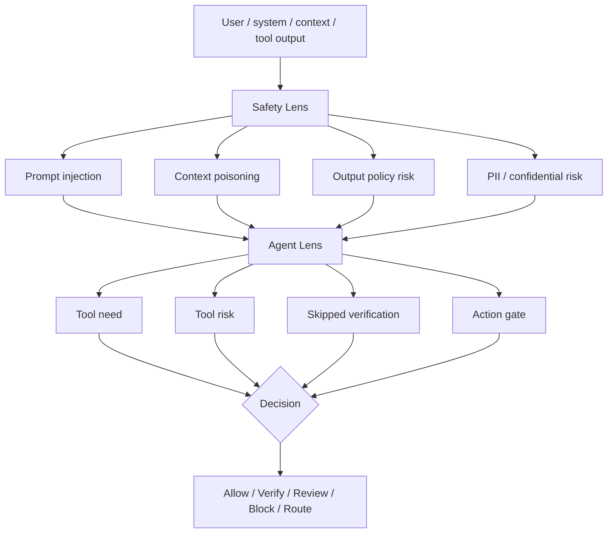

# NeuronLens Product Plan

> **Status:** Active · **Last updated:** May 2026  
> **Purpose:** Single source of truth for product structure, build priorities, and execution order.  
> **Audience:** Founders, engineers, investors — read top-to-bottom once, then use the [Quick Reference](#quick-reference) and [Game Plan](#game-plan) sections daily.

---

## TL;DR

NeuronLens narrows to **three connected products**. Do not rebrand. Do not collapse Safety Lens into Agent Lens.

| Product | One-line role |
|---------|---------------|
| **Safety Lens** | Horizontal safety firewall — prompts, RAG context, draft outputs, policy risk |
| **Agent Lens** | Runtime action gate — tool need, tool risk, skipped verification, routing |
| **Model Repair Studio** | Targeted repair for repeated failures in open/customer-owned models |

**The clean line:**

> Safety Lens detects safety/policy risk. Agent Lens decides whether an agent can act. Model Repair Studio fixes repeated failures.

**Do not push as standalone products now:** Concept Studio, Runtime Control / Steering, Domain Lens, Trading Lens.

---

## Quick Reference

### Product portfolio

| Product | Final role | Separate? | Why |
|---------|------------|:---------:|-----|
| **Agent Lens** | Runtime assurance for AI agents before tool/action execution | **Yes** | Agents have plans, tools, actions, omissions, and trace risk |
| **Safety Lens** | Safety firewall for prompts, RAG context, draft outputs, policy risk | **Yes** | Useful for chatbots, RAG, copilots, and agents — sells independently |
| **Model Repair Studio** | Targeted repair for recurring failures in open/customer-owned models | **Yes (Phase 2)** | Converts repeated Agent/Safety failures into patches |
| Concept Studio | Internal evidence workbench | No | Supports feature/probe/SAE investigation only |
| Runtime Control / Steering | Optional action layer | No | Use after a detector fires; do not lead with it |

### Decision vocabulary

**Agent Lens gate:** Allow · Verify · Review · Block · Route

**Safety Lens gate:** Allow · Review · Block

### Architecture flow



### Feature ownership

| Feature | Owner | Used by |
|---------|-------|---------|
| Prompt injection | Safety Lens | Agent Lens calls it |
| Context poisoning | Safety Lens | Agent Lens calls it |
| Output safety | Safety Lens | Chatbots + agents |
| Tool need / tool risk | Agent Lens | Agent systems |
| Action routing | Agent Lens | Agent systems |
| SAE/probe risk evidence | Safety Lens / Agent Lens (open-model tier) | Model Repair Studio |
| Failure-slice generation | Both | Model Repair Studio |

---

## Table of Contents

1. [What we already have](#1-what-we-already-have)
2. [Why this matters — Claude system-card validation](#2-why-this-matters--claude-system-card-validation)
3. [Agent Lens — product spec](#3-agent-lens--product-spec)
4. [Safety Lens — product spec](#4-safety-lens--product-spec)
5. [How the products interact](#5-how-the-products-interact)
6. [Model Repair Studio](#6-model-repair-studio)
7. [Steering policy](#7-steering-policy)
8. [Game Plan](#8-game-plan) ← **start here for execution**
9. [Deployment Card (Phase 2 deliverable)](#9-deployment-card-phase-2-deliverable)
10. [VC narrative](#10-vc-narrative)
11. [Final recommendation](#11-final-recommendation)
12. [References](#references)

---

## 1. What we already have

### Agent Lens — already strong

Positioned well today: sees inside AI agents before they act, detects tool-use intent from internal signals, scores action risk, routes to **allow / review / block** with mechanistic evidence. Integrates with HTTP, LangChain, CrewAI, LlamaIndex. Uses GPT-OSS-20B SAE features with `tool_needed_probe` and `tool_risk_category_probe`.

**Do not rebrand.** Sharpen only.

| Existing item | Keep? | Upgrade |
|---------------|:-----:|---------|
| Tool-needed probe | Yes | Add omission/failure taxonomy from Claude |
| Tool-risk probe | Yes | Add risk categories by action type and enterprise workflow |
| Allow / Review / Block gate | Yes | Add **Verify** and **Route** |
| SAE feature evidence | Yes | Frame as "evidence," not causal proof |
| Framework integrations | Yes | Real product advantage — keep investing |
| Feature Explorer | Yes | Move toward Concept Studio / internal evidence layer |

### Safety Lens — already separate and useful

Self-contained **Safety Firewall** with four activation-probe detectors: **Prompt Guard**, **Context Guard**, **Output Shield**, **Threat Radar**. Supports FastAPI, Next.js, Streamlit, live GPT-OSS/NNSight mode, demo mode, policy modes, event history, token attribution, root cause, and steering endpoints (`/steer_regenerate`, `/steer_sweep`).

**Do not merge into Agent Lens.** Position as:

> A horizontal safety and policy layer for chatbots, RAG systems, copilots, and agents.

Agent Lens can call Safety Lens; Safety Lens also sells independently.

---

## 2. Why this matters — Claude system-card validation

Claude Opus 4.8's system card validates the enterprise risk framing. Anthropic evaluates cyber, safeguards, agentic safety, alignment, and model welfare; prompt injection is a high-priority risk for agentic systems with private data and actions.

Enterprise risk is no longer *"Did the chatbot answer correctly?"* It is:

> **Can this AI system safely use tools, retrieve private data, act on behalf of users, and remain policy-compliant?**

| Claude concern | NeuronLens product |
|----------------|-------------------|
| Prompt injection | Safety Lens + Agent Lens |
| Tool-use risk | Agent Lens |
| Skipped verification | Agent Lens |
| Unsafe / policy-violating output | Safety Lens |
| Internal risk signals | Safety Lens (open/customer-owned models) |
| Repeated failure patterns | Model Repair Studio |
| White-box investigation | Concept Studio (backend) |
| Steering / mitigation | Runtime Control module |

**NeuronLens failure taxonomy** (from Claude's flagged sessions): fabrication, instruction-following failure, cheap verification skipped, ignored correction.

---

## 3. Agent Lens — product spec

### Positioning

> Agent Lens monitors AI agents before they use tools or take actions. It detects skipped verification, risky tool calls, prompt injection, false completion, and action risk, then routes the agent to allow, verify, review, block, or route.

### Build backlog

| Priority | Subcomponent | In product? | Next build | Impact | Effort |
|:--------:|--------------|:-----------:|------------|:------:|:------:|
| **P0** | Tool-Need Probe | Yes | Omission detection: "tool needed but skipped" | 5/5 | 2/5 |
| **P0** | Tool-Risk Probe | Yes | Expand risk tiers: finance, SOC, payments, code, data | 5/5 | 2.5/5 |
| **P0** | Action Gate | Yes | Add **Verify** and **Route** to Allow/Review/Block | 5/5 | 2/5 |
| **P0** | Prompt-Injection Check | Partly via Safety Lens | Call Safety Lens before tool execution when context/tool output present | 5/5 | 2.5/5 |
| **P1** | False-Completion Detector | Partly via trace | Agent claims work done but trace doesn't support it | 4.5/5 | 3/5 |
| **P1** | Ignored-Correction Detector | No | Track repeated wrong assumptions after correction | 4/5 | 3/5 |
| **P1** | Deployment Card for Agents | No | Workflow-specific safety report | 5/5 | 3/5 |

### Messaging — do vs don't

| Don't say | Do say |
|-----------|--------|
| "Agent Lens fully understands model intent." | "Agent Lens exposes useful internal decision signals before action." |

Features are mechanistic evidence, not causal proof — already aligned with current README.

---

## 4. Safety Lens — product spec

### Positioning

> Safety Lens is a standalone safety firewall for prompts, RAG context, draft outputs, and model interactions. It works for chatbots, RAG systems, copilots, and agents.

Safety Lens owns all safety/policy detectors — not Agent Lens.

### Build backlog

| Priority | Subcomponent | In product? | Next build | Impact | Effort |
|:--------:|--------------|:-----------:|------------|:------:|:------:|
| **P0** | Prompt Guard | Yes | Expand direct prompt-injection / jailbreak test set | 5/5 | 2/5 |
| **P0** | Context Guard | Yes | Improve indirect RAG prompt-injection detection | 5/5 | 3/5 |
| **P0** | Output Shield | Yes | Add finance / compliance / advice-language policies | 4.5/5 | 2.5/5 |
| **P0** | Threat Radar | Yes | Keep as shadow detector; use for red-team scoring | 4/5 | 2/5 |
| **P1** | PII / Confidential Data Detector | Not explicit | Sensitive data leakage detection | 4.5/5 | 3/5 |
| **P1** | Overconfidence / Missing Caveat Detector | No | Professional-work safety signal | 4/5 | 3/5 |
| **P1** | Known-Wrong Signal | No | Open-model tier: internal-output mismatch detector | 5/5 | 4/5 |

### Two operating modes

| Mode | Models | Uses activations? | Buyer use |
|------|--------|:-----------------:|-----------|
| **Black-box Safety** | Claude / GPT / Gemini / open | No | Prompt / context / output safety checks |
| **White-box Safety** | Open / customer-owned | Yes | SAE / dense probe risk prediction |

**VC-safe framing:**

> Safety Lens works behaviorally for closed models and mechanistically for open/customer-owned models.

We do **not** claim closed-model mechanistic access.

---

## 5. How the products interact

```text
User / system / context / tool output
        ↓
Safety Lens  →  prompt injection, context poisoning, output policy, PII
        ↓
Agent Lens   →  tool need, tool risk, skipped verification, action gate
        ↓
Decision     →  Allow / Verify / Review / Block / Route
```

Agent Lens calls Safety Lens when prompt, context, or tool output is in the execution path. Safety Lens remains independently deployable for non-agent use cases.

---

## 6. Model Repair Studio

Rename **Model Design Studio** → **Model Repair Studio**.

### Positioning

> Model Repair Studio fixes repeated failures discovered by Agent Lens and Safety Lens.

Targeted repair product — not broad model design.

### Repair workflow

```text
Agent Lens / Safety Lens incident
        ↓
Failure slice
        ↓
Baseline repair ladder
        ↓
Regression proof card
        ↓
Patch / adapter / policy update
```

### Repair methods (priority order)

| Priority | Method | Why |
|:--------:|--------|-----|
| **P0** | Calibration / head patch | Cheap and auditable |
| **P0** | Vanilla LoRA | Commodity baseline |
| **P0** | LoRA + anchor/KL | Fix while preserving old behavior |
| **P1** | Probe-guided LoRA | Non-SAE mechanistic targeting |
| **P1** | SAE-guided repair | Only if SAE features beat baselines |

### Proof table to build

| Method | Target gain | Held-out gain | Anchor regression | Calibration drift | Verdict |
|--------|:-----------:|:-------------:|:-----------------:|:-----------------:|---------|
| Base | — | — | — | — | baseline |
| LoRA | ? | ? | ? | ? | commodity |
| LoRA + KL | ? | ? | ? | ? | strong baseline |
| Probe-guided LoRA | ? | ? | ? | ? | MI edge |
| SAE-guided repair | ? | ? | ? | ? | keep only if wins |

---

## 7. Steering policy

Safety Lens already has `/steer_regenerate` and `/steer_sweep`. **Do not sell steering as a standalone product.**

```text
Safety Lens detects risk
        ↓
Agent Lens or Safety Lens chooses action
        ↓
If low/medium risk and open model → try steering/regeneration
Else → verify / review / block / route
```

| Product | Steering use | Build now? |
|---------|--------------|:----------:|
| Safety Lens | Regenerate safer draft; alpha sweep for risk score drop | **Yes** (experimental) |
| Agent Lens | Reduce overconfident action, force verification-style response | Later |
| Model Repair Studio | Causal diagnostic before baking into LoRA | **Yes** (diagnostic only) |

**Do not use steering for:** numerical correctness, citation correctness, guaranteed compliance, final safety guarantees.

**Use steering for:** safer regeneration, caveat/uncertainty injection, reducing overconfident style, causal feature testing, temporary mitigation before repair.

---

## 8. Game Plan

> **How to use this section:** Work top-to-bottom. Check items off as shipped. Do not start Phase 2 until Phase 1 exit criteria are met.

### Phase 1 — Tighten existing products (Weeks 1–4)

**Goal:** No new product names. Ship concrete improvements to Agent Lens and Safety Lens. Wire them together. Start Model Repair Studio proof harness.

#### Week 1

| Track | Tasks | Owner | Done |
|-------|-------|-------|:----:|
| **Agent Lens** | Add **Verify** and **Route** decisions to action gate | | ☐ |
| **Agent Lens** | Expand Tool-Need / Tool-Risk test scenarios (finance, SOC, payments) | | ☐ |
| **Agent Lens** | Add omission taxonomy: tool needed but skipped | | ☐ |
| **Safety Lens** | Expand Prompt Guard + Context Guard test scenarios | | ☐ |
| **Safety Lens** | Add finance compliance policy mode to Output Shield | | ☐ |

#### Week 2

| Track | Tasks | Owner | Done |
|-------|-------|-------|:----:|
| **Integration** | Wire Agent Lens → Safety Lens before tool execution when prompt/context/tool-output present | | ☐ |
| **Safety Lens** | Add PII / confidential-data detector (P1 → pull forward) | | ☐ |
| **Agent Lens** | Document integration contract: when Safety Lens is called, what fields pass through | | ☐ |

#### Week 3

| Track | Tasks | Owner | Done |
|-------|-------|-------|:----:|
| **Model Repair Studio** | Build failure-slice builder from Agent/Safety incidents | | ☐ |
| **Model Repair Studio** | Rename Model Design Studio → Model Repair Studio in docs and UI | | ☐ |
| **Agent Lens** | Start false-completion detector (trace-based, P1) | | ☐ |

#### Week 4

| Track | Tasks | Owner | Done |
|-------|-------|-------|:----:|
| **Model Repair Studio** | Run LoRA / LoRA+KL / probe-guided repair proof harness | | ☐ |
| **Model Repair Studio** | Fill proof table with first FinBERT or GPT-OSS results | | ☐ |
| **Safety Lens** | Keep `/steer_sweep` as causal validation + safe-regeneration demo only | | ☐ |
| **Both** | Phase 1 exit review — confirm integration works end-to-end | | ☐ |

#### Phase 1 exit criteria

- [ ] Agent Lens gate supports Allow / Verify / Review / Block / Route
- [ ] Agent Lens calls Safety Lens on tool-execution paths with external context
- [ ] Safety Lens has expanded test sets + finance compliance mode + PII detector
- [ ] Model Repair Studio has failure-slice pipeline and first proof-table numbers
- [ ] No new standalone product names launched

---

### Phase 2 — Deployment Card (Weeks 5–8)

**Goal:** Enterprise deliverable — a generated safety report from live product data.

| Section | Source product |
|---------|----------------|
| Model and workflow description | Agent Lens |
| Tool / action permissions | Agent Lens |
| Prompt-injection results | Safety Lens |
| Tool-risk and omission results | Agent Lens |
| Policy violations | Safety Lens |
| Human-review thresholds | Agent Lens |
| Open-model internal probe evidence | Agent Lens / Safety Lens |
| Remaining risks | Combined |
| Repair candidates | Model Repair Studio |

#### Phase 2 checklist

- [ ] Define Deployment Card JSON schema
- [ ] Agent Lens: export tool-risk + omission summary per workflow
- [ ] Safety Lens: export prompt/context/output policy results
- [ ] Combined PDF / markdown generator
- [ ] Pilot with one internal agent workflow

---

### Phase 3 — Advanced detectors (Weeks 9–12)

**Goal:** P1 detectors and open-model differentiation.

- [ ] Agent Lens: false-completion detector
- [ ] Agent Lens: ignored-correction detector
- [ ] Safety Lens: overconfidence / missing-caveat detector
- [ ] Safety Lens: known-wrong signal (open-model tier)
- [ ] Model Repair Studio: SAE-guided repair — run only if it beats LoRA+KL baseline

---

### Phase 4 — Enterprise hardening (ongoing)

Cross-reference: `neuronlens/agent-lens/README_ToDo_Product.md` for SDK, K8s sidecar, OTEL, multi-tenancy.

- [ ] `pip install agent-lens` SDK with `ProbeGate` class
- [ ] LangChain / CrewAI / LlamaIndex callback integrations
- [ ] Kubernetes sidecar + Helm chart
- [ ] OpenTelemetry spans on gate decisions
- [ ] PostgreSQL + multi-tenancy
- [ ] Sparse activation storage (1000× compression)

---

### What we are NOT doing (guardrails)

| Item | Status |
|------|--------|
| Rebrand Agent Lens or Safety Lens | **No** |
| Collapse Safety Lens into Agent Lens | **No** |
| Ship Concept Studio as standalone product | **No** |
| Ship Runtime Control / Steering as standalone product | **No** |
| Ship Domain Lens or Trading Lens as alpha products | **No** |
| Claim closed-model mechanistic access | **No** |

---

## 9. Deployment Card (Phase 2 deliverable)

The Deployment Card is the enterprise artifact — analogous to Claude's system-card process, but deployment-specific for customer agents, tools, documents, and models.

It combines Agent Lens action telemetry, Safety Lens policy results, and Model Repair Studio repair candidates into one auditable report per workflow.

---

## 10. VC narrative

> We are not building a menu of research lenses. We are narrowing NeuronLens to three connected products. **Safety Lens** is the horizontal safety firewall for prompts, RAG context, outputs, PII, and policy risk. **Agent Lens** is the runtime action gate for agents using tools. **Model Repair Studio** fixes repeated failures discovered by those systems in open/customer-owned models.
>
> This is directly aligned with Claude Opus 4.8's system-card process: Anthropic evaluates agentic safety, prompt injection, tool-use risk, white-box internal signals, and regression behavior before deployment. NeuronLens brings that deployment-specific safety machinery to enterprises running their own agents, tools, documents, and models.
>
> We do not claim closed-model mechanistic access. Closed models get behavioral safety checks. Open/customer-owned models get SAE/probe internals and targeted repair.

---

## 11. Final recommendation

**Ship:**

1. **Agent Lens** — clean agent action gate
2. **Safety Lens** — standalone safety firewall
3. **Model Repair Studio** — targeted fix engine

**Use internally only:** Concept Studio (evidence workbench)

**Use as action layer, not product:** Steering via Safety Lens safe-regeneration + Model Repair Studio causal diagnostic

**Proof story:** Frontier labs already need this safety machinery; enterprises need a deployment-specific version.

---

## References

| # | Paper | Topic |
|---|-------|-------|
| [1] | [LoRA: Low-Rank Adaptation of Large Language Models](https://arxiv.org/abs/2106.09685) | Vanilla LoRA baseline |
| [2] | [Direct Preference Optimization](https://arxiv.org/abs/2305.18290) | LoRA + KL / anchor framing |
| [3] | [Representation Engineering](https://arxiv.org/abs/2310.01405) | Probe-guided LoRA |
| [4] | [SAEs Are Good for Steering — If You Select the Right Features](https://arxiv.org/abs/2505.20063) | SAE-guided repair |
| [5] | [Steering Language Models With Activation Engineering](https://arxiv.org/abs/2308.10248) | Activation Addition |
| [6] | [Programming Refusal with Conditional Activation Steering](https://arxiv.org/abs/2409.05907) | CAST |
| [7] | [End-to-end Learning of Sparse Interventions on Activations](https://arxiv.org/abs/2503.10679) | LinEAS |
| [8] | [Inference-Time Intervention](https://arxiv.org/abs/2306.03341) | ITI |

---

## Related docs in repo

| Doc | Location |
|-----|----------|
| Agent Lens README | `neuronlens/agent-lens/README.md` |
| Agent Lens engineering backlog | `neuronlens/agent-lens/README_ToDo_Product.md` |
| Safety Lens README | `neuronlens/safety-lens/README.md` |
| Model Repair Studio README | `ModelModification/ModelRepairStudio/README.md` |
