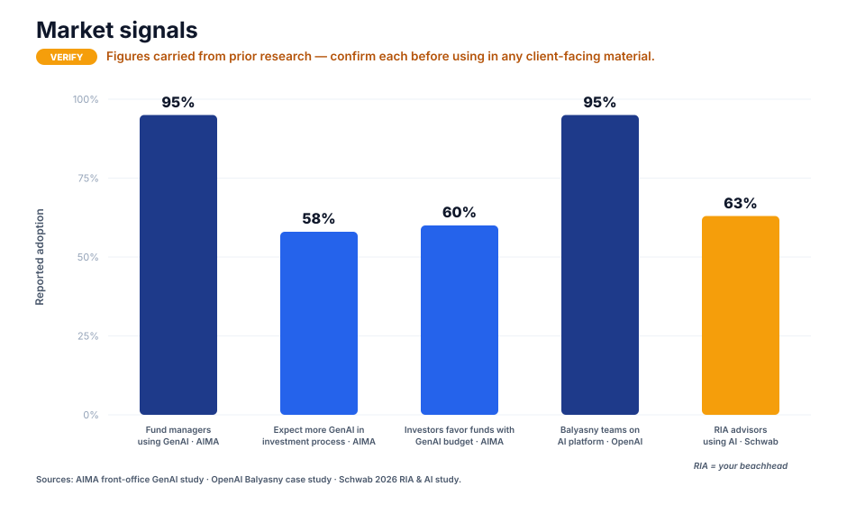
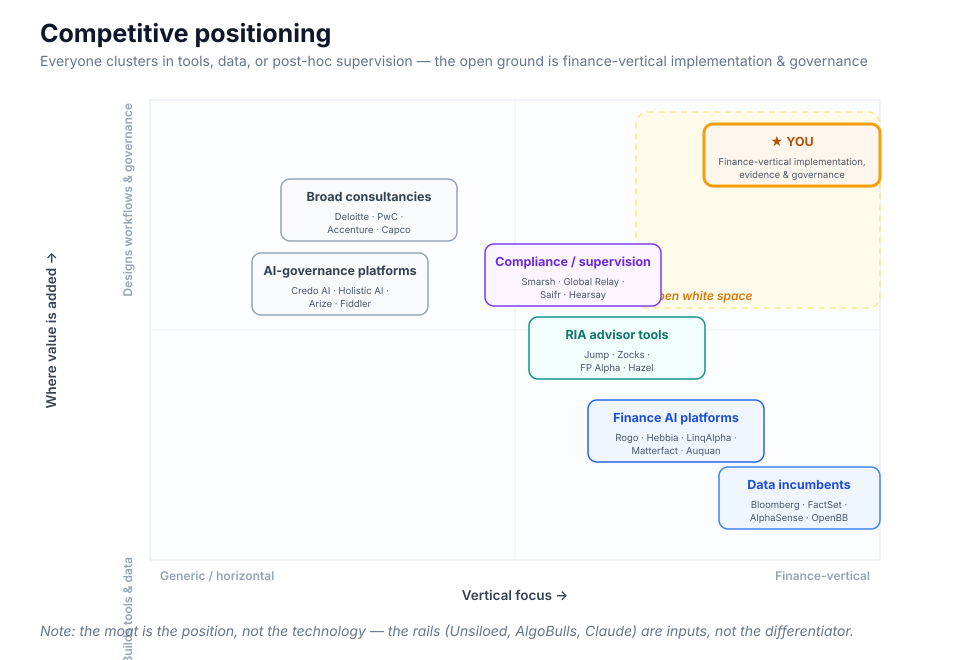
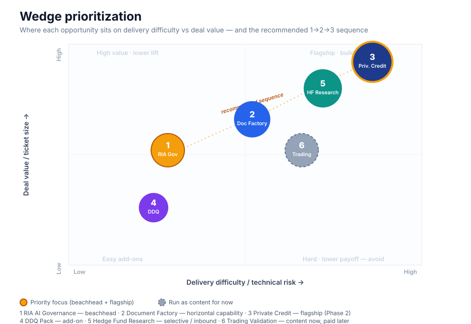
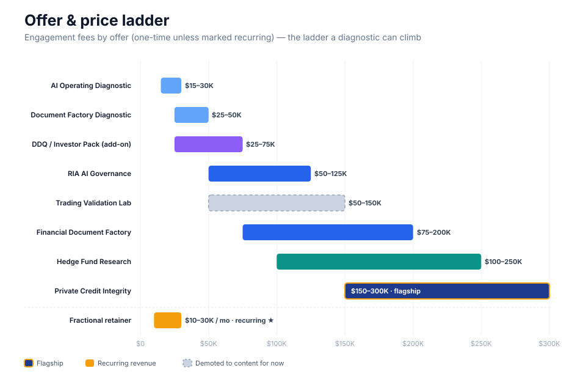
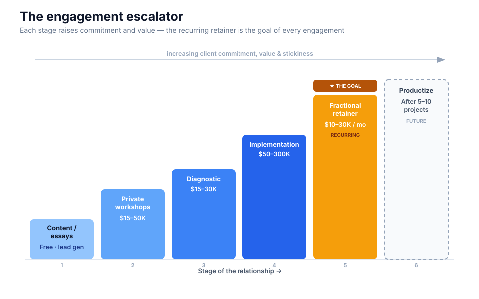
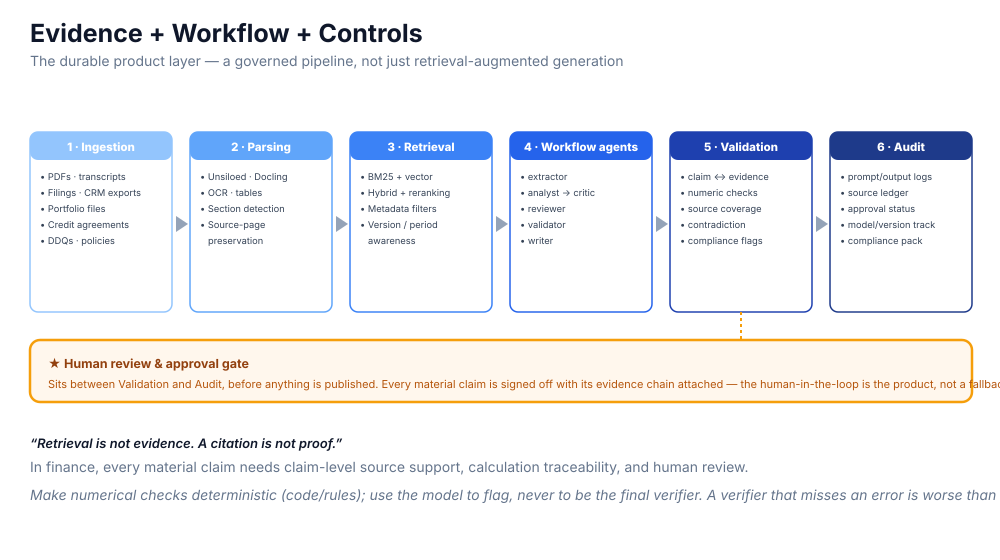
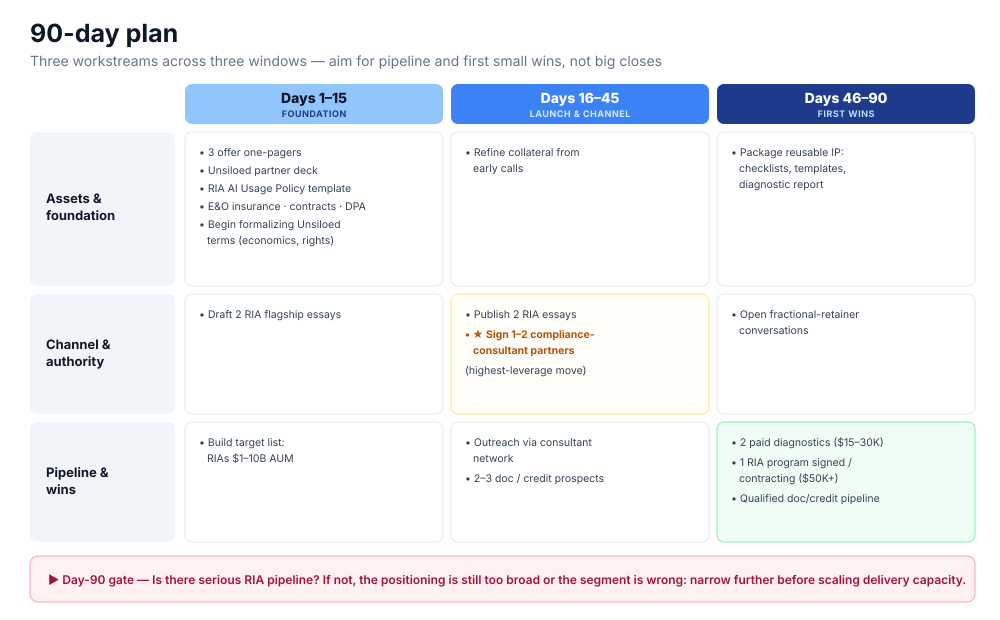

# The Last Mile of AI in Investment Management

### Strategy, Prioritization, and Sanity Check

---

## Conventions

| Symbol | Meaning |
|--------|---------|
| ⭐ **Starred** use cases | Highest-value entry points |
| **Sound** | Keep as-is |
| **Watch** | Do it, but carefully |
| **Ambitious** | Likely over-reach — adjust scope |
| **Verify** | Confirm the underlying fact first |

> **Worth considering** callouts flag the judgment calls, trade-offs, and cautions to weigh before committing.
>
> Source links sit **inline**, next to the company or claim they support; a consolidated list is in [Section 22](#22-sources). Market statistics cited here should be **independently re-verified** before they appear in any client-facing material.

---

## Table of Contents

| # | Section |
|---|---------|
| [1](#1-purpose-and-how-to-use-this-document) | Purpose and How to Use This Document |
| [2](#2-the-thesis) | The Thesis |
| [3](#3-why-this-works-the-market-reality) | Why This Works: The Market Reality |
| [4](#4-positioning) | Positioning |
| [5](#5-competitive-landscape-and-how-to-position-against-each) | Competitive Landscape |
| [6](#6-wedge-prioritization-recommended-order) | Wedge Prioritization |
| [7](#7-the-two-implementation-rails) | The Two Implementation Rails |
| [8](#8-partner-and-distribution-strategy) | Partner and Distribution Strategy |
| [9](#9-offer-stack-and-pricing-ladder) | Offer Stack and Pricing Ladder |
| [10](#10-target-segments-icp) | Target Segments (ICP) |
| [11](#11-use-case-catalog) | Use-Case Catalog |
| [12](#12-technical-architecture--evidence--workflow--controls) | Technical Architecture |
| [13](#13-data-security-liability-and-foundations) | Data Security, Liability, and Foundations |
| [14](#14-what-not-to-do--kill--deprioritize) | What Not to Do / Kill / Deprioritize |
| [15](#15-education-and-coaching) | Education and Coaching |
| [16](#16-content-and-lead-generation) | Content and Lead-Generation |
| [17](#17-building-the-firm) | Building the Firm |
| [18](#18-90-day-plan) | 90-Day Plan |
| [19](#19-suggested-charts-and-visuals) | Suggested Charts and Visuals |
| [20](#20-sanity-check) | Sanity Check |
| [21](#21-final-synthesis) | Final Synthesis |
| [22](#22-sources) | Sources |

---

## 1. Purpose and How to Use This Document

This is the go-to-market and product strategy for a specialized firm that helps regulated investment firms turn generative AI from scattered experimentation into **approved, evidence-backed, defensible workflows** across documents, research, advisory, credit, and (eventually) trading.

**The one-line offer:**

> *I help hedge funds, RIAs, family offices, and private-credit teams move from random AI usage to approved, evidence-backed, high-ROI workflows.*

The [sanity check](#20-sanity-check) (Section 20) rates every major element as **Sound / Watch / Ambitious / Verify**.

---

## 2. The Thesis

**Core conclusion:**

> Investment firms already own the AI tools. They do not know how to turn them into controlled, useful, measurable, defensible workflows. Sell the **operating model** — workflows, governance, evidence, compliance, implementation, ROI — not another AI platform.

**The reasoning chain:**

- Firms already run [Claude](https://www.anthropic.com/), ChatGPT, [Rogo](https://www.prnewswire.com/news-releases/rogo-raises-160m-series-d-to-scale-the-agentic-platform-for-finance-302756546.html), [Hebbia](https://www.hebbia.com/), [AlphaSense](https://www.alpha-sense.com/), [Bloomberg](https://professional.bloomberg.com/products/bloomberg-terminal/ai/), [FactSet](https://investor.factset.com/news-releases/news-release-details/factset-recognized-pioneering-ai-advancements-financial), [OpenBB](https://openbb.co/), [Jump](https://jump.ai/products/meet/notetaker), [Zocks](https://www.zocks.io/), and [FP Alpha](https://fpalpha.com/). You will not out-build them.
- What firms **lack** is approved workflows, AI usage policies, human review, source-backed outputs, claim-level evidence, numerical checks, cost-per-workflow thinking, compliance-ready logs, vendor evaluation, training/adoption, ROI measurement, and workflow-specific implementation.
- Therefore the opportunity is the **last mile**: helping firms use the AI they already have safely, deeply, and profitably.

**The lines worth keeping front-and-center:**

> *Prompts are disposable. Workflows and controls are durable.*
>
> *Firms don't have an AI-access problem; they have an AI-operating-model problem.*
>
> *Retrieval is not evidence. A citation is not proof.*

### Two implementation rails

The unfair advantage is direct access to two delivery rails:

1. **[Unsiloed](https://docs.unsiloed.ai/)** — turns PDFs, scans, slides, spreadsheets, and 20+ formats into Markdown and structured JSON with **confidence scores and bounding boxes**. The document-intelligence engine beneath most wedges.
2. **[AlgoBulls](https://algobulls.com/)** — a regulatory-compliant algorithmic-trading platform (backtesting, execution, automation, audit-ready logs) for traders, quants, strategy creators, brokers, and fintechs.

The operating stance: use Unsiloed for document intelligence, use AlgoBulls for trading validation/governance, and sell yourself as the **AI Operating Partner** who decides what should be trusted, reviewed, deployed, or rejected.

> **Worth considering.** The two rails are not equal. Unsiloed sits under almost every wedge and is core. AlgoBulls serves a different buyer in a different market with a harder sale, so it should sit outside the main line (see Section 6). Don't let "we have two rails" force a symmetrical strategy.

---

## 3. Why This Works: The Market Reality

**Hedge funds — already deep in GenAI.** [AIMA](https://www.aima.org/article/press-release-front-office-gen-ai-adoption-shifts-from-if-to-when-for-leading-fund-managers-aima-research-finds.html) reports 95% of fund-manager respondents use GenAI (up from 86% in 2023), 58% expect more use in investment processes within a year, and 60% of institutional investors would be more likely to invest in a fund allocating meaningful GenAI budget. The [OpenAI / Balyasny](https://openai.com/index/balyasny-asset-management/) case study reports ~95% of Balyasny investment teams on its AI research platform, compressing deep-research tasks from days to hours. [Anthropic](https://www.anthropic.com/news/finance-agents) now ships finance agents via Claude Cowork, Claude Code, and Managed Agents. The pattern is **specific agents, not one chatbot**, with **human-in-the-loop** on high-judgment calls.

**RIAs — earlier, messier, better as an entry point.** [Schwab's 2026 RIA AI study](https://www.aboutschwab.com/advisor-ai-in-action-2026) reports 63% of advisors using AI, but most firms are still experimenting. RIAs aren't chasing "AI alpha" — they need governance, approved use cases, communication review, training, and defensible documentation.

**Regulation — the urgency engine.** [FINRA's 2026 oversight report](https://www.finra.org/rules-guidance/guidance/reports/2026-finra-annual-regulatory-oversight-report/gen-ai) has a dedicated GenAI section. The [SEC's 2025 exam priorities](https://www.sec.gov/files/2025-exam-priorities.pdf) signal that AI in advisory operations may trigger deeper review of policies, procedures, and disclosures. [WealthManagement.com](https://www.wealthmanagement.com/artificial-intelligence/sec-examiners-are-asking-rias-about-ai-governance-now) reports SEC examiners already asking RIAs about AI tool inventories, vendor oversight, and supervisory procedures.

> **Worth considering.** The strongest *commercial* signal isn't adoption — it's the regulatory pressure on RIAs. It converts "nice to have" into "have to," and it has a named buyer (the CCO) with budget anxiety. Anchor the first offer there.

---

## 4. Positioning

**Master:** *AI Operating Partner for regulated investment firms — moving firms from AI demos to defensible workflows across documents, research, advisory, credit, and trading, with evidence, controls, review, and measurable ROI.*

| Client type | Positioning line |
|-------------|-----------------|
| Hedge funds / family offices | "Use GenAI for research, DDQs, portfolio monitoring, and trading research without losing evidence, review, or control." |
| RIAs | "Create SEC-defensible AI usage programs across client communications, portfolio commentary, meeting prep, and advisor workflows." |
| Private credit | "Verify AI-generated credit work before IC: covenants, definitions, thresholds, calculations, source evidence, memo consistency." |
| Brokers / fintech | "Offer AI-assisted trading and strategy automation with backtesting discipline, paper-trading validation, risk limits, and execution governance." |

**Hard rule:** don't pitch "AI consulting." Pitch **document integrity, advisor governance, credit-memo integrity, trading validation.**

> **Worth considering.** Two cautions. (1) "SEC-defensible" is a quasi-legal promise — only safe if co-delivered with a registered compliance professional, and never as a guaranteed outcome (Section 13). (2) A solo founder can't credibly lead with all four lines at once; make the RIA line the headline and keep the rest as "also."

---

## 5. Competitive Landscape and How to Position Against Each

### A. Finance-native AI platforms — don't copy

| Company | What they do | Implication |
|---------|-------------|-------------|
| **[Rogo](https://www.prnewswire.com/news-releases/rogo-raises-160m-series-d-to-scale-the-agentic-platform-for-finance-302756546.html)** | Agentic finance platform; reported $160M Series D; 35,000+ users across 250+ institutions | Don't build "Rogo for smaller funds." |
| **[Hebbia](https://www.hebbia.com/)** | Institutional AI for finance, asset managers, banks, law firms | Don't build generic document/research AI. |
| **[LinqAlpha](https://aws.amazon.com/blogs/machine-learning/how-linqalpha-assesses-investment-theses-using-devils-advocate-on-amazon-bedrock/)** | Multi-agent research; "Devil's Advocate" thesis testing on AWS Bedrock | Thesis pressure-testing is already live. |
| **[Matterfact](https://www.matterfact.com/)** | "AI superagent" unifying filings, transcripts, expert calls, alt-data into cited research | Don't pitch a broad "cited research assistant." |
| **[Auquan](https://www.auquan.com/)** | Agentic AI: deal screening, IC memos, portfolio monitoring, LP reporting | Credit/private-market workflows are being attacked. |
| [BlueFlame](https://www.blueflame.ai/), [Finster](https://www.finster.ai/), [Brightwave](https://www.brightwave.io/) | Diligence, research, IR, data-room analysis | Same direction; avoid head-on competition. |

### B. Incumbent data/workflow platforms — don't compete on data

| Company | What they do | Implication |
|---------|-------------|-------------|
| **[Bloomberg (ASKB/AI)](https://professional.bloomberg.com/products/bloomberg-terminal/ai/)** | Conversational AI inside the Terminal | Build workflows *around* it; they won't leave Bloomberg. |
| **[FactSet AI / Mercury](https://investor.factset.com/news-releases/news-release-details/factset-recognized-pioneering-ai-advancements-financial)** | AI-powered data, analytics, workflows | Don't compete on data. |
| **[AlphaSense](https://www.alpha-sense.com/)** | AI market intelligence over 500M+ documents | Don't build generic research search. |
| **[OpenBB](https://openbb.co/)** | Agentic workspace unifying data + internal tools | **Possible build-on-top / integration partner.** |

### C. RIA / advisor AI tools — don't build another notetaker

| Company | What they do | Implication |
|---------|-------------|-------------|
| **[Jump](https://jump.ai/products/meet/notetaker)** | AI meeting notes, follow-ups, compliance docs (5–10 hrs/week saved) | Don't build a notetaker. |
| **[Zocks](https://www.zocks.io/)** | Notes, forms, emails, CRM, plans (10+ hrs/week saved) | Don't compete on advisor admin. |
| **[FP Alpha](https://fpalpha.com/)** | Reads tax returns, wills, trusts, insurance; planning insights | Don't build a planning-doc reader. |
| **[Altruist Hazel](https://www.investopedia.com/altruist-hazel-ai-assistant-smart-practice-review-11964891)** | Advisor AI: research, meeting prep, tax planning | Custodian/data-native tools are hard to beat. |

### D. Compliance & AI-governance platforms — stay finance-workflow-specific

[Smarsh](https://www.smarsh.com/), [Global Relay](https://www.globalrelay.com/), [Saifr](https://saifr.ai/), Archive Intel, [Hearsay](https://hearsaysystems.com/), [Red Oak](https://www.redoakcompliance.com/), Glynac, Luthor, [Credo AI](https://www.credo.ai/), [Holistic AI](https://www.holisticai.com/), [IBM watsonx.governance](https://www.ibm.com/products/watsonx-governance), [OneTrust](https://www.onetrust.com/), [Galileo](https://galileo.ai/), [Arize](https://arize.com/), [Fiddler](https://www.fiddler.ai/), [Patronus](https://www.patronus.ai/), Maxim, [LangSmith](https://www.langchain.com/langsmith).

They **supervise communications**; you **design the workflow before risky communications are created**.

### E. Broad consultancies and internal AI teams

| Competitor | What they do | Your counter |
|-----------|-------------|--------------|
| [Deloitte](https://www2.deloitte.com/), [PwC](https://www.pwc.com/), [Accenture](https://www.accenture.com/), [Capco](https://www.capco.com/) | Broad AI transformation | "A narrow *working* implementation, not a 100-slide deck." |
| Internal AI teams (large funds/banks) | Build in-house | "For firms too small to build like Balyasny or Citadel, but serious enough to need governance and discipline." |

> **Worth considering — where the moat actually is.** It is **not technology** (you use Unsiloed, AlgoBulls, Claude, OpenBB). It is finance-vertical workflow expertise + trust + reusable IP + speed. That is a real but **boutique-scale** moat: it defends a high-margin services firm, not a venture-scale platform. The defense is depth in one narrow vertical, delivered faster than a Big-4 and more credibly than a generic AI shop.

---

## 6. Wedge Prioritization (Recommended Order)

The recommended order separates two questions the typical plan conflates — *what funds the business fastest and earns proof?* vs *what is the highest-value flagship?* — and treats the Document Factory as the **horizontal capability under everything**, not a standalone first sale.

| Rank | Wedge | Role | Why this order |
|:----:|-------|------|----------------|
| **1** | **RIA AI Governance & Advisor Workflow** | Cash-flow beachhead | Clearest buyer (CCO/COO), strongest regulatory urgency, shortest sales cycle, most repeatable, ready-made distribution (compliance consultants), lowest technical risk, no rail dependency |
| **2** | **Financial Document Factory ([Unsiloed](https://docs.unsiloed.ai/))** | Horizontal capability | Every engagement touches documents. Build and prove the extraction/evidence engine *inside* paid work, then spin it out |
| **3** | **Private Credit AI Integrity** | Flagship (Phase 2) | Highest ticket, strongest moat, real pain, productizable — but hardest sale, smallest universe, needs a credit contractor and a proven document layer |
| **4** | **DDQ / Investor AI Response Pack** | Add-on, never standalone | Attach to fund / emerging-manager / family-office engagements |
| **5** | **Hedge Fund Research Workflow** | Selective / inbound | Crowded. Only smaller/emerging funds, framed as "configure and control what you already have" |
| **6** | **AI Trading Strategy Validation Lab ([AlgoBulls](https://algobulls.com/))** | Content now, paid later | Different ICP, partner-fit unverified, and it sells *discipline* to buyers who want *alpha* |

> **Worth considering — why trading is demoted.** Three independent reasons, any one sufficient: (1) brokers/fintech/quant buyers share almost nothing with your RIA/credit/fund-COO buyer, doubling your go-to-market; (2) AlgoBulls appears to be primarily an India-market / retail-and-broker platform — confirm it serves the US institutional/SEC context before any US-facing offer (Section 20); (3) "we install risk discipline so your backtests don't blow you up" is the opposite of what an alpha-seeker wants to hear — a low-conversion sale.

### The wedges in detail

#### Wedge 1 — RIA AI Governance & Advisor Workflow Program

Buyer: RIA CCO/COO/founder · $50K–$125K · 6–8 weeks

Deliverables: AI usage policy; approved/prohibited use-case matrix; advisor AI playbook; client-communication and portfolio-commentary review workflows; meeting-prep workflow; prompt/output logging; vendor due-diligence checklist; compliance-approval workflow; staff training; CCO management report.

*Framing:* "[Jump](https://jump.ai/)/[Zocks](https://www.zocks.io/) automate advisor work; I make advisor AI usage defensible."

#### Wedge 2 — Financial Document Factory ([Unsiloed](https://docs.unsiloed.ai/))

Buyer: fund/bank/credit/RIA COO · diagnostic $25K–$50K, implementation $75K–$200K

Deliverables: document-workflow map; Unsiloed parse of real samples; source-of-record rules; extraction-accuracy report; **10-number audit against original documents**; report/memo/deck verification workflow; evidence table; human-review checklist; build-buy-configure recommendation; SOP.

*Framing:* "Generation is becoming a commodity. The number, the source, and the verification chain are the product."

#### Wedge 3 — Private Credit AI Integrity Program

Buyer: credit PM/CIO/COO · $150K–$300K · 8–12 weeks

Deliverables: credit-agreement parsing; covenant extraction table; definitions/thresholds; source-page references; covenant-headroom template; ratio-calculation checklist; EBITDA-adjustment review; credit-memo consistency checker; IC evidence appendix; borrower-monitoring workflow.

*Framing:* not "we summarize credit agreements," but "we verify whether the memo matches the agreement — definitions, thresholds, calculations, exceptions, evidence."

#### Wedge 4 — DDQ / Investor AI Response Pack (add-on)

Buyer: emerging-manager COO/IR · $25K–$75K · 3–6 weeks

Deliverables: AI-governance DDQ answers; vendor/model-oversight language; cybersecurity/data-privacy/IP responses; stale-answer detector; consistency checker; investor-ready AI-policy summary; fundraising support.

#### Wedge 5 — Hedge Fund AI Research Workflow Program (selective)

Buyer: emerging funds, family offices, smaller sector funds · $100K–$250K · 8–12 weeks

Deliverables: earnings-memo workflow; research-archive RAG; thesis tracker; Devil's Advocate workflow; portfolio risk memo; source-evidence table; analyst-review process; training/SOP.

*Guardrail:* "configure and control what you already have," never "a better AI analyst."

#### Wedge 6 — AI Trading Strategy Validation Lab (content now)

Buyer (eventually): brokers, fintechs, strategy creators, small quant teams · $50K–$150K · 4–8 weeks

Deliverables: strategy-hypothesis workflow; backtesting setup; train/test split + walk-forward + out-of-sample; paper-trading protocol; overfitting review; Deflated-Sharpe/PBO checklist; risk limits; kill-switch design; execution-readiness checklist.

---

### Two big platform ideas — parked, not killed

| Idea | Verdict |
|------|---------|
| **Finance AI Control Plane** (one product on top of model exports + internal docs: workflow templates, validation, audit logs, approvals) | Good long-term product; too broad for day one |
| **AI Output QA / Validator** (claim-level evidence, numerical/citation/coverage/contradiction checks) | Technically strong, not yet a buyer category. Embed in workflows; don't sell standalone. Vendor-agnostic validation across [Claude](https://www.anthropic.com/)/[Rogo](https://www.prnewswire.com/news-releases/rogo-raises-160m-series-d-to-scale-the-agentic-platform-for-finance-302756546.html)/[Hebbia](https://www.hebbia.com/)/[AlphaSense](https://www.alpha-sense.com/)/[Bloomberg](https://professional.bloomberg.com/products/bloomberg-terminal/ai/) is genuinely hard |

---

## 7. The Two Implementation Rails

**Rail 1 — [Unsiloed](https://docs.unsiloed.ai/) (primary, core).** The extraction layer beneath the Document Factory, Private Credit, and RIA document workflows.

Joint offerings: Document Factory Diagnostic; Private Credit Integrity Pilot; AI Report Verification Workflow; RIA Document Workflow Program.

*Hard rule:* don't sell it as OCR — sell it as "the extraction rail behind defensible AI workflows."

The demo: original PDF/deck/credit agreement → structured content → source-linked claim table → 10-number audit → confidence/error flags → final memo with evidence appendix.

---

**Rail 2 — [AlgoBulls](https://algobulls.com/) (secondary, demoted).** Joint offerings (later): AI Trading Strategy Validation Lab; Broker/Fintech Algo Enablement; Strategy-Creator Education; Paper-to-Live Execution Governance.

*Hard rule:* market "AI-assisted strategy research with backtesting discipline, paper-trading validation, risk limits, and execution governance" — never "AI-generated profitable strategies."

> **Worth considering — the dependency risk.** Building go-to-market on third-party rails is double-edged: fast to demo, but exposed to partners who can change terms, get acquired, churn, or launch their own services arm. Before either logo goes on a deck, formalize the relationship (referral, reseller, revenue-share, co-sell, or just "I know them" — the last is not a strategy yet) and get the economics and right-to-represent in writing. On extraction specifically: measure Unsiloed's accuracy on real client documents in each diagnostic; never assume it parses a 200-page credit agreement cleanly.

---

## 8. Partner and Distribution Strategy

| Partner | Role | What you bring | What they bring | Sharp point |
|---------|------|---------------|----------------|-------------|
| **[Unsiloed](https://docs.unsiloed.ai/)** | Primary technical | Finance use cases, buyer language, workflow design, implementation + governance | Parsing engine, Markdown/JSON, bounding boxes, confidence scores | Sell the extraction rail, not OCR |
| **[AlgoBulls](https://algobulls.com/)** | Secondary technical | Validation discipline, overfitting education, risk-control framework, BD | Backtesting/execution infra, deployment, broker/fintech reach, audit logs | Sell discipline + governance, not alpha |
| **RIA compliance consultants** (outsourced CCOs, exam-prep, advisor-tech) | **Best RIA channel** | AI/document workflows, tooling, training, implementation | Existing trust + compliance representation | RIAs buy "will this create a compliance problem?" — speak to CCO anxiety |
| **Fund administrators / outsourced COO/CFO firms** | Emerging-manager channel | AI usage policy, DDQ responses, data/privacy controls, LP-ready summary | Reach into emerging managers | Efficient channel, not the main business |
| **[OpenBB](https://openbb.co/) / data ecosystem** | Build-on-top component | — | Data + workflow layer for smaller funds | Use only where it cuts demo/build friction |

> **Worth considering.** The RIA compliance-consultant channel is the single best distribution lever — it supplies trust you can't manufacture as an unknown founder and offloads regulatory-representation risk. Signing 2–3 of these should outrank almost everything else in the first 90 days.

---

## 9. Offer Stack and Pricing Ladder

| Stage | Offer | Price | Buyer |
|-------|-------|-------|-------|
| Entry | AI Operating Diagnostic | $15K–$30K | RIA/fund COO/CCO/CIO |
| Entry (doc-heavy) | Document Factory / Extraction-Accuracy Diagnostic | $25K–$50K | Document- or credit-heavy firms |
| Implementation | RIA AI Governance & Advisor Workflow | $50K–$125K | RIA CCO/COO/founder |
| Implementation | Financial Document Factory | $75K–$200K | Fund/bank/credit/RIA COO |
| Implementation | Private Credit AI Integrity | $150K–$300K | Credit PM/CIO/COO |
| Implementation | Hedge Fund AI Research Workflow | $100K–$250K | Emerging-fund CIO/COO/head of research |
| Separate track | AI Trading Strategy Validation Lab | $50K–$150K | Broker/fintech/quant/small fund |
| Add-on | DDQ / Investor AI Response Pack | $25K–$75K | Emerging-manager COO/IR |
| **Recurring** | **Fractional AI Operating Partner** | **$10K–$30K/month** | Firms without an AI lead |

A $5K audit is too low — too little revenue, too much effort. The $15K–$30K diagnostic is the right floor.

> **Worth considering.** (1) These are *mature-boutique* prices. As an unknown founder, the first 2–3 deals land at the lower bound, or need a discounted "founding client" diagnostic to buy the case study — don't anchor runway on the top of the ranges. (2) Elevate the **retainer**: it's the best model here (recurring, sticky, founder-leveraged) and the natural land-and-expand from any engagement. Make it the *goal* of every engagement, and never let a diagnostic die as a report.

---

## 10. Target Segments (ICP)

| Segment | Why it's the right band | Best package |
|---------|------------------------|--------------|
| **RIAs, $1B–$10B AUM** | Big enough to pay; too small for an internal AI team; compliance anxiety; advisors already experimenting; clear CCO/COO buyer; fast ROI | RIA AI Governance & Advisor Workflow |
| **Emerging hedge funds / family offices, $250M–$2B** | Need research leverage; can't build like Balyasny; use AI tools but lack discipline; painful DDQs/IR | AI Research + Investor Workflow |
| **Private credit / direct lending / family-office credit** | High-ticket; document-heavy; technical moat; covenant/memo risk; productizable | Private Credit AI Integrity |

**Avoid first:** Citadel / Two Sigma / Balyasny-tier funds — they build internally or partner with model labs directly.

> **Worth considering — the discipline most likely to be missing: focus.** The temptation is to serve RIAs, hedge funds, family offices, private credit, brokers, fintechs, emerging managers, and boutique banks at once — eight ICPs, each with a different buyer, vocabulary, and trust bar. Pick **one beachhead** (RIAs at $1B–$10B) and win it before adding a second. Private credit becomes the second beachhead once there are proof points and a credit contractor; everything else is opportunistic inbound until then.

---

## 11. Use-Case Catalog

A menu, not a roadmap. ⭐ items are the highest-value entry points.

### Hedge fund / asset manager

earnings-call transcript analyzer ⭐ · 10-K/10-Q synthesis ⭐ · broker-research synthesis · internal research-archive RAG ⭐ · stock-coverage expansion · thesis tracker ⭐ · Devil's Advocate / red-team agent ⭐ · management tone-shift monitor · portfolio risk memo · event-driven / merger-arb monitor · regulatory-timeline monitor · expert-call prep · pre-mortem memo · investment-memo generator ⭐ · PM-ready brief · daily risk/catalyst digest · DDQ / LP response · LP reporting / factsheets · compliance monitoring · trade/comms surveillance · P&L reconciliation · contract review · coding/research automation

### RIA / wealth management

AI usage policy ⭐ · approved/prohibited use-case matrix ⭐ · advisor meeting prep ⭐ · notes-to-CRM review · client follow-up emails · portfolio commentary ⭐ · client segmentation · IPS summarization · estate/tax/insurance document review · communication compliance review ⭐ · advisor training ⭐ · vendor due diligence · prompt/output logs ⭐ · supervisory workflow · CCO governance report ⭐

### Private credit

credit-agreement parsing ⭐ · covenant extraction ⭐ · covenant-definition table ⭐ · ratio-calculation validation ⭐ · EBITDA-adjustment review · borrower monitoring · monthly-reporting review · credit-memo validation ⭐ · IC evidence pack ⭐ · covenant-headroom monitor · risk flagging · source-page evidence export ⭐

### DDQ / investor relations

AI-governance DDQ answers ⭐ · cybersecurity/privacy responses · vendor-risk responses · model-oversight language ⭐ · stale-answer detection · consistency checker · fundraising document library · LP-query response · factsheet generation · investor-ready AI-policy appendix ⭐

---

## 12. Technical Architecture — Evidence + Workflow + Controls

*(Not "just RAG")*

| Layer | Components |
|-------|-----------|
| **1. Ingestion** | PDFs, transcripts, filings, internal notes, CRM exports, portfolio files, credit agreements, DDQs, policies |
| **2. Parsing** | [Unsiloed](https://docs.unsiloed.ai/), Docling, Unstructured, PyMuPDF, OCR; table extraction; section detection; **source-page preservation** |
| **3. Retrieval** | BM25 + vector + hybrid; reranking; metadata filters; version/period awareness |
| **4. Workflow agents** | extractor → analyst → critic → reviewer → validator → compliance checker → writer |
| **5. Validation** | claim–evidence mapping; numerical checks; source coverage; stale-source detection; contradiction checks; compliance-language flags |
| **6. Audit** | prompt/output logs; source ledger; reviewer notes; approval status; model/version tracking; exportable compliance pack |

> **Core insight:** in finance, every material claim needs claim-level source support, calculation traceability, and human review.

> **Worth considering — the biggest technical landmine.** Verification is genuinely hard. Three rules to avoid blowing up your own reputation: (1) make numerical validation **deterministic** — extract figures and cross-check with code/rules; LLM-as-judge is fine for *flagging*, never for final figure verification; never ship "AI verifies AI." (2) **Human-in-the-loop is the product**, not a fallback — sell "AI drafts, a human signs off, the system proves the chain." (3) **False confidence is the existential risk** — a verifier that *misses* an error is worse than none, because it launders a bad number with a green checkmark. Design every output to surface uncertainty and force review.

---

## 13. Data Security, Liability, and Foundations

In regulated finance this is both a sales hook and a delivery requirement:

- **Data handling.** Specify what data can go to which model, plus redaction, VPC/private-deployment options, retention, and DPAs. Make it a named pillar of every engagement — it directly answers CISO/CCO anxiety and is half of what "defensible AI usage" means.
- **Your own liability.** Handling client financial data and advising near compliance means you need **E&O insurance**, contracts with **limitation-of-liability and no-guarantee clauses**, and DPAs.
- **No compliance guarantees.** You design workflows and documentation; you cannot promise SEC/FINRA outcomes. Co-deliver the regulatory representation with a registered compliance professional.

> **Worth considering.** The first time a prospect asks "where does our data go, and who's liable?", a crisp answer wins the deal — and the absence of one loses it.

---

## 14. What Not to Do / Kill / Deprioritize

| Item | Decision | Reason |
|------|:--------:|--------|
| Generic finance AI research assistant | ⛔ Kill | [Rogo](https://www.prnewswire.com/news-releases/rogo-raises-160m-series-d-to-scale-the-agentic-platform-for-finance-302756546.html), [Hebbia](https://www.hebbia.com/), [LinqAlpha](https://aws.amazon.com/blogs/machine-learning/how-linqalpha-assesses-investment-theses-using-devils-advocate-on-amazon-bedrock/), [Matterfact](https://www.matterfact.com/), [AlphaSense](https://www.alpha-sense.com/) already there |
| [Bloomberg](https://professional.bloomberg.com/products/bloomberg-terminal/ai/) / [FactSet](https://investor.factset.com/news-releases/news-release-details/factset-recognized-pioneering-ai-advancements-financial) replacement | ⛔ Kill | Impossible without data/distribution |
| Generic document chatbot | ⛔ Kill | Commodity |
| RIA meeting notetaker | ⛔ Kill | [Jump](https://jump.ai/), [Zocks](https://www.zocks.io/), Zeplyn, [Hazel](https://www.investopedia.com/altruist-hazel-ai-assistant-smart-practice-review-11964891) competing hard |
| Sell "AI alpha" | ⛔ Kill | Hard to prove; compliance + credibility risk |
| Autonomous trading for RIAs | ⛔ Kill (for now) | Fiduciary/suitability risk |
| Buy GPUs / on-prem infra first | ⛔ Kill (for now) | Capex before demand |
| Build SaaS before paid services | ⛔ Kill (for now) | Too slow, too speculative |
| Target Citadel/Two Sigma/Balyasny first | ⛔ Kill | They build internally / partner with labs |
| "AI output QA" as a standalone category | 🟡 Deprioritize | Budget category unclear; embed in workflows |
| DDQ as the main company | 🟡 Lower priority | Useful but crowded, less technical |
| Broad hedge-fund research copilot | 🟡 Lower priority | Crowded, hard to defend |
| Rely only on prompts | ⚠️ Avoid | Prompts decay; workflows/controls persist |
| AlgoBulls trading lab as a core wedge | 🟡 Deprioritize to content | Wrong ICP; sells discipline to alpha-seekers |

---

## 15. Education and Coaching

**Program:** *GenAI for Investment Firms: From Experimentation to Defensible Workflows.*

Modules: market map → hedge-fund use cases → RIA use cases → private-credit use cases → DDQ/IR workflows → AI operating model → RAG & document intelligence → evidence & validation → governance & compliance → build vs buy vs configure → cost & ROI → 30-day roadmap.

| Format | Price |
|--------|-------|
| Public cohort | $500–$2K/person |
| Private workshop | $15K–$50K |
| Workshop + diagnostic | $25K–$75K |
| Coaching → implementation | $50K–$250K |

Coaching is **not** the main business — it's the authority builder and lead-generation engine.

> **Worth considering.** Re-weight toward **paid private workshops**, not public cohorts. A private workshop into a target firm is a paid foot-in-the-door that converts straight to diagnostic → implementation → retainer. Use public content to build the audience; sell *private* workshops to monetize it.

---

## 16. Content and Lead-Generation

**Category:** *The Last Mile of AI in Investment Management.*
**Thesis:** firms don't have an AI-access problem; they have an AI-operating-model problem.

**Pillars:** AI operating model · hedge-fund research workflows · RIA advisor workflows · private-credit & covenant workflows · cost/architecture/evaluation · governance/DDQs/compliance · build vs buy vs configure · human-in-the-loop workflows · evidence-backed outputs · the AI operating partner

### Flagship essays (start here, not 40 posts)

| # | Title |
|---|-------|
| 1 | The AI Subscription Trap: Why Firms Still Fail After Buying Claude, Rogo, Hebbia, or AlphaSense |
| 2 | The Real Bottleneck in Investment AI Is the Operating Model, Not the Model |
| 3 | The Document Factory: Why the Hard Part of AI-Generated Reports Isn't the Report |
| 4 | The Number on Slide 14: Why Financial AI Fails at the Most Important Detail |
| 5 | Retrieval Is Not Evidence |
| 6 | Private Credit May Be the Best GenAI Use Case in Finance |
| 7 | Covenant Extraction Is Not PDF Summarization |
| 8 | RIAs Don't Need an AI Toy — They Need an AI Usage Policy |
| 9 | Portfolio Commentary Is the Killer RIA Use Case — If Reviewed Correctly |
| 10 | The AI Client Email Problem: How One Bad Sentence Creates Regulatory Risk |
| 11 | Agentic Trading, Honestly: Where AI Actually Belongs |
| 12 | The Superhuman Overfitting Machine: Why AI Backtests Can Destroy You Faster |
| 13 | Build vs Buy vs Configure: The AI Decision Framework |
| 14 | The AI DDQ Is Coming |
| 15 | The Future Investment Firm Will Have an AI Operating Partner, Not Just AI Tools |

### Lead magnets (build three first)

| # | Magnet | What it covers |
|---|--------|---------------|
| 1 | **Financial Extraction Accuracy Checklist** | Wrong-source/period risks, table-parsing, footnotes/definitions, confidence scores, source-of-record rules, 10-number audit |
| 2 | **RIA AI Usage Policy Template** | Approved/prohibited use cases, client-data rules, human-review, recordkeeping, vendor due diligence, communication review |
| 3 | **Agentic Trading Readiness Checklist** | Hypothesis record, backtest hygiene, number of trials, Deflated-Sharpe/overfitting checks, paper trading, kill switch, risk limits, human approval |

> **Worth considering.** Don't ship 15 flagship essays *and* sell *and* deliver solo. Start with **3–4 essays mapped to the RIA beachhead** (e.g., #8, #10, #2, #1) plus the RIA AI Usage Policy lead magnet; add document/credit essays as that work begins. One excellent essay a month that a CCO forwards to a peer beats ten thin posts.

---

## 17. Building the Firm

A specialized implementation firm, not SaaS (yet).

| Role | Type |
|------|------|
| You | Founder / sales / finance-AI / product strategy |
| Document-AI engineer | Contractor |
| Workflow / full-stack engineer | Contractor |
| Credit analyst | Contractor |
| RIA compliance consultant | Contractor / channel partner |
| Trading/backtesting specialist | Contractor / [AlgoBulls](https://algobulls.com/) ecosystem |
| Designer / ops | Part-time |

**Reusable IP to build while selling services:** source-of-record checklist · claim-evidence table · covenant-extraction template · AI usage policy · RIA review log · trading-validation checklist · overfitting checklist · build/buy/configure scorecard · diagnostic report template · compliance log · workflow regression tests.

**Productize only after 5–10 paid projects.**

> **Worth considering.** (1) E&O insurance, contracts, and DPAs (Section 13) are founding-week items, not afterthoughts. (2) The hire that unlocks private credit is the **credit analyst** — don't sell that wedge until the contractor is lined up. (3) "Productize after 5–10 engagements" at these tickets is likely an **18–24 month horizon**. That's fine, but it means this is a *boutique consultancy with IP reuse*, not a venture-scale startup — optimize for margin, repeatability, and a sellable IP base, not a VC narrative.

---

## 18. 90-Day Plan

> **Worth considering — be realistic about close timing.** Closing a $100K+ implementation from a standing start in ~90 days, as an unknown founder into regulated buyers with 3–9 month procurement and vendor-security reviews, is unrealistic. Aim for *pipeline and first small wins*; the big implementations land in months 4–9.

### Days 1–15 — assets & foundation

One-pagers (AI Operating Diagnostic, RIA AI Governance, Document Factory diagnostic); a 12-slide [Unsiloed](https://docs.unsiloed.ai/) partner deck (defer [AlgoBulls](https://algobulls.com/)); RIA AI Usage Policy template first. Founding-week ops: E&O insurance, contract with liability/no-guarantee clauses, DPA template. Begin formalizing the Unsiloed relationship.

### Days 16–45 — authority + channel

Publish 2 RIA-focused flagship essays. **Sign 1–2 RIA compliance-consultant channel partners** (highest-leverage action here). Outreach to RIAs ($1B–$10B) via the consultant network; light outreach to 2–3 document/credit prospects.

### Days 46–90 — first wins + pipeline

Realistic targets: **2 paid diagnostics ($15K–$30K each)**; **1 RIA governance program signed or in contracting ($50K+)**; a *qualified* document/credit pipeline. Open at least one fractional-retainer conversation. If a document/credit prospect is hot, scope a smaller paid pilot rather than holding out for a $100K+ deal.

**Day-90 gate:** if there's no serious RIA pipeline, the positioning is still too broad or the segment is wrong — narrow further before spending on delivery capacity.

---

## 19. Suggested Charts and Visuals

| # | Visual | Embedded in |
|---|--------|-------------|
| 1 | **Wedge prioritization matrix (2×2)** | [Section 6](#6-wedge-prioritization-recommended-order) |
| 2 | **Value escalator / funnel** | [Section 9](#9-offer-stack-and-pricing-ladder) |
| 3 | **Offer-and-price ladder (horizontal bars)** | [Section 9](#9-offer-stack-and-pricing-ladder) |
| 4 | **Competitive positioning map** | [Section 5](#5-competitive-landscape-and-how-to-position-against-each) |
| 5 | **Market-signal snapshot (bar chart)** | [Section 3](#3-why-this-works-the-market-reality) |
| 6 | **90-day roadmap timeline** | [Section 18](#18-90-day-plan) |
| 7 | **Architecture flow** | [Section 12](#12-technical-architecture--evidence--workflow--controls) |

---

## 20. Sanity Check

Ratings: **Sound** (keep) · **Watch** (do it carefully) · **Ambitious** (likely over-reach; adjust) · **Verify** (confirm the fact first)

| # | Element | Rating | Note |
|:-:|---------|:------:|------|
| 1 | Core thesis: sell workflows/governance, not a platform | ✅ Sound | The foundation; keep |
| 2 | "Prompts disposable, workflows durable" / "retrieval is not evidence" messaging | ✅ Sound | Strong, differentiated, true |
| 3 | Avoiding Citadel/Two Sigma/Balyasny tier | ✅ Sound | They build/partner directly |
| 4 | ICP band: RIAs $1–10B; emerging funds $250M–2B | ✅ Sound | The right "can pay, can't build it" band |
| 5 | Fractional AI Operating Partner retainer | ✅ Sound — underweighted | Best recurring model; make it the goal of every engagement |
| 6 | "Productize after 5–10 engagements" discipline | ✅ Sound | But an 18–24 month horizon — set expectations |
| 7 | RIA compliance-consultant distribution channel | ✅ Sound | Your single best lever; sign 2–3 |
| 8 | Targeting 8 ICPs at once | ⚠️ Watch | Pick one beachhead (RIA); breadth reads as unfocused |
| 9 | "SEC-defensible" framing without a compliance partner | ⚠️ Watch | Co-deliver with a registered compliance pro; never guarantee |
| 10 | Leaving the diagnostic as the deliverable | ⚠️ Watch | Engineer it to convert to implementation/retainer |
| 11 | Public coaching cohorts before an audience exists | ⚠️ Watch | Lead with paid private workshops |
| 12 | Treating this as a VC/startup story | ⚠️ Watch | It's a boutique consultancy with IP reuse; don't optimize for VCs |
| 13 | Building GTM on third-party rails before formalizing terms | ⚠️ Watch → fix early | Get economics + right-to-represent in writing first |
| 14 | Selling automated numerical "verification" as accuracy | ⚠️ Watch (false-confidence) | Deterministic + human-in-loop only; never "AI verifies AI" |
| 15 | $150K–$300K / $100K+ deals on day one for an unknown founder | 🔴 Ambitious | First deals land low; high tickets come after case studies |
| 16 | 90-day plan closing $100K+ implementations from a standing start | 🔴 Ambitious | Finance sales cycles are 3–9 months; target pipeline + small wins |
| 17 | 15 flagship essays up front while selling and delivering solo | 🔴 Ambitious (bandwidth) | Start with 3–4 mapped to the beachhead |
| 18 | AlgoBulls trading-validation lab as a core wedge | 🔴 Ambitious / risky | Wrong ICP; sells discipline to alpha-seekers; demote to content |
| 19 | Selling private credit before a credit-analyst contractor is in place | 🔴 Ambitious | Line up the domain hire first; delivery risk is high |
| 20 | Reliable extraction on gnarly docs (200-page agreements, scans, complex tables) | ⚠️ Watch / Verify | Measure Unsiloed accuracy on real client docs in each diagnostic |
| 21 | Missing pillar: data security / liability / E&O / DPAs | ❗ Gap to fix | Make it a named pillar (Section 13) |
| 22 | AlgoBulls' fit for US institutional / SEC buyers | 🔍 Verify | Appears India-market / retail-and-broker; confirm before any US-facing offer |
| 23 | Load-bearing market statistics (Rogo $160M + 35k users; AIMA 95%/58%/60%; Schwab 63%; platform metrics) | 🔍 Verify | Re-confirm each before it enters a client deck |
| 24 | Vendor-agnostic validation across all AI tools | ⚠️ Watch | Technically hard; keep validation embedded in specific workflows |

---

## 21. Final Synthesis

**The strategy, distilled:** build authority through a small number of deep essays; use them to sell paid private workshops; use workshops to sell premium diagnostics; use diagnostics to sell implementation; use implementation to discover repeated workflows and land fractional retainers; productize only after repeated paid demand. Build on [Unsiloed](https://docs.unsiloed.ai/) for document intelligence; keep [AlgoBulls](https://algobulls.com/)/trading as content until the core business is funded and its fit is verified.

**Strongest wedges, in order:**
1. RIA AI Governance & Advisor Workflow — cash-flow beachhead
2. Financial Document Factory — horizontal capability built inside #1
3. Private Credit AI Integrity — flagship, Phase 2
4. DDQ / Investor Response Pack — add-on
5. Hedge Fund Research Workflow — selective/inbound
6. AlgoBulls Trading Validation Lab — content now, paid later

**The stance:**

> AI adoption in investment firms is not about buying better models. It is about building better **workflows, evidence, controls, and review systems** — and proving the number on slide 14 is right.

**One-line brand:** *The Last Mile of AI in Investment Management: documents, research, trading, evidence, controls, and human judgment.*

**The operating principle:** don't build another AI platform. Build the implementation layer that makes existing AI tools accurate, reviewable, governed, and useful inside real investment workflows.

---

## 22. Sources

Links are placed inline throughout; consolidated here for reference.

### Market adoption & regulation

[AIMA — GenAI adoption](https://www.aima.org/article/press-release-front-office-gen-ai-adoption-shifts-from-if-to-when-for-leading-fund-managers-aima-research-finds.html) · [OpenAI — Balyasny case study](https://openai.com/index/balyasny-asset-management/) · [Anthropic — finance agents](https://www.anthropic.com/news/finance-agents) · [Schwab — 2026 RIA & AI study](https://www.aboutschwab.com/advisor-ai-in-action-2026) · [FINRA — 2026 GenAI report](https://www.finra.org/rules-guidance/guidance/reports/2026-finra-annual-regulatory-oversight-report/gen-ai) · [SEC — 2025 exam priorities](https://www.sec.gov/files/2025-exam-priorities.pdf) · [WealthManagement.com — SEC examiners on AI governance](https://www.wealthmanagement.com/artificial-intelligence/sec-examiners-are-asking-rias-about-ai-governance-now)

### Implementation rails

[Unsiloed](https://docs.unsiloed.ai/) · [AlgoBulls](https://algobulls.com/)

### Finance-native AI platforms

[Rogo ($160M Series D)](https://www.prnewswire.com/news-releases/rogo-raises-160m-series-d-to-scale-the-agentic-platform-for-finance-302756546.html) · [Hebbia](https://www.hebbia.com/) · [LinqAlpha (AWS)](https://aws.amazon.com/blogs/machine-learning/how-linqalpha-assesses-investment-theses-using-devils-advocate-on-amazon-bedrock/) · [Matterfact](https://www.matterfact.com/) · [Auquan](https://www.auquan.com/) · [BlueFlame](https://www.blueflame.ai/) · [Finster](https://www.finster.ai/) · [Brightwave](https://www.brightwave.io/)

### Data / workflow incumbents

[Bloomberg](https://professional.bloomberg.com/products/bloomberg-terminal/ai/) · [FactSet](https://investor.factset.com/news-releases/news-release-details/factset-recognized-pioneering-ai-advancements-financial) · [AlphaSense](https://www.alpha-sense.com/) · [OpenBB](https://openbb.co/)

### RIA / advisor tools

[Jump](https://jump.ai/products/meet/notetaker) · [Zocks](https://www.zocks.io/) · [FP Alpha](https://fpalpha.com/) · [Altruist Hazel](https://www.investopedia.com/altruist-hazel-ai-assistant-smart-practice-review-11964891)

### Compliance / AI-governance

[Smarsh](https://www.smarsh.com/) · [Global Relay](https://www.globalrelay.com/) · [Saifr](https://saifr.ai/) · [Hearsay](https://hearsaysystems.com/) · [Red Oak](https://www.redoakcompliance.com/) · [Credo AI](https://www.credo.ai/) · [Holistic AI](https://www.holisticai.com/) · [IBM watsonx.governance](https://www.ibm.com/products/watsonx-governance) · [OneTrust](https://www.onetrust.com/) · [Galileo](https://galileo.ai/) · [Arize](https://arize.com/) · [Fiddler](https://www.fiddler.ai/) · [Patronus](https://www.patronus.ai/) · [LangSmith](https://www.langchain.com/langsmith)

### Consultancies

[Deloitte](https://www2.deloitte.com/) · [PwC](https://www.pwc.com/) · [Accenture](https://www.accenture.com/) · [Capco](https://www.capco.com/)

---

*A few smaller-vendor links (Archive Intel, Glynac, Luthor, Zeplyn, Maxim) are not included because a verified URL wasn't available; worth a quick check if you cite them.*
